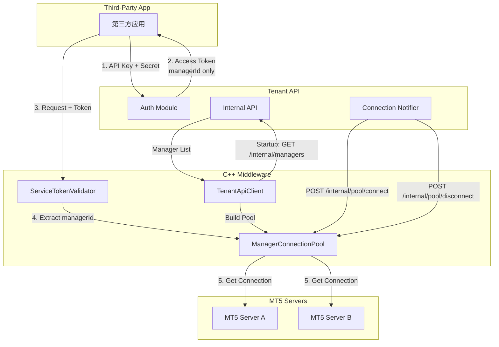
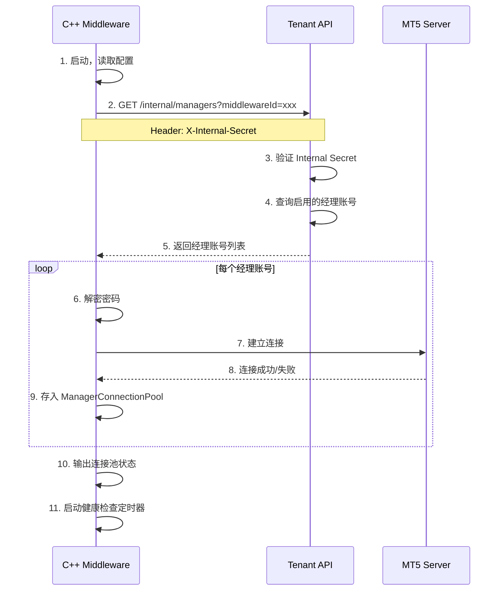
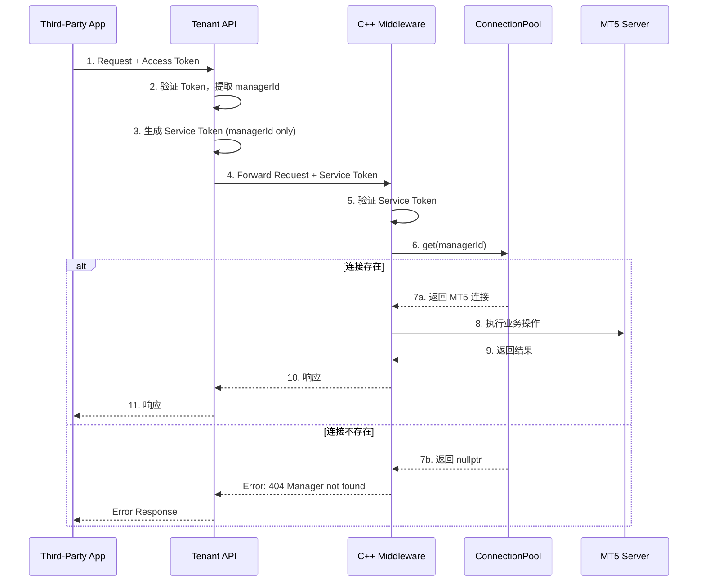

# Design Document - Manager Connection Pool

## Overview

本设计文档描述 MT5 中间件从"按需连接"模式改造为"预连接池"模式的技术架构。核心变化是：中间件启动时主动连接所有经理账号，第三方应用请求时直接使用已建立的连接，同时简化 Token 结构提升安全性。

### 关键设计决策

1. **使用 managerId (UUID) 作为连接池唯一标识**：解决不同 MT5 服务器上 managerLogin 重名问题
2. **Token 最小化**：API Key Token 和 Service Token 只包含 `managerId`、`tenantId`、`apiKeyId`
3. **新增 ManagerConnectionPool**：与现有 ManagerSessionPool 并行，专门管理预建立的连接

## Steering Document Alignment

### Technical Standards (tech.md)

- **TypeScript/NestJS**: Tenant API 内部接口遵循现有 NestJS 模块化架构
- **C++17**: ManagerConnectionPool 使用现代 C++ 特性 (std::unordered_map, std::mutex)
- **JWT**: Token 生成使用现有 JWT 库，简化 Payload 结构
- **AES-256-GCM**: 密码加密沿用现有加密方案

### Project Structure (structure.md)

```
MT5-middleware/
├── include/
│   ├── services/
│   │   ├── ManagerSessionPool.h      # 现有（保留）
│   │   └── ManagerConnectionPool.h   # 新增
│   └── clients/
│       └── TenantApiClient.hpp       # 扩展 getManagers()
├── src/
│   ├── services/
│   │   └── ManagerConnectionPool.cpp # 新增
│   └── clients/
│       └── TenantApiClient.cpp       # 扩展

tenant-api/src/
├── auth/
│   ├── interfaces/
│   │   └── request-context.interface.ts  # 修改 ApiKeyTokenPayload
│   ├── services/
│   │   ├── mt-manager-api-key.service.ts # 修改 Token 生成
│   │   └── service-token.service.ts      # 修改 Service Token
│   └── guards/
│       └── api-key-auth.guard.ts         # 适配新 Token
├── mt-manager/
│   └── mt-manager.controller.ts          # 新增内部接口
└── middleware-proxy/
    └── services/
        └── middleware-auth.service.ts    # 修改认证逻辑
```

## Code Reuse Analysis

### Existing Components to Leverage

- **ManagerSessionPool**: 复用其熔断器、请求队列、健康检查机制
- **TenantApiClient**: 扩展添加 `getManagers()` 方法，复用现有 HTTP 请求和重试逻辑
- **CredentialEncryption**: 复用现有 AES-256-GCM 加密/解密
- **CircuitBreaker**: 复用现有熔断器实现
- **JwtService**: 复用现有 JWT 签发和验证

### Integration Points

- **Tenant API `/internal/managers`**: 新增内部端点，C++ 中间件调用
- **C++ 中间件 `/internal/pool/*`**: 新增连接池管理端点，Tenant API 调用
- **Redis**: 连接池状态可选持久化（用于中间件重启恢复）

## Architecture

### 整体架构图



### 启动流程



### 请求处理流程



## Components and Interfaces

### Component 1: ManagerConnectionPool (C++ 新增)

- **Purpose:** 管理预建立的经理账号连接，使用 managerId (UUID) 作为唯一标识
- **Interfaces:**
  ```cpp
  class ManagerConnectionPool {
  public:
      // 连接管理
      bool add(const ManagerConnectionInfo& info);
      bool remove(const std::string& managerId);
      bool reconnect(const std::string& managerId);

      // 连接获取
      std::shared_ptr<MT5Manager> get(const std::string& managerId);
      std::unique_ptr<SafeMT5Connection> getSafe(const std::string& managerId);

      // 状态查询
      ConnectionStatus getStatus(const std::string& managerId);
      Json::Value getAllStatus();
      Json::Value getStatistics();

      // 批量操作
      void initializeFromList(const std::vector<ManagerConnectionInfo>& managers);
      int healthCheck();
  };
  ```
- **Dependencies:** MT5Manager, CredentialEncryption, CircuitBreaker, RequestQueueManager
- **Reuses:** 熔断器和请求队列机制来自 ManagerSessionPool

### Component 2: TenantApiClient 扩展 (C++)

- **Purpose:** 调用 Tenant API 内部接口获取经理账号列表
- **Interfaces:**
  ```cpp
  // 新增方法
  struct ManagerInfo {
      std::string managerId;      // UUID
      std::string tenantId;
      std::string mtServerId;
      std::string serverAddress;
      uint64_t managerLogin;
      std::string encryptedPassword;
  };

  std::vector<ManagerInfo> getManagers(const std::string& middlewareId);
  ```
- **Dependencies:** HTTP Client, JSON Parser
- **Reuses:** 现有的 HTTP 请求、重试、X-Internal-Secret 认证机制

### Component 3: Internal API Controller (Tenant API 新增)

- **Purpose:** 提供内部接口供 C++ 中间件调用
- **Interfaces:**
  ```typescript
  // GET /internal/managers?middlewareId=xxx
  @Controller('internal')
  export class InternalController {
      @Get('managers')
      async getManagers(
          @Query('middlewareId') middlewareId: string,
          @Headers('x-internal-secret') secret: string
      ): Promise<ManagerInfoDto[]>;
  }
  ```
- **Dependencies:** MtManagerService, PrismaService, ConfigService
- **Reuses:** 现有的 X-Internal-Secret 验证模式

### Component 4: Connection Pool Management API (C++ 新增)

- **Purpose:** 供 Tenant API 调用管理连接池
- **Interfaces:**
  ```
  POST /internal/pool/connect
  Body: { managerId, tenantId, mtServerId, serverAddress, managerLogin, encryptedPassword }

  POST /internal/pool/disconnect
  Body: { managerId }

  POST /internal/pool/reconnect
  Body: { managerId, encryptedPassword? }

  GET /internal/pool/status
  Response: { connections: [...], statistics: {...} }
  ```
- **Dependencies:** ManagerConnectionPool
- **Reuses:** 现有的 HTTP 服务器框架

### Component 5: ApiKeyTokenPayload 简化 (Tenant API 修改)

- **Purpose:** 简化 Token 结构，只包含必要的标识信息
- **Interfaces:**
  ```typescript
  // 修改前
  interface ApiKeyTokenPayload {
      type: 'access' | 'refresh';
      managerId: string;
      tenantId: string;
      serverId: string;           // 移除
      managerLogin: string;       // 移除
      middlewareId?: string;      // 移除
      middlewareUrl?: string;     // 移除
      platformType: string;       // 移除
      apiKeyId: string;
      iat?: number;
      exp?: number;
  }

  // 修改后
  interface ApiKeyTokenPayload {
      type: 'access' | 'refresh';
      managerId: string;
      tenantId: string;
      apiKeyId: string;
      iat?: number;
      exp?: number;
  }
  ```
- **Dependencies:** JwtService
- **Reuses:** 现有 JWT 签发机制

### Component 6: ServiceToken 简化 (Tenant API 修改)

- **Purpose:** Tenant API 发给中间件的 Token，只包含 managerId
- **Interfaces:**
  ```typescript
  // 修改后的 ServiceTokenPayload
  interface ServiceTokenPayload {
      managerId: string;
      tenantId: string;
      apiKeyId: string;
      iat: number;
      exp: number;
  }
  ```
- **Dependencies:** ServiceTokenService, JwtService
- **Reuses:** 现有 JWT 签发机制

### Component 7: buildContextFromApiKey 适配 (Tenant API 修改)

- **Purpose:** 从简化的 Token 补充完整的 RequestContext
- **Interfaces:**
  ```typescript
  // 修改后需要从数据库补充字段
  async function buildContextFromApiKey(
      payload: ApiKeyTokenPayload,
      mtManagerService: MtManagerService
  ): Promise<RequestContext> {
      // 根据 managerId 查询数据库获取 serverId, platformType 等
      const manager = await mtManagerService.findById(payload.managerId);
      return {
          authType: AuthType.API_KEY,
          tenantId: payload.tenantId,
          serverId: manager.mtServerId,
          platformType: manager.platformType,
          managerId: payload.managerId,
          apiKeyId: payload.apiKeyId,
          // managerLogin 不再暴露给业务层
      };
  }
  ```
- **Dependencies:** MtManagerService, PrismaService
- **Reuses:** 现有数据库查询

## Data Models

### ManagerConnectionInfo (C++)

```cpp
struct ManagerConnectionInfo {
    std::string managerId;           // UUID，连接池的 key
    std::string tenantId;            // 租户 ID
    std::string mtServerId;          // MT5 服务器 ID
    std::string serverAddress;       // MT5 服务器地址 (ip:port)
    uint64_t managerLogin;           // MT5 经理登录号
    std::string encryptedPassword;   // AES-256-GCM 加密的密码
};
```

### PooledConnection (C++)

```cpp
struct PooledConnection {
    ManagerConnectionInfo info;
    std::shared_ptr<MT5Manager> manager;     // MT5 连接句柄
    ConnectionStatus status;                  // CONNECTED, DISCONNECTED, CONNECTING, ERROR
    std::chrono::system_clock::time_point connectedAt;
    std::chrono::system_clock::time_point lastUsedAt;
    std::string lastError;
    int reconnectAttempts;
};
```

### ManagerInfoDto (Tenant API)

```typescript
class ManagerInfoDto {
    managerId: string;           // UUID
    tenantId: string;
    mtServerId: string;
    serverAddress: string;
    managerLogin: number;
    encryptedPassword: string;   // AES-256-GCM 加密
}
```

### Simplified Token Payloads

```typescript
// API Key Access Token (第三方应用持有)
interface ApiKeyTokenPayload {
    type: 'access' | 'refresh';
    managerId: string;    // UUID
    tenantId: string;
    apiKeyId: string;
    iat: number;
    exp: number;
}

// Service Token (Tenant API → Middleware)
interface ServiceTokenPayload {
    managerId: string;    // UUID
    tenantId: string;
    apiKeyId: string;
    iat: number;
    exp: number;
}
```

## Error Handling

### Error Scenarios

1. **中间件启动时无法连接 Tenant API**
   - **Handling:** 记录错误日志，使用指数退避重试（最多 3 次），超时后中间件启动失败
   - **User Impact:** 中间件无法启动，需要检查网络和 Tenant API 状态

2. **某个经理账号连接 MT5 失败**
   - **Handling:** 记录错误日志，标记该连接为 ERROR 状态，继续处理其他账号
   - **User Impact:** 使用该经理账号的请求返回 503 Service Unavailable

3. **Token 中的 managerId 在连接池中不存在**
   - **Handling:** 返回 404 Not Found，错误消息 "Manager connection not found"
   - **User Impact:** 请求失败，提示经理账号未配置或未启用

4. **连接池中的连接断开**
   - **Handling:** 健康检查检测到后自动重连，使用指数退避策略
   - **User Impact:** 重连期间请求可能短暂失败，重连成功后自动恢复

5. **X-Internal-Secret 验证失败**
   - **Handling:** 返回 401 Unauthorized
   - **User Impact:** 内部 API 调用被拒绝，需要检查配置

### Error Codes

| 错误码 | 描述 | HTTP Status |
|--------|------|-------------|
| MANAGER_NOT_FOUND | 连接池中不存在该 managerId | 404 |
| CONNECTION_ERROR | MT5 连接失败 | 503 |
| INTERNAL_AUTH_FAILED | 内部接口认证失败 | 401 |
| POOL_UNAVAILABLE | 连接池服务不可用 | 503 |
| INVALID_TOKEN | Token 无效或已过期 | 401 |

## Testing Strategy

### Unit Testing

**C++ ManagerConnectionPool:**
- 测试 add/remove/get/reconnect 方法
- 测试并发访问安全性
- 测试熔断器触发和恢复
- 测试健康检查逻辑

**Tenant API Token 修改:**
- 测试简化后的 Token 生成
- 测试 buildContextFromApiKey 从数据库补充字段
- 测试 ApiKeyAuthGuard 适配

### Integration Testing

**Tenant API ↔ C++ Middleware:**
- 测试 `/internal/managers` 接口调用
- 测试 `/internal/pool/*` 接口调用
- 测试 X-Internal-Secret 认证

**中间件启动流程:**
- 测试从 Tenant API 获取经理账号列表
- 测试批量建立连接
- 测试部分连接失败的容错

### End-to-End Testing

**完整业务流程:**
1. 第三方应用获取 Access Token
2. 使用新 Token 格式请求业务接口
3. 验证 Tenant API → 中间件 → MT5 的完整链路

**连接池动态更新:**
1. 在 Tenant API 创建新经理账号
2. 验证中间件收到通知并建立连接
3. 验证新账号可正常使用

### Performance Testing

**对比测试:**
- 首次请求响应时间（预连接 vs 按需连接）
- 目标：预连接模式响应时间 < 50ms

**负载测试:**
- 连接池支持 1000+ 连接
- 并发请求处理能力

## Migration Strategy

### Phase 1: 准备阶段
1. 部署 Tenant API 内部接口 `/internal/managers`
2. 不修改现有 Token 结构，保持兼容

### Phase 2: 中间件更新
1. 部署 ManagerConnectionPool
2. 启动时建立预连接
3. 同时支持旧 Token（按需连接）和新 Token（预连接）

### Phase 3: Token 简化
1. 修改 ApiKeyTokenPayload 和 ServiceToken
2. 更新 buildContextFromApiKey 从数据库补充字段
3. 灰度发布，验证新 Token 工作正常

### Phase 4: 清理
1. 移除旧 Token 支持代码
2. 文档更新

### 回滚方案
- 配置开关：`USE_CONNECTION_POOL=false` 可回退到按需连接模式
- 新旧 Token 共存期间，旧 Token 继续工作
