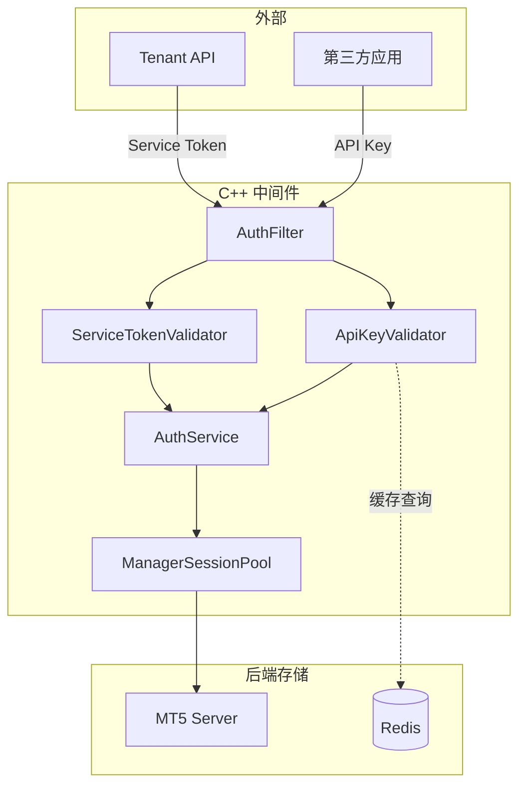
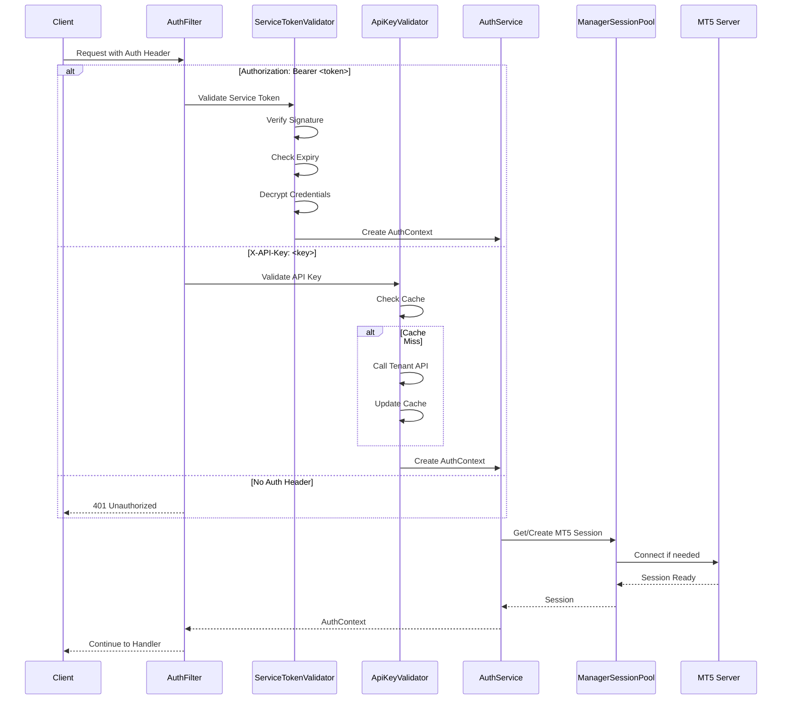

# 设计文档: Middleware Auth Refactor (中间件认证架构重构)

## 概述

本文档描述中间件认证架构重构的技术设计。核心改动是将现有的"登录获取 Token"模式改为：
1. **Service Token**: Tenant API 生成包含 MT5 凭据的 JWT，中间件验证后直接连接
2. **API Key**: 第三方应用使用预先分配的 API Key 直连中间件

## 技术标准对齐

### 技术栈
- **C++ 中间件**: Drogon 框架、jwt-cpp 库、OpenSSL
- **Tenant API**: NestJS、@nestjs/jwt、crypto
- **租户控制台**: Vue 3、TypeScript

### 项目结构
```
MT5-middleware/
├── src/
│   ├── filters/
│   │   ├── AuthFilter.hpp          # 统一认证过滤器
│   │   ├── ServiceTokenValidator.hpp
│   │   └── ApiKeyValidator.hpp
│   ├── services/
│   │   └── AuthService.hpp         # 认证服务
│   └── models/
│       └── AuthContext.hpp         # 认证上下文

mt5-platform/apps/tenant-api/
├── src/
│   ├── auth/
│   │   └── services/
│   │       └── service-token.service.ts
│   ├── api-keys/                   # 新模块
│   │   ├── api-keys.module.ts
│   │   ├── api-keys.controller.ts
│   │   ├── api-keys.service.ts
│   │   └── dto/
│   └── middleware-proxy/
│       └── services/
│           └── middleware-auth.service.ts  # 重构
```

## 代码复用分析

### 现有组件复用

| 组件 | 位置 | 复用方式 |
|------|------|----------|
| `MiddlewareAuthService` | tenant-api | 重构，替换 login 为 Service Token |
| `CryptoService` | tenant-api | 复用加密/解密逻辑 |
| `ApiKeyFilter` | middleware | 扩展现有框架 |
| `ManagerSessionPool` | middleware | 复用 MT5 连接管理 |

### 集成点

| 系统 | 集成方式 |
|------|----------|
| Redis | 缓存 API Key 验证结果 |
| PostgreSQL | 存储 API Key 数据 |
| Prisma | 扩展 api_keys 表 |

---

## 架构设计

### 整体架构



### 认证流程



---

## 组件和接口

### 1. AuthFilter (C++ 中间件)

**Purpose:** 统一认证入口，路由到不同的验证器

**文件:** `src/filters/AuthFilter.hpp`

```cpp
class AuthFilter : public drogon::HttpFilter<AuthFilter> {
public:
    void doFilter(const HttpRequestPtr& req,
                  FilterCallback&& fcb,
                  FilterChainCallback&& fccb) override;

private:
    bool isExemptPath(const std::string& path);
    std::shared_ptr<ServiceTokenValidator> serviceTokenValidator_;
    std::shared_ptr<ApiKeyValidator> apiKeyValidator_;
};
```

**豁免路径:**
- `GET /health`
- `GET /api/v1/server/info`
- `GET /`

### 2. ServiceTokenValidator (C++ 中间件)

**Purpose:** 验证 Service Token 并提取 MT5 凭据

**文件:** `src/filters/ServiceTokenValidator.hpp`

```cpp
class ServiceTokenValidator {
public:
    struct ValidationResult {
        bool valid;
        std::string error;
        AuthContext context;
    };

    ValidationResult validate(const std::string& token);

private:
    bool verifySignature(const jwt::decoded_jwt& decoded);
    bool checkExpiry(const jwt::decoded_jwt& decoded);
    std::string decryptPassword(const std::string& encrypted);

    std::string signingKey_;
    std::string encryptionKey_;
};
```

**Token Payload 结构:**
```json
{
    "type": "service",
    "iss": "tenant-api",
    "sub": "tenant:{tenantId}",
    "tenantId": "e0cd8035-ac4c-4b54-9198-35c6fcbcaddc",
    "serverId": "demo-mt5-server",
    "serverAddress": "192.250.228.240:1950",
    "managerLogin": 10007,
    "managerPassword": "AES256_ENCRYPTED_BASE64",
    "iat": 1704067200,
    "exp": 1704070800
}
```

### 3. ApiKeyValidator (C++ 中间件)

**Purpose:** 验证 API Key 并检查权限

**文件:** `src/filters/ApiKeyValidator.hpp`

```cpp
class ApiKeyValidator {
public:
    struct ApiKeyInfo {
        std::string tenantId;
        std::string serverId;
        std::vector<std::string> scopes;
        std::vector<std::string> allowedIps;
        bool isActive;
        std::chrono::system_clock::time_point expiresAt;
    };

    struct ValidationResult {
        bool valid;
        std::string error;
        ApiKeyInfo info;
    };

    ValidationResult validate(const std::string& apiKey,
                             const std::string& clientIp,
                             const std::string& requiredScope);

private:
    std::string computeHash(const std::string& key);
    std::optional<ApiKeyInfo> getFromCache(const std::string& hashPrefix);
    ApiKeyInfo fetchFromTenantApi(const std::string& keyHash);
    void updateCache(const std::string& hashPrefix, const ApiKeyInfo& info);

    std::shared_ptr<RedisClient> redis_;
    std::string tenantApiUrl_;
    std::chrono::seconds cacheTtl_{300}; // 5 minutes
};
```

### 4. AuthContext (C++ 中间件)

**Purpose:** 存储认证上下文，供后续处理器使用

**文件:** `src/models/AuthContext.hpp`

```cpp
enum class AuthType {
    SERVICE_TOKEN,
    API_KEY
};

struct AuthContext {
    AuthType type;
    std::string tenantId;
    std::string serverId;
    std::string serverAddress;
    int64_t managerLogin;
    std::string managerPassword;  // 解密后的密码（内存中）
    std::vector<std::string> scopes;
    std::string clientIp;
    std::string sessionKey;       // tenantId:serverId
};
```

### 5. ServiceTokenService (Tenant API)

**Purpose:** 生成和管理 Service Token

**文件:** `src/auth/services/service-token.service.ts`

```typescript
@Injectable()
export class ServiceTokenService {
    constructor(
        private readonly jwtService: JwtService,
        private readonly configService: ConfigService,
        private readonly mtServerService: MtServerService,
        private readonly cryptoService: CryptoService,
    ) {}

    async generateToken(tenantId: string, serverId?: string): Promise<string>;
    async refreshToken(oldToken: string): Promise<string>;
    validateToken(token: string): ServiceTokenPayload | null;

    private encryptPassword(password: string): string;
    private getSigningKey(): string;
}

interface ServiceTokenPayload {
    type: 'service';
    iss: string;
    sub: string;
    tenantId: string;
    serverId: string;
    serverAddress: string;
    managerLogin: number;
    managerPassword: string;  // encrypted
    iat: number;
    exp: number;
}
```

### 6. ApiKeysService (Tenant API)

**Purpose:** API Key 的 CRUD 操作

**文件:** `src/api-keys/api-keys.service.ts`

```typescript
@Injectable()
export class ApiKeysService {
    constructor(
        private readonly prisma: PrismaService,
        private readonly cryptoService: CryptoService,
        private readonly middlewareWebhook: MiddlewareWebhookService,
    ) {}

    async create(tenantId: string, dto: CreateApiKeyDto): Promise<ApiKeyCreatedResponse>;
    async findAll(tenantId: string, query: ApiKeyQueryDto): Promise<PaginatedApiKeys>;
    async findOne(tenantId: string, id: string): Promise<ApiKeyDto>;
    async update(tenantId: string, id: string, dto: UpdateApiKeyDto): Promise<ApiKeyDto>;
    async revoke(tenantId: string, id: string): Promise<void>;
    async validate(keyHash: string): Promise<ApiKeyValidationResult>;
    async recordUsage(keyHash: string): Promise<void>;

    private generateKey(tenantId: string): string;
    private hashKey(key: string): string;
}
```

### 7. MiddlewareAuthService 重构 (Tenant API)

**Purpose:** 使用 Service Token 调用中间件

**文件:** `src/middleware-proxy/services/middleware-auth.service.ts`

```typescript
@Injectable()
export class MiddlewareAuthService {
    constructor(
        private readonly serviceTokenService: ServiceTokenService,
        private readonly configService: ConfigService,
    ) {}

    // 新方法
    async getAuthHeaders(tenantId: string, serverId?: string): Promise<Record<string, string>> {
        const token = await this.serviceTokenService.generateToken(tenantId, serverId);
        return {
            'Authorization': `Bearer ${token}`,
            'Content-Type': 'application/json',
        };
    }

    // 废弃的方法（保留向后兼容，标记 @Deprecated）
    /** @deprecated Use getAuthHeaders instead */
    async login(instanceId: string, credentials?: any, tenantId?: string): Promise<MiddlewareSession>;
}
```

---

## 数据模型

### API Key 表扩展

```sql
-- 扩展现有 api_keys 表
ALTER TABLE platform.api_keys
ADD COLUMN IF NOT EXISTS scopes TEXT[] DEFAULT '{}',
ADD COLUMN IF NOT EXISTS allowed_ips TEXT[] DEFAULT '{}',
ADD COLUMN IF NOT EXISTS last_used_at TIMESTAMP(3),
ADD COLUMN IF NOT EXISTS usage_count BIGINT DEFAULT 0,
ADD COLUMN IF NOT EXISTS server_id TEXT,
ADD COLUMN IF NOT EXISTS expires_at TIMESTAMP(3);

-- 添加索引
CREATE INDEX IF NOT EXISTS idx_api_keys_key_hash ON platform.api_keys(key_hash);
CREATE INDEX IF NOT EXISTS idx_api_keys_tenant_id ON platform.api_keys(tenant_id);
```

### Prisma Schema 更新

```prisma
model ApiKey {
  id          String    @id @default(uuid())
  tenantId    String    @map("tenant_id")
  name        String
  keyHash     String    @unique @map("key_hash")
  keyPrefix   String    @map("key_prefix")  // 前8位，用于显示
  scopes      String[]  @default([])
  allowedIps  String[]  @default([]) @map("allowed_ips")
  serverId    String?   @map("server_id")
  expiresAt   DateTime? @map("expires_at")
  lastUsedAt  DateTime? @map("last_used_at")
  usageCount  BigInt    @default(0) @map("usage_count")
  isActive    Boolean   @default(true) @map("is_active")
  createdAt   DateTime  @default(now()) @map("created_at")
  updatedAt   DateTime  @updatedAt @map("updated_at")

  tenant      Tenant    @relation(fields: [tenantId], references: [id])

  @@map("api_keys")
  @@index([tenantId])
  @@index([keyHash])
}
```

### 权限范围定义

```typescript
// src/api-keys/constants/scopes.ts
export const API_KEY_SCOPES = {
    // 交易相关
    'trading:read': '读取交易数据（持仓、订单、历史）',
    'trading:write': '执行交易操作（开仓、平仓、修改）',

    // 账户相关
    'account:read': '读取账户信息',
    'account:write': '修改账户信息',

    // 市场数据
    'market:read': '读取市场数据（报价、品种）',

    // 管理员权限
    'admin:*': '完全管理员权限',
} as const;

// 端点权限映射
export const ENDPOINT_SCOPES: Record<string, string[]> = {
    'GET /api/v1/account/users': ['account:read', 'admin:*'],
    'GET /api/v1/account/positions': ['trading:read', 'admin:*'],
    'POST /api/v1/trading/order': ['trading:write', 'admin:*'],
    'GET /api/v1/market/quotes': ['market:read', 'admin:*'],
    // ...
};
```

---

## 错误处理

### 错误场景

| 场景 | HTTP 状态码 | 错误码 | 用户影响 |
|------|------------|--------|----------|
| 无认证头 | 401 | AUTH_MISSING_CREDENTIALS | 提示需要认证 |
| Token 签名无效 | 401 | AUTH_INVALID_TOKEN | 提示 Token 无效 |
| Token 过期 | 401 | AUTH_TOKEN_EXPIRED | 提示重新获取 Token |
| API Key 无效 | 401 | AUTH_INVALID_API_KEY | 提示 Key 无效 |
| API Key 已撤销 | 401 | AUTH_API_KEY_REVOKED | 提示 Key 已撤销 |
| 权限不足 | 403 | AUTH_INSUFFICIENT_SCOPE | 提示缺少权限 |
| IP 不在白名单 | 403 | AUTH_IP_NOT_ALLOWED | 提示 IP 被拒绝 |
| MT5 连接失败 | 503 | MT5_CONNECTION_FAILED | 提示服务暂时不可用 |

### 错误响应格式

```json
{
    "success": false,
    "error": "Human readable error message",
    "code": "ERROR_CODE",
    "details": {
        "required": ["trading:write"],
        "provided": ["trading:read"]
    }
}
```

---

## 安全设计

### 密钥管理

```yaml
# 环境变量配置
SERVICE_TOKEN_SIGNING_KEY: "32字节随机密钥用于JWT签名"
SERVICE_TOKEN_ENCRYPTION_KEY: "32字节随机密钥用于密码加密"
API_KEY_SALT: "16字节随机盐值用于Key哈希"
```

### 加密方案

| 数据 | 加密方式 | 说明 |
|------|----------|------|
| MT5 Manager Password (in Token) | AES-256-GCM | IV 随机生成，与密文一起 Base64 编码 |
| API Key (存储) | SHA-256 | 单向哈希，不可逆 |
| JWT 签名 | HS256 或 RS256 | 推荐 RS256 用于密钥轮换 |

### IP 白名单验证

```cpp
bool ApiKeyValidator::checkIpWhitelist(
    const std::vector<std::string>& allowedIps,
    const std::string& clientIp
) {
    if (allowedIps.empty()) {
        return true;  // 未配置白名单，允许所有
    }

    for (const auto& allowed : allowedIps) {
        if (allowed.find('/') != std::string::npos) {
            // CIDR 格式
            if (ipInCidr(clientIp, allowed)) {
                return true;
            }
        } else {
            // 精确匹配
            if (clientIp == allowed) {
                return true;
            }
        }
    }
    return false;
}
```

---

## 测试策略

### 单元测试

**C++ 中间件:**
```cpp
// ServiceTokenValidator 测试
TEST(ServiceTokenValidatorTest, ValidToken) {
    auto validator = createValidator();
    auto token = createValidToken();
    auto result = validator.validate(token);
    EXPECT_TRUE(result.valid);
    EXPECT_EQ(result.context.tenantId, "test-tenant");
}

TEST(ServiceTokenValidatorTest, ExpiredToken) {
    auto validator = createValidator();
    auto token = createExpiredToken();
    auto result = validator.validate(token);
    EXPECT_FALSE(result.valid);
    EXPECT_EQ(result.error, "Token expired");
}
```

**Tenant API:**
```typescript
describe('ServiceTokenService', () => {
    it('should generate valid token', async () => {
        const token = await service.generateToken('tenant-id');
        const payload = service.validateToken(token);
        expect(payload).not.toBeNull();
        expect(payload.tenantId).toBe('tenant-id');
    });
});

describe('ApiKeysService', () => {
    it('should create API key with scopes', async () => {
        const result = await service.create('tenant-id', {
            name: 'Test Key',
            scopes: ['trading:read'],
        });
        expect(result.key).toMatch(/^mt5_/);
        expect(result.scopes).toContain('trading:read');
    });
});
```

### 集成测试

```typescript
describe('Middleware Auth Integration', () => {
    it('should authenticate with Service Token', async () => {
        const token = await serviceTokenService.generateToken(tenantId);
        const response = await request(middlewareUrl)
            .get('/api/v1/account/users')
            .set('Authorization', `Bearer ${token}`);
        expect(response.status).toBe(200);
    });

    it('should authenticate with API Key', async () => {
        const { key } = await apiKeysService.create(tenantId, {
            name: 'Test',
            scopes: ['account:read'],
        });
        const response = await request(middlewareUrl)
            .get('/api/v1/account/users')
            .set('X-API-Key', key);
        expect(response.status).toBe(200);
    });

    it('should reject revoked API Key', async () => {
        const { key, id } = await apiKeysService.create(tenantId, { name: 'Test', scopes: ['account:read'] });
        await apiKeysService.revoke(tenantId, id);
        const response = await request(middlewareUrl)
            .get('/api/v1/account/users')
            .set('X-API-Key', key);
        expect(response.status).toBe(401);
    });
});
```

### E2E 测试

```typescript
describe('API Key Management E2E', () => {
    it('should complete full API key lifecycle', async () => {
        // 1. 登录租户控制台
        const { accessToken } = await login('admin@demo.com', 'demo123456');

        // 2. 创建 API Key
        const createRes = await request(tenantApiUrl)
            .post('/tenant/api-keys')
            .set('Authorization', `Bearer ${accessToken}`)
            .send({ name: 'Trading Bot', scopes: ['trading:read', 'trading:write'] });
        expect(createRes.status).toBe(201);
        const apiKey = createRes.body.data.key;

        // 3. 使用 API Key 调用中间件
        const tradeRes = await request(middlewareUrl)
            .get('/api/v1/account/positions')
            .set('X-API-Key', apiKey);
        expect(tradeRes.status).toBe(200);

        // 4. 撤销 API Key
        await request(tenantApiUrl)
            .delete(`/tenant/api-keys/${createRes.body.data.id}`)
            .set('Authorization', `Bearer ${accessToken}`);

        // 5. 验证 Key 已失效
        const revokedRes = await request(middlewareUrl)
            .get('/api/v1/account/positions')
            .set('X-API-Key', apiKey);
        expect(revokedRes.status).toBe(401);
    });
});
```

---

## 配置项

### C++ 中间件配置

```json
{
    "auth": {
        "service_token": {
            "enabled": true,
            "signing_key_env": "SERVICE_TOKEN_SIGNING_KEY",
            "encryption_key_env": "SERVICE_TOKEN_ENCRYPTION_KEY",
            "issuer": "tenant-api",
            "clock_skew_seconds": 30
        },
        "api_key": {
            "enabled": true,
            "header_name": "X-API-Key",
            "cache_ttl_seconds": 300,
            "tenant_api_validation_url": "http://tenant-api:3200/internal/api-keys/validate"
        },
        "exempt_paths": [
            "/health",
            "/api/v1/server/info",
            "/"
        ]
    }
}
```

### Tenant API 配置

```yaml
# .env
SERVICE_TOKEN_SIGNING_KEY=your-32-byte-signing-key
SERVICE_TOKEN_ENCRYPTION_KEY=your-32-byte-encryption-key
SERVICE_TOKEN_EXPIRES_IN=3600
API_KEY_SALT=your-16-byte-salt
```

---

## 迁移兼容性

### 向后兼容设计

1. **旧登录端点保留**（标记 Deprecated）
   - `/api/v1/auth/admin/login` 继续工作
   - 返回响应中增加 `deprecation` 警告头
   - 日志记录使用旧端点的调用

2. **认证优先级**
   ```
   Service Token > API Key > Legacy JWT (from login)
   ```

3. **Tenant API 兼容**
   - `MiddlewareAuthService.login()` 保留但标记 @Deprecated
   - 新代码使用 `getAuthHeaders()`

### 迁移步骤

1. 部署新版中间件（支持双认证）
2. 部署新版 Tenant API（支持 Service Token）
3. 切换 Tenant API 到 Service Token 模式
4. 监控旧登录端点使用情况
5. 通知外部系统迁移到 API Key
6. 下一版本移除旧登录端点
