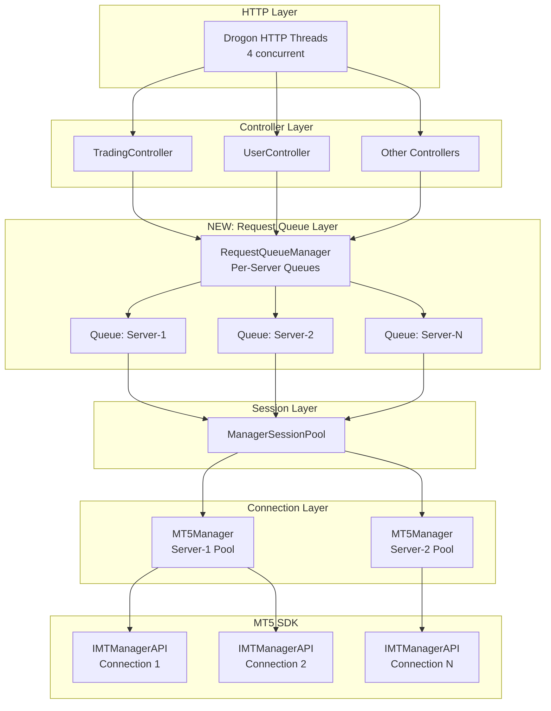
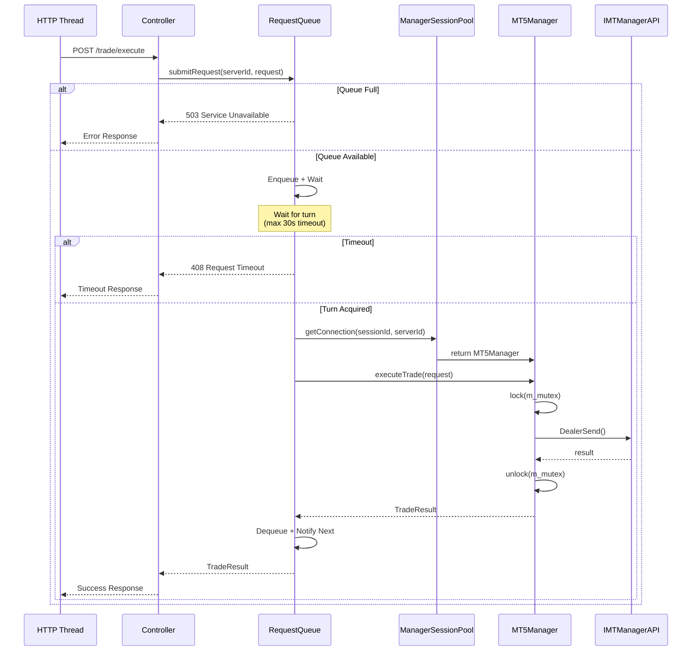

# Design Document: MT5 Middleware Stability Protection

## Overview

本设计文档描述 MT5 中间件稳定性保护机制的技术实现方案。核心目标是在中间件内部实现请求序列化，确保即使外部发送并行请求，中间件也能正确处理而不崩溃。

### 设计目标

1. **请求序列化**：确保对同一 MT5 连接的 API 调用串行执行
2. **队列管理**：提供请求排队、超时和监控能力
3. **连接池扩展**：支持多连接并行处理提高吞吐量
4. **优雅降级**：高负载时保持系统可用性
5. **向后兼容**：不改变现有 API 接口

## Steering Document Alignment

### Technical Standards (tech.md)

- 遵循现有 C++17 标准
- 使用 spdlog 进行日志记录
- 使用 std::mutex/std::condition_variable 进行线程同步
- 与现有 Drogon 框架集成

### Project Structure (structure.md)

新增文件将放置在现有目录结构中：
- `include/services/` - 新增头文件
- `src/services/` - 新增实现文件
- `include/utils/` - 工具类头文件

## Code Reuse Analysis

### Existing Components to Leverage

- **MT5Manager**: 现有的 MT5 API 封装类，已有 `m_mutex` 保护
- **MT5ManagerPool**: 现有的连接池实现，提供 acquire/release 模式
- **CircuitBreaker**: 现有的熔断器实现，用于故障隔离
- **ManagerSessionPool**: 现有的多租户会话管理，包含 `executeWithCircuitBreaker` 模板

### Integration Points

- **TradingController**: HTTP 请求入口，需要修改获取连接的方式
- **ManagerSessionPool::getConnection()**: 需要返回带请求队列包装的连接
- **MT5Manager**: 所有公共方法已有 mutex 保护，新方案将在更高层添加队列

## Architecture

### 整体架构



### 请求处理流程



### Modular Design Principles

- **Single File Responsibility**:
  - `RequestQueue.h/cpp` - 单一请求队列实现
  - `RequestQueueManager.h/cpp` - 多队列管理器
  - `QueueMetrics.h/cpp` - 队列监控指标

- **Component Isolation**:
  - 请求队列与 MT5Manager 解耦
  - 通过接口抽象，便于测试和替换

- **Service Layer Separation**:
  - Controller 层：HTTP 请求处理
  - Queue 层：请求排队和调度
  - Session 层：会话和连接管理
  - SDK 层：MT5 API 调用

## Components and Interfaces

### Component 1: RequestQueue

**Purpose:** 单个服务器的请求队列，实现请求序列化

**File:** `include/services/RequestQueue.h`, `src/services/RequestQueue.cpp`

**Interfaces:**

```cpp
namespace services {

// 请求优先级
enum class RequestPriority {
    HIGH = 0,      // 交易操作 (executeTrade, closePosition)
    NORMAL = 1,    // 普通查询
    LOW = 2        // 批量查询
};

// 队列配置
struct RequestQueueConfig {
    size_t maxQueueSize = 100;           // 最大队列长度
    int defaultTimeoutMs = 30000;        // 默认超时时间 (30秒)
    size_t warningThreshold = 50;        // 警告阈值
    bool enablePriorityQueue = true;     // 是否启用优先级队列
};

// 队列统计
struct QueueStats {
    size_t currentSize;           // 当前队列长度
    size_t totalEnqueued;         // 总入队数
    size_t totalDequeued;         // 总出队数
    size_t totalTimeouts;         // 超时总数
    size_t totalRejected;         // 拒绝总数 (队列满)
    double avgWaitTimeMs;         // 平均等待时间
    double maxWaitTimeMs;         // 最大等待时间
    size_t currentProcessing;     // 当前正在处理的请求数
};

class RequestQueue {
public:
    explicit RequestQueue(const RequestQueueConfig& config = RequestQueueConfig());
    ~RequestQueue();

    // 提交请求并等待执行机会
    // @param priority 请求优先级
    // @param timeoutMs 超时时间 (0 = 使用默认值)
    // @return true = 获得执行权, false = 超时或被拒绝
    // @throws QueueFullException 如果队列已满
    bool acquireExecutionSlot(RequestPriority priority = RequestPriority::NORMAL,
                              int timeoutMs = 0);

    // 释放执行槽位，通知下一个等待者
    void releaseExecutionSlot();

    // 获取队列统计信息
    QueueStats getStats() const;

    // 重置统计信息
    void resetStats();

    // 检查队列是否可用
    bool isAvailable() const;

    // 获取当前队列大小
    size_t size() const;

private:
    RequestQueueConfig m_config;

    // 等待队列 (优先级队列)
    struct WaitingRequest {
        RequestPriority priority;
        std::chrono::steady_clock::time_point enqueueTime;
        std::shared_ptr<std::condition_variable> cv;
        std::atomic<bool> ready{false};
        std::atomic<bool> cancelled{false};
    };

    std::priority_queue<std::shared_ptr<WaitingRequest>,
                       std::vector<std::shared_ptr<WaitingRequest>>,
                       /* comparator */> m_waitQueue;

    // 简单队列 (非优先级模式)
    std::queue<std::shared_ptr<WaitingRequest>> m_simpleQueue;

    // 当前是否有请求在执行
    std::atomic<bool> m_executing{false};

    // 同步原语
    mutable std::mutex m_mutex;
    std::condition_variable m_queueCondition;

    // 统计信息
    mutable QueueStats m_stats;
    mutable std::mutex m_statsMutex;

    // 内部方法
    void updateStats(double waitTimeMs, bool success);
    void notifyNext();
};

// 异常类
class QueueFullException : public std::runtime_error {
public:
    QueueFullException() : std::runtime_error("Request queue is full") {}
};

class QueueTimeoutException : public std::runtime_error {
public:
    QueueTimeoutException() : std::runtime_error("Request queue timeout") {}
};

} // namespace services
```

**Dependencies:**
- `<mutex>`, `<condition_variable>`, `<queue>`, `<atomic>`
- spdlog for logging

**Reuses:**
- 类似 `AsyncTaskQueue` 的设计模式

### Component 2: RequestQueueManager

**Purpose:** 管理多个服务器的请求队列

**File:** `include/services/RequestQueueManager.h`, `src/services/RequestQueueManager.cpp`

**Interfaces:**

```cpp
namespace services {

class RequestQueueManager {
public:
    explicit RequestQueueManager(const RequestQueueConfig& defaultConfig = RequestQueueConfig());
    ~RequestQueueManager();

    // 获取指定服务器的队列
    // 如果不存在则创建
    std::shared_ptr<RequestQueue> getQueue(const std::string& serverId);

    // 移除服务器队列
    void removeQueue(const std::string& serverId);

    // 获取所有队列的统计信息
    std::map<std::string, QueueStats> getAllStats() const;

    // 获取汇总统计
    QueueStats getAggregatedStats() const;

    // 设置服务器特定配置
    void setQueueConfig(const std::string& serverId, const RequestQueueConfig& config);

    // RAII 风格的执行槽位获取器
    class ExecutionSlot {
    public:
        ExecutionSlot(std::shared_ptr<RequestQueue> queue,
                     RequestPriority priority,
                     int timeoutMs);
        ~ExecutionSlot();

        bool acquired() const { return m_acquired; }

        // 禁用拷贝
        ExecutionSlot(const ExecutionSlot&) = delete;
        ExecutionSlot& operator=(const ExecutionSlot&) = delete;

        // 允许移动
        ExecutionSlot(ExecutionSlot&& other) noexcept;
        ExecutionSlot& operator=(ExecutionSlot&& other) noexcept;

    private:
        std::shared_ptr<RequestQueue> m_queue;
        bool m_acquired{false};
    };

    // 便捷方法：获取执行槽位
    ExecutionSlot acquireSlot(const std::string& serverId,
                              RequestPriority priority = RequestPriority::NORMAL,
                              int timeoutMs = 0);

private:
    RequestQueueConfig m_defaultConfig;
    std::unordered_map<std::string, std::shared_ptr<RequestQueue>> m_queues;
    std::unordered_map<std::string, RequestQueueConfig> m_serverConfigs;
    mutable std::shared_mutex m_mutex;  // 读写锁
};

} // namespace services
```

**Dependencies:**
- `RequestQueue`
- `<shared_mutex>` for reader-writer lock

**Reuses:**
- 类似 `ManagerSessionPool` 的多实例管理模式

### Component 3: SafeMT5Connection (Wrapper)

**Purpose:** 包装 MT5Manager，自动处理队列获取和释放

**File:** `include/services/SafeMT5Connection.h`, `src/services/SafeMT5Connection.cpp`

**Interfaces:**

```cpp
namespace services {

class SafeMT5Connection {
public:
    SafeMT5Connection(
        std::shared_ptr<mt5::MT5Manager> manager,
        std::shared_ptr<RequestQueue> queue,
        const std::string& serverId
    );

    ~SafeMT5Connection();

    // 获取底层 MT5Manager (用于需要直接访问的场景)
    std::shared_ptr<mt5::MT5Manager> getManager() const { return m_manager; }

    // 代理常用方法，自动处理队列

    // 交易操作 (高优先级)
    mt5::MT5Result executeTrade(const mt5::TradeRequest& request,
                                mt5::TradeResult& result,
                                int timeoutMs = 30000);

    mt5::MT5Result closePosition(UINT64 login, UINT64 position, double volume,
                                 mt5::TradeResult& result,
                                 int timeoutMs = 30000);

    // 查询操作 (普通优先级)
    mt5::MT5Result getPositions(UINT64 login,
                                std::vector<mt5::PositionInfo>& positions,
                                int timeoutMs = 10000);

    mt5::MT5Result getOrders(UINT64 login,
                            std::vector<mt5::OrderInfo>& orders,
                            int timeoutMs = 10000);

    mt5::MT5Result getUserInfo(UINT64 login,
                               mt5::UserInfo& user,
                               int timeoutMs = 10000);

    // 批量操作 (低优先级)
    mt5::MT5Result batchQuery(const mt5::BatchQueryRequest& request,
                              mt5::BatchQueryResult& result,
                              int timeoutMs = 60000);

    // 获取服务器ID
    const std::string& getServerId() const { return m_serverId; }

private:
    std::shared_ptr<mt5::MT5Manager> m_manager;
    std::shared_ptr<RequestQueue> m_queue;
    std::string m_serverId;

    // 内部执行方法模板
    template<typename Func>
    auto executeWithQueue(Func&& func, RequestPriority priority, int timeoutMs)
        -> decltype(func());
};

} // namespace services
```

**Dependencies:**
- `MT5Manager`
- `RequestQueue`

**Reuses:**
- 装饰器模式，包装现有 `MT5Manager`

### Component 4: Enhanced ManagerSessionPool

**Purpose:** 修改现有 ManagerSessionPool，返回带队列保护的连接

**File:** 修改现有 `include/services/ManagerSessionPool.h`

**接口变更:**

```cpp
// 新增方法
class ManagerSessionPool {
public:
    // ... 现有方法 ...

    /**
     * @brief 获取带请求队列保护的连接 (推荐使用)
     * @param sessionId 会话ID
     * @param serverId 服务器ID
     * @return SafeMT5Connection 包装器，如果失败返回 nullptr
     */
    std::shared_ptr<SafeMT5Connection> getSafeConnection(
        const std::string& sessionId,
        const std::string& serverId
    );

    /**
     * @brief 获取请求队列管理器
     * @return RequestQueueManager 实例
     */
    RequestQueueManager& getQueueManager();

    /**
     * @brief 获取所有队列的统计信息
     * @return JSON 格式的统计信息
     */
    Json::Value getQueueStatistics();

private:
    // 新增成员
    std::unique_ptr<RequestQueueManager> m_queueManager;
};
```

## Data Models

### QueueStats

```cpp
struct QueueStats {
    size_t currentSize;           // 当前队列长度
    size_t totalEnqueued;         // 总入队数
    size_t totalDequeued;         // 总出队数
    size_t totalTimeouts;         // 超时总数
    size_t totalRejected;         // 拒绝总数
    double avgWaitTimeMs;         // 平均等待时间
    double maxWaitTimeMs;         // 最大等待时间
    size_t currentProcessing;     // 正在处理数

    Json::Value toJson() const {
        Json::Value json;
        json["current_size"] = static_cast<Json::UInt64>(currentSize);
        json["total_enqueued"] = static_cast<Json::UInt64>(totalEnqueued);
        json["total_dequeued"] = static_cast<Json::UInt64>(totalDequeued);
        json["total_timeouts"] = static_cast<Json::UInt64>(totalTimeouts);
        json["total_rejected"] = static_cast<Json::UInt64>(totalRejected);
        json["avg_wait_time_ms"] = avgWaitTimeMs;
        json["max_wait_time_ms"] = maxWaitTimeMs;
        json["current_processing"] = static_cast<Json::UInt64>(currentProcessing);
        return json;
    }
};
```

### RequestQueueConfig

```cpp
struct RequestQueueConfig {
    size_t maxQueueSize = 100;           // 最大队列长度
    int defaultTimeoutMs = 30000;        // 默认超时 30秒
    size_t warningThreshold = 50;        // 警告阈值
    bool enablePriorityQueue = true;     // 启用优先级

    static RequestQueueConfig fromJson(const Json::Value& json) {
        RequestQueueConfig config;
        if (json.isMember("max_queue_size"))
            config.maxQueueSize = json["max_queue_size"].asUInt64();
        if (json.isMember("default_timeout_ms"))
            config.defaultTimeoutMs = json["default_timeout_ms"].asInt();
        if (json.isMember("warning_threshold"))
            config.warningThreshold = json["warning_threshold"].asUInt64();
        if (json.isMember("enable_priority_queue"))
            config.enablePriorityQueue = json["enable_priority_queue"].asBool();
        return config;
    }
};
```

## Error Handling

### Error Scenarios

1. **队列已满 (QueueFullException)**
   - **Handling:** 立即返回 503 Service Unavailable
   - **User Impact:** 用户收到"服务繁忙"提示
   - **Logging:** WARN 级别，包含队列大小和服务器ID

2. **请求超时 (QueueTimeoutException)**
   - **Handling:** 返回 408 Request Timeout
   - **User Impact:** 用户收到"请求超时"提示
   - **Logging:** WARN 级别，包含等待时间和队列深度

3. **MT5 API 错误**
   - **Handling:** 通过现有 CircuitBreaker 处理，必要时触发熔断
   - **User Impact:** 根据错误类型返回相应 HTTP 状态码
   - **Logging:** ERROR 级别，包含 MT5 错误码和详细信息

4. **连接池耗尽**
   - **Handling:** 等待可用连接或返回 503
   - **User Impact:** 用户收到"服务暂时不可用"提示
   - **Logging:** WARN 级别，包含池状态

### HTTP 错误码映射

| 场景 | HTTP 状态码 | 错误消息 |
|------|------------|---------|
| 队列已满 | 503 | Service temporarily unavailable, too many pending requests |
| 请求超时 | 408 | Request timeout, please retry |
| 熔断器打开 | 503 | Service unavailable, circuit breaker open |
| MT5 连接失败 | 502 | Bad gateway, MT5 server connection failed |
| MT5 认证失败 | 401 | Unauthorized, MT5 authentication failed |
| MT5 权限不足 | 403 | Forbidden, insufficient MT5 permissions |

## Testing Strategy

### Unit Testing

**测试文件:** `test/services/RequestQueue_test.cpp`

- **队列基本功能测试:**
  - 单请求入队出队
  - 多请求顺序处理
  - 优先级队列排序

- **并发测试:**
  - 多线程同时入队
  - 执行槽位竞争
  - 超时处理

- **边界条件测试:**
  - 队列满时拒绝
  - 零超时
  - 空队列释放

### Integration Testing

**测试文件:** `test/integration/SafeMT5Connection_test.cpp`

- **与 MT5Manager 集成:**
  - 正常交易流程
  - 并行请求序列化
  - 错误传播

- **与 ManagerSessionPool 集成:**
  - getSafeConnection 工作流
  - 多会话并发
  - 会话过期处理

### End-to-End Testing

**测试场景:**

1. **并发压力测试:**
   - 10 个客户端同时发送请求
   - 验证所有请求都被正确处理
   - 验证无崩溃

2. **超时测试:**
   - 模拟 MT5 服务器响应慢
   - 验证超时处理正确

3. **故障恢复测试:**
   - 模拟 MT5 服务器断连
   - 验证重连和队列恢复

## Configuration

### config.json 新增配置项

```json
{
  "request_queue": {
    "max_queue_size": 100,
    "default_timeout_ms": 30000,
    "warning_threshold": 50,
    "enable_priority_queue": true,
    "per_server_config": {
      "main-server": {
        "max_queue_size": 200,
        "default_timeout_ms": 60000
      }
    }
  }
}
```

## Migration Plan

### Phase 1: 添加新组件 (不影响现有功能)

1. 实现 `RequestQueue` 类
2. 实现 `RequestQueueManager` 类
3. 实现 `SafeMT5Connection` 类
4. 添加单元测试

### Phase 2: 集成到 ManagerSessionPool

1. 在 `ManagerSessionPool` 中添加 `m_queueManager`
2. 实现 `getSafeConnection()` 方法
3. 添加配置文件支持

### Phase 3: Controller 迁移

1. 修改 `TradingController` 使用 `getSafeConnection()`
2. 修改其他 Controller
3. 端到端测试

### Phase 4: 监控和优化

1. 添加 Prometheus 指标导出
2. 添加队列监控 API
3. 性能调优

## Appendix: 为什么选择请求队列方案

### 对比分析

| 方案 | 优点 | 缺点 | 选择理由 |
|------|------|------|---------|
| **细粒度锁** | 实现简单 | 可能不兼容 MT5 SDK | MT5 SDK 对象创建也需要锁 |
| **请求队列** | 完全控制，可监控 | 略复杂 | **选择** - 最安全可靠 |
| **连接池扩容** | 线性扩展 | 需要更多 Manager 账号 | 可作为补充方案 |

### 最终选择

**请求队列 + 连接池** 组合方案：

1. **请求队列** 确保单个连接的 API 调用串行执行
2. **连接池** (已有 `MT5ManagerPool`) 允许多连接并行，提高吞吐量
3. **两者结合** 既保证线程安全，又提供良好的并发性能
