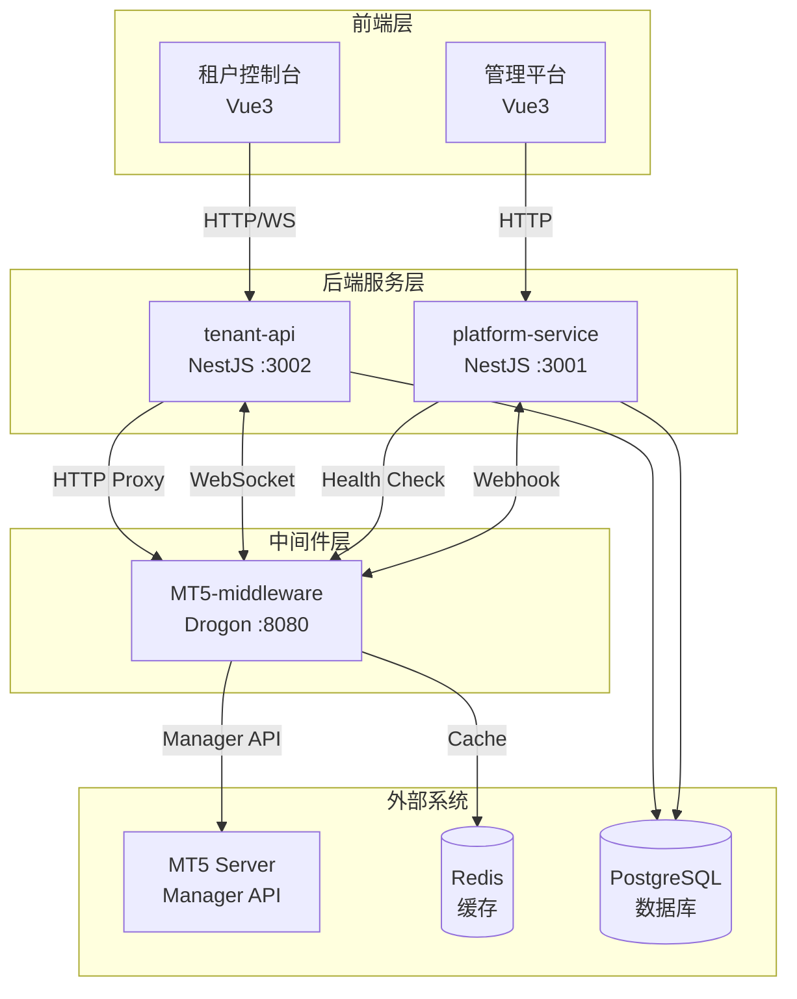
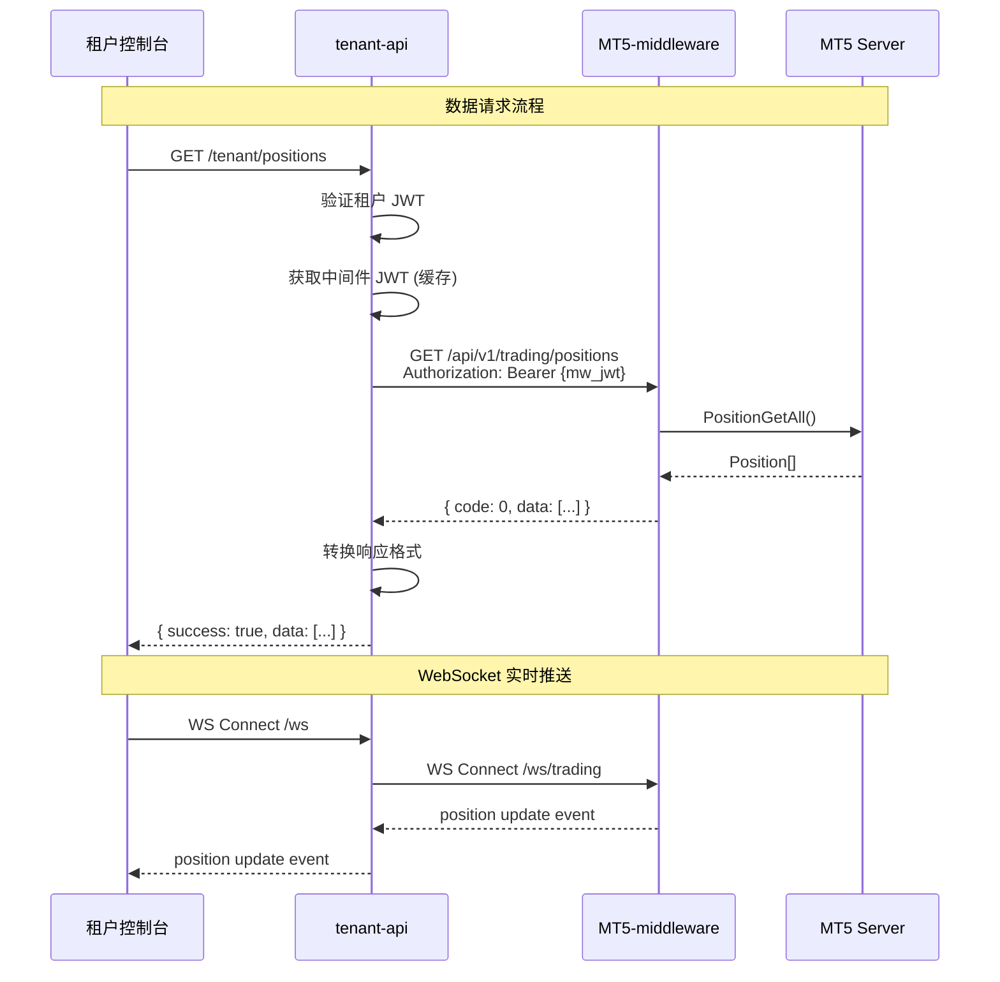

# Design Document: MT5 Middleware Integration

## Overview

本设计文档描述 MT5 SaaS 平台与 MT5 中间件的技术集成方案。集成涉及两个主要系统：
- **mt5-platform**: NestJS 后端 + Vue3 前端的多租户 SaaS 平台
- **MT5-middleware**: C++ Drogon 高性能中间件，提供 MT5 Manager API 封装

核心目标是建立平台与中间件之间的数据通道，实现账户、持仓、报价、历史等数据的无缝对接。

---

## Code Reuse Analysis

### Existing Components to Leverage

#### Platform Service (platform-service)
| 组件 | 位置 | 用途 |
|------|------|------|
| **MiddlewareClientService** | `src/modules/middleware-integration/services/middleware-client.service.ts` | HTTP 请求封装，已支持重试和熔断 |
| **HealthCheckerService** | `src/modules/middleware-integration/services/health-checker.service.ts` | 健康检查，需适配响应格式 |
| **CircuitBreakerService** | `src/modules/middleware-integration/services/circuit-breaker.service.ts` | 熔断器，可直接复用 |
| **WebhookController** | `src/modules/middleware-integration/controllers/webhook.controller.ts` | Webhook 接收，需适配事件类型 |
| **EventEmitterService** | `src/modules/middleware-integration/services/event-emitter.service.ts` | 事件发送，可直接复用 |
| **InstancesService** | `src/modules/instances/instances.service.ts` | 实例管理，可直接复用 |

#### Tenant API (tenant-api)
| 组件 | 位置 | 用途 |
|------|------|------|
| **MiddlewareProxyService** | `src/middleware-proxy/middleware-proxy.service.ts` | 代理服务，需重构响应转换 |
| **TenantWebsocketGateway** | `src/websocket/tenant-websocket.gateway.ts` | WebSocket 网关，需扩展中间件转发 |

### Integration Points
- **数据库**: MiddlewareInstance 模型已包含所需字段
- **缓存**: 需引入 Redis 替代内存缓存
- **认证**: 需新增中间件 JWT 管理

---

## Architecture

### 整体架构图



### 数据流架构



---

## Components and Interfaces

### Component 1: ResponseTransformer (新增)

**Purpose:** 统一转换中间件响应格式为平台格式

**Location:** `apps/tenant-api/src/middleware-proxy/transformers/response.transformer.ts`

**Interfaces:**
```typescript
interface MiddlewareResponse<T> {
  code: number;
  message: string;
  data: T;
  timestamp: number;
}

interface PlatformResponse<T> {
  success: boolean;
  data?: T;
  error?: {
    code: string;
    message: string;
  };
}

class ResponseTransformer {
  // 转换成功响应
  transformSuccess<T>(response: MiddlewareResponse<T>): PlatformResponse<T>;

  // 转换错误响应
  transformError(code: number, message: string): PlatformResponse<never>;

  // 映射错误码
  mapErrorCode(middlewareCode: number): { httpStatus: number; errorCode: string };
}
```

**Dependencies:** 无外部依赖

---

### Component 2: MiddlewareAuthService (新增)

**Purpose:** 管理与中间件的认证会话

**Location:** `apps/tenant-api/src/middleware-proxy/services/middleware-auth.service.ts`

**Interfaces:**
```typescript
interface MiddlewareCredentials {
  serverAddress: string;
  managerLogin: number;
  managerPassword: string;
}

interface MiddlewareSession {
  accessToken: string;
  refreshToken: string;
  expiresAt: Date;
  sessionId: string;
}

class MiddlewareAuthService {
  // 获取或创建中间件会话
  async getSession(instanceId: string): Promise<MiddlewareSession>;

  // 登录中间件
  async login(instanceId: string, credentials: MiddlewareCredentials): Promise<MiddlewareSession>;

  // 刷新 Token
  async refreshToken(instanceId: string): Promise<MiddlewareSession>;

  // 清理会话
  async clearSession(instanceId: string): Promise<void>;
}
```

**Dependencies:**
- Redis (缓存会话)
- MiddlewareClientService (HTTP 请求)

---

### Component 3: MiddlewareProxyService (重构)

**Purpose:** 代理转发请求到中间件

**Location:** `apps/tenant-api/src/middleware-proxy/middleware-proxy.service.ts`

**Interfaces (重构):**
```typescript
class MiddlewareProxyService {
  // 获取账户信息 (REQ-5)
  async getAccountInfo(instanceId: string): Promise<AccountInfo>;

  // 获取持仓列表 (REQ-6)
  async getPositions(instanceId: string, filters?: PositionFilter): Promise<Position[]>;

  // 获取单个持仓
  async getPositionByTicket(instanceId: string, ticket: number): Promise<Position>;

  // 获取报价 (REQ-7)
  async getQuotes(instanceId: string, symbols: string[]): Promise<Quote[]>;

  // 获取品种列表
  async getSymbols(instanceId: string): Promise<Symbol[]>;

  // 获取交易历史 (REQ-8)
  async getHistory(instanceId: string, filters: HistoryFilter): Promise<Deal[]>;

  // 健康检查 (REQ-2)
  async healthCheck(instanceId: string): Promise<HealthStatus>;
}
```

**Dependencies:**
- MiddlewareAuthService (认证)
- ResponseTransformer (响应转换)
- MiddlewareClientService (HTTP)
- CircuitBreakerService (熔断)

---

### Component 4: WebSocketBridge (新增)

**Purpose:** 桥接中间件 WebSocket 和平台 WebSocket

**Location:** `apps/tenant-api/src/websocket/websocket-bridge.service.ts`

**Interfaces:**
```typescript
interface SubscriptionRequest {
  channel: 'market' | 'trading';
  symbols?: string[];
  events?: ('tick' | 'candle' | 'position' | 'order' | 'account')[];
}

class WebSocketBridgeService {
  // 建立到中间件的 WebSocket 连接
  async connectToMiddleware(instanceId: string, token: string): Promise<void>;

  // 订阅频道
  async subscribe(instanceId: string, request: SubscriptionRequest): Promise<void>;

  // 取消订阅
  async unsubscribe(instanceId: string, channel: string): Promise<void>;

  // 转发消息到客户端
  onMiddlewareMessage(instanceId: string, message: any): void;

  // 断开连接
  async disconnect(instanceId: string): Promise<void>;
}
```

**Dependencies:**
- TenantWebsocketGateway (平台 WS)
- MiddlewareAuthService (获取 Token)

---

### Component 5: HealthCheckAdapter (修改)

**Purpose:** 适配中间件健康检查响应格式

**Location:** `apps/platform-service/src/modules/middleware-integration/services/health-checker.service.ts`

**修改点:**
```typescript
// 原响应格式期望
interface OldHealthResponse {
  status: 'healthy' | 'degraded' | 'unhealthy';
  components: {...};
}

// 新响应格式 (中间件实际格式)
interface MiddlewareHealthResponse {
  service: string;
  status: 'healthy' | 'degraded' | 'unhealthy';
  uptime_seconds: number;
  components: {
    mt5: { status: string; pool: { size: number; available: number; } };
    redis: { status: string; };
    database: { status: string; };
  };
  circuit_breakers: Array<{ name: string; state: string; }>;
  metrics: {
    cpu_usage_percent: number;
    memory_usage_mb: number;
    connections: { total: number; websocket: number; http: number; };
  };
}

// 需要添加适配逻辑
private adaptHealthResponse(response: MiddlewareHealthResponse): HealthStatus;
```

---

## Data Models

### DTO: AccountInfo
```typescript
interface AccountInfo {
  login: number;           // 账户ID
  name: string;            // 用户名
  group: string;           // 账户组
  leverage: number;        // 杠杆倍数
  balance: number;         // 余额
  credit: number;          // 信用额度
  equity: number;          // 净值
  margin: number;          // 已用保证金
  marginFree: number;      // 可用保证金
  marginLevel: number;     // 保证金比例 (%)
}
```

### DTO: Position
```typescript
interface Position {
  ticket: number;          // 持仓ID
  login: number;           // 账户ID
  symbol: string;          // 交易品种
  action: 'buy' | 'sell';  // 方向
  volume: number;          // 手数
  priceOpen: number;       // 开仓价
  priceCurrent: number;    // 当前价
  sl: number;              // 止损
  tp: number;              // 止盈
  profit: number;          // 盈亏
  commission: number;      // 手续费
  swap: number;            // 库存费
  timeCreate: Date;        // 开仓时间
  timeUpdate: Date;        // 更新时间
  comment: string;         // 备注
}
```

### DTO: Quote
```typescript
interface Quote {
  symbol: string;          // 品种
  bid: number;             // 买价
  ask: number;             // 卖价
  spread: number;          // 点差
  time: Date;              // 时间
  volume: number;          // 成交量
}
```

### DTO: Symbol
```typescript
interface Symbol {
  name: string;            // 品种名称
  description: string;     // 描述
  category: string;        // 分类 (forex, metals, indices...)
  digits: number;          // 小数位数
  contractSize: number;    // 合约大小
  minVolume: number;       // 最小手数
  maxVolume: number;       // 最大手数
  volumeStep: number;      // 手数步长
  spreadDefault: number;   // 默认点差
}
```

### DTO: HistoryDeal
```typescript
interface HistoryDeal {
  ticket: number;          // 订单ID
  login: number;           // 账户ID
  symbol: string;          // 品种
  action: 'buy' | 'sell';  // 方向
  volume: number;          // 手数
  price: number;           // 成交价
  profit: number;          // 盈亏
  commission: number;      // 手续费
  swap: number;            // 库存费
  time: Date;              // 成交时间
  comment: string;         // 备注
}
```

---

## Error Handling

### Error Code Mapping

| 中间件 Code | HTTP Status | 平台 Error Code | 说明 |
|-------------|-------------|-----------------|------|
| 0 | 200 | - | 成功 |
| 1001 | 401 | AUTH_INVALID_CREDENTIALS | 认证失败 |
| 1002 | 403 | AUTH_ACCOUNT_DISABLED | 账户禁用 |
| 1003 | 401 | AUTH_TOKEN_EXPIRED | Token 过期 |
| 2001 | 404 | RESOURCE_NOT_FOUND | 资源不存在 |
| 3001 | 400 | INVALID_PARAMETER | 参数错误 |
| 4001-4999 | 400 | TRADING_ERROR | 交易错误 |
| 5001 | 503 | MT5_CONNECTION_ERROR | MT5 连接失败 |
| 5002 | 503 | MIDDLEWARE_UNAVAILABLE | 中间件不可用 |

### Error Scenarios

1. **中间件连接超时**
   - **Handling:** 触发熔断器，返回 503
   - **User Impact:** 显示 "服务暂时不可用，请稍后重试"
   - **Recovery:** 熔断器半开状态自动重试

2. **中间件 JWT 过期**
   - **Handling:** 自动刷新 Token，重试请求
   - **User Impact:** 无感知（后台自动处理）
   - **Recovery:** 刷新失败则重新登录

3. **MT5 服务器断开**
   - **Handling:** 通过 Webhook 接收通知，更新实例状态
   - **User Impact:** 显示实例离线状态
   - **Recovery:** MT5 重连后自动恢复

4. **WebSocket 连接断开**
   - **Handling:** 客户端自动重连
   - **User Impact:** 短暂数据中断，自动恢复
   - **Recovery:** 指数退避重连策略

---

## Testing Strategy

### Unit Testing

**测试范围:**
- ResponseTransformer: 响应格式转换逻辑
- MiddlewareAuthService: 认证流程和 Token 管理
- Error code mapping: 错误码映射
- DTO validation: 数据模型验证

**工具:** Jest + ts-mockito

### Integration Testing

**测试范围:**
- MiddlewareProxyService → MiddlewareClientService 集成
- 健康检查端到端流程
- Webhook 接收和处理
- Redis 缓存集成

**工具:** Jest + Supertest + TestContainers (Redis)

### End-to-End Testing

**测试场景:**
1. 租户登录 → 获取账户信息 → 显示仪表盘
2. 订阅实时行情 → 接收 tick 推送 → 更新 UI
3. 中间件重启 → 健康检查失败 → 状态更新 → 恢复
4. 并发请求 → 熔断触发 → 降级处理

**工具:** Cypress / Playwright

---

## Configuration

### 新增环境变量 (tenant-api/.env)

```env
# 中间件认证
MIDDLEWARE_AUTH_CACHE_TTL=3600        # 会话缓存时间（秒）
MIDDLEWARE_TOKEN_REFRESH_BUFFER=300   # Token 提前刷新时间（秒）

# WebSocket 配置
MIDDLEWARE_WS_RECONNECT_INTERVAL=5000 # 重连间隔（毫秒）
MIDDLEWARE_WS_MAX_RETRIES=10          # 最大重连次数

# Redis 配置 (如果启用分布式缓存)
REDIS_HOST=localhost
REDIS_PORT=6379
```

### 中间件配置 (MT5-middleware/configs/config.json)

```json
{
  "platform_callback": {
    "enabled": true,
    "url": "http://localhost:3001/api/v1/webhook/middleware",
    "secret": "${WEBHOOK_SECRET}",
    "enabled_events": [
      "instance.status_change",
      "mt5.connected",
      "mt5.disconnected",
      "health.check_failed"
    ]
  },
  "security": {
    "enable_api_key": false,
    "jwt": {
      "secret": "${JWT_SECRET}",
      "expire_seconds": 7200
    }
  }
}
```

---

## File Structure (New/Modified)

```
apps/tenant-api/src/
├── middleware-proxy/
│   ├── middleware-proxy.module.ts        [修改]
│   ├── middleware-proxy.service.ts       [重构]
│   ├── transformers/
│   │   └── response.transformer.ts       [新增]
│   ├── services/
│   │   └── middleware-auth.service.ts    [新增]
│   └── dto/
│       ├── account.dto.ts                [新增]
│       ├── position.dto.ts               [新增]
│       ├── quote.dto.ts                  [新增]
│       └── history.dto.ts                [新增]
├── websocket/
│   ├── websocket-bridge.service.ts       [新增]
│   └── tenant-websocket.gateway.ts       [修改]

apps/platform-service/src/
├── modules/middleware-integration/
│   ├── services/
│   │   └── health-checker.service.ts     [修改]
│   └── dto/
│       └── health-response.dto.ts        [新增]
```

---

## Implementation Priority

| 优先级 | 组件 | 依赖 | 实现 REQ |
|--------|------|------|----------|
| P0 | ResponseTransformer | - | REQ-3 |
| P0 | MiddlewareAuthService | Redis | REQ-4 |
| P1 | MiddlewareProxyService 重构 | P0 | REQ-5,6,7,8 |
| P1 | HealthCheckAdapter | - | REQ-2 |
| P2 | WebSocketBridge | P0, WS Gateway | REQ-9 |
| P2 | Webhook 事件适配 | - | REQ-10 |
| P3 | 前端数据展示适配 | P1 | - |
