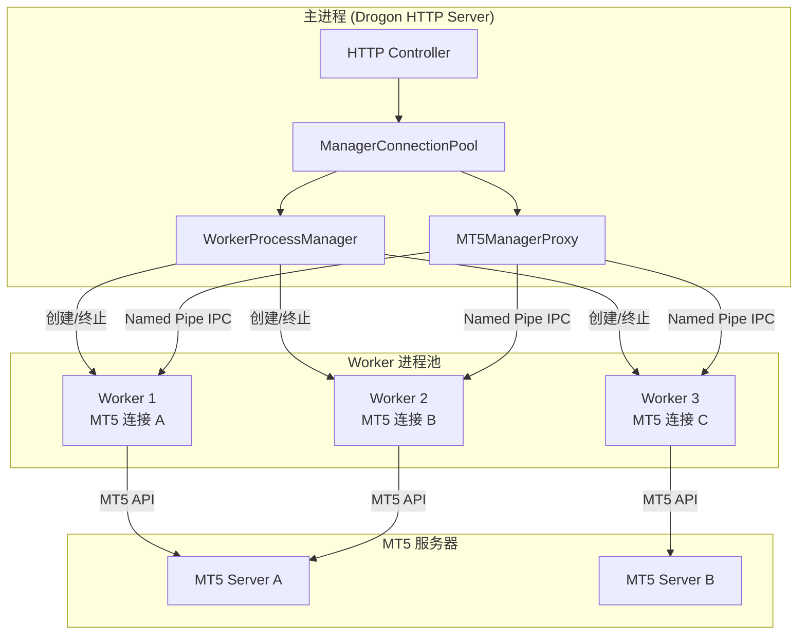
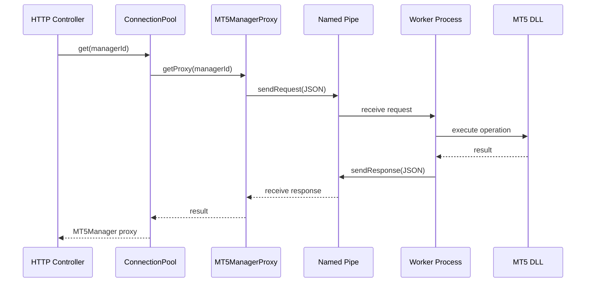
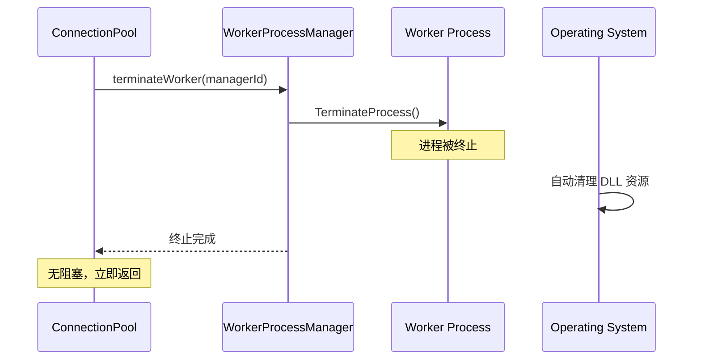

# Design Document: MT5 多进程架构

## Overview

本设计将 MT5 连接从单进程架构迁移到多进程架构。每个 MT5 连接运行在独立的 Worker 子进程中，主进程通过 Named Pipe 与 Worker 通信。当需要释放连接时，直接终止 Worker 进程，由操作系统清理 DLL 资源，从根本上解决 MT5 DLL `Release()` 阻塞问题。

## Architecture

### 整体架构图



### 通信流程



### 释放连接流程



## Code Reuse Analysis

### Existing Components to Leverage

- **MT5Manager**: 现有的 MT5 操作封装类，将在 Worker 进程中复用
- **CredentialEncryption**: 密码加密/解密工具，主进程和 Worker 都需要使用
- **MT5DLLLock**: 仍然在 Worker 内部使用，序列化单个 Worker 的 DLL 操作
- **CircuitBreaker**: 熔断器模式，用于 IPC 通信失败保护

### Integration Points

- **ManagerConnectionPool**: 修改为使用 WorkerProcessManager 和 MT5ManagerProxy
- **PoolController**: 保持 HTTP API 不变，内部调用更新后的连接池
- **HealthCheck**: 扩展为监控 Worker 进程状态

## Components and Interfaces

### Component 1: MT5Worker (Worker 子进程)

- **Purpose:** 独立运行的子进程，负责加载 MT5 DLL 并执行所有 MT5 操作
- **File:** `src/worker/MT5Worker.cpp`, `src/worker/MT5Worker.h`
- **Interfaces:**
  ```cpp
  // 入口点
  int main(int argc, char* argv[]);

  // IPC 消息处理
  void handleRequest(const IPCRequest& request);
  void sendResponse(const IPCResponse& response);
  ```
- **Dependencies:** MT5Manager, CredentialEncryption, Named Pipe
- **Lifecycle:** 由 WorkerProcessManager 创建和终止

### Component 2: WorkerProcessManager

- **Purpose:** 管理所有 Worker 子进程的生命周期
- **File:** `include/services/WorkerProcessManager.h`, `src/services/WorkerProcessManager.cpp`
- **Interfaces:**
  ```cpp
  class WorkerProcessManager {
  public:
      // 创建 Worker 进程
      std::string createWorker(const std::string& managerId);

      // 终止 Worker 进程（立即返回，不阻塞）
      bool terminateWorker(const std::string& managerId);

      // 检查 Worker 是否存活
      bool isWorkerAlive(const std::string& managerId);

      // 获取 Worker 的 Pipe 名称
      std::string getWorkerPipeName(const std::string& managerId);

      // 终止所有 Worker
      void terminateAll();

      // 获取状态统计
      WorkerStats getStats() const;
  };
  ```
- **Dependencies:** Windows Process API, Named Pipe

### Component 3: IPCChannel (Named Pipe 通信层)

- **Purpose:** 封装 Named Pipe 的创建、读写和管理
- **File:** `include/utils/IPCChannel.h`, `src/utils/IPCChannel.cpp`
- **Interfaces:**
  ```cpp
  class IPCChannel {
  public:
      // 服务端（Worker 使用）
      static std::unique_ptr<IPCChannel> createServer(const std::string& pipeName);

      // 客户端（主进程使用）
      static std::unique_ptr<IPCChannel> createClient(const std::string& pipeName);

      // 发送请求并等待响应
      IPCResponse sendRequest(const IPCRequest& request, int timeoutMs = 30000);

      // 异步发送（不等待响应）
      void sendAsync(const IPCRequest& request);

      // 接收请求（阻塞）
      IPCRequest receiveRequest();

      // 发送响应
      void sendResponse(const IPCResponse& response);

      // 检查连接状态
      bool isConnected() const;

      // 关闭通道
      void close();
  };
  ```
- **Dependencies:** Windows Named Pipe API

### Component 4: MT5ManagerProxy

- **Purpose:** 代理对象，与 MT5Manager 接口兼容，通过 IPC 调用 Worker
- **File:** `include/services/MT5ManagerProxy.h`, `src/services/MT5ManagerProxy.cpp`
- **Interfaces:**
  ```cpp
  class MT5ManagerProxy : public IMT5Manager {
  public:
      MT5ManagerProxy(std::shared_ptr<IPCChannel> channel);

      // 与 MT5Manager 相同的接口
      MT5Result connect(const ConnectionConfig& config, bool subscribeEvents) override;
      MT5Result disconnect() override;
      bool isConnected() const override;

      // 交易操作
      MT5Result getPositions(uint64_t login, std::vector<Position>& positions) override;
      MT5Result getOrders(uint64_t login, std::vector<Order>& orders) override;
      // ... 其他操作

      // 代理特有方法
      bool isWorkerAlive() const;
      std::string getWorkerId() const;
  };
  ```
- **Dependencies:** IPCChannel, JSON 序列化

### Component 5: IPCProtocol (通信协议)

- **Purpose:** 定义 IPC 请求和响应的格式
- **File:** `include/utils/IPCProtocol.h`
- **Data Structures:**
  ```cpp
  struct IPCRequest {
      std::string requestId;      // 请求 ID（UUID）
      std::string method;         // 方法名称
      Json::Value params;         // 参数（JSON）
      int64_t timestamp;          // 时间戳
  };

  struct IPCResponse {
      std::string requestId;      // 对应的请求 ID
      bool success;               // 是否成功
      int errorCode;              // 错误码
      std::string errorMessage;   // 错误信息
      Json::Value data;           // 返回数据（JSON）
      int64_t timestamp;          // 时间戳
  };
  ```

## Data Models

### WorkerInfo

```cpp
struct WorkerInfo {
    std::string managerId;              // 经理账号 ID
    std::string pipeName;               // Named Pipe 名称
    HANDLE processHandle;               // 进程句柄
    DWORD processId;                    // 进程 ID
    WorkerStatus status;                // 状态
    std::chrono::system_clock::time_point createdAt;
    std::chrono::system_clock::time_point lastActiveAt;
};

enum class WorkerStatus {
    STARTING,       // 正在启动
    READY,          // 就绪
    BUSY,           // 忙碌中
    UNRESPONSIVE,   // 无响应
    TERMINATED      // 已终止
};
```

### WorkerStats

```cpp
struct WorkerStats {
    int totalWorkers;           // 总 Worker 数
    int activeWorkers;          // 活跃 Worker 数
    int unresponsiveWorkers;    // 无响应 Worker 数
    int terminatedWorkers;      // 已终止 Worker 数
};
```

## Error Handling

### Error Scenarios

1. **Worker 进程崩溃**
   - **检测:** WorkerProcessManager 定期检查进程状态
   - **处理:** 标记连接为 DISCONNECTED，健康检查时自动重建 Worker
   - **用户影响:** 短暂的连接中断，自动恢复

2. **IPC 通信超时**
   - **检测:** IPCChannel.sendRequest() 超时返回
   - **处理:** 标记 Worker 为 UNRESPONSIVE，可选择终止并重建
   - **用户影响:** 当前操作失败，返回超时错误

3. **Worker 创建失败**
   - **检测:** CreateProcess() 返回错误
   - **处理:** 记录错误日志，返回创建失败
   - **用户影响:** 无法建立新连接

4. **Named Pipe 连接失败**
   - **检测:** CreateFile() 或 ConnectNamedPipe() 失败
   - **处理:** 重试 3 次，仍失败则终止 Worker
   - **用户影响:** 连接建立延迟或失败

5. **MT5 操作失败**
   - **检测:** Worker 内部 MT5Manager 返回错误
   - **处理:** 通过 IPC 返回错误信息
   - **用户影响:** 操作失败，显示错误信息

## Testing Strategy

### Unit Testing

- **IPCChannel**: 测试 Pipe 创建、读写、超时处理
- **IPCProtocol**: 测试 JSON 序列化/反序列化
- **MT5ManagerProxy**: Mock IPCChannel，测试请求构造和响应解析
- **WorkerProcessManager**: Mock 进程 API，测试生命周期管理

### Integration Testing

- **Worker 启动流程**: 验证 Worker 能正确启动并建立 IPC 连接
- **MT5 操作代理**: 通过 Proxy 执行实际 MT5 操作
- **Worker 终止流程**: 验证终止后资源正确清理
- **故障恢复**: 模拟 Worker 崩溃，验证自动恢复

### End-to-End Testing

- **完整业务流程**: 添加连接 → 执行操作 → 移除连接
- **并发场景**: 多个 Worker 同时操作
- **压力测试**: 大量 Worker 创建/终止

## File Structure

```
MT5-middleware/
├── include/
│   ├── services/
│   │   ├── WorkerProcessManager.h      # Worker 进程管理器
│   │   └── MT5ManagerProxy.h           # MT5 操作代理
│   ├── utils/
│   │   ├── IPCChannel.h                # Named Pipe 通信层
│   │   └── IPCProtocol.h               # IPC 协议定义
│   └── worker/
│       └── MT5Worker.h                 # Worker 进程头文件
├── src/
│   ├── services/
│   │   ├── WorkerProcessManager.cpp
│   │   └── MT5ManagerProxy.cpp
│   ├── utils/
│   │   └── IPCChannel.cpp
│   └── worker/
│       └── MT5Worker.cpp               # Worker 进程入口
└── CMakeLists.txt                      # 需要添加 Worker 可执行文件
```

## Performance Considerations

- **Worker 启动时间**: 使用进程池预创建 Worker 可减少延迟
- **IPC 开销**: JSON 序列化有一定开销，但对于 MT5 操作来说可忽略
- **内存占用**: 每个 Worker 进程约 20-50MB（主要是 MT5 DLL）
- **进程数限制**: Windows 默认支持数千个进程，不是瓶颈
