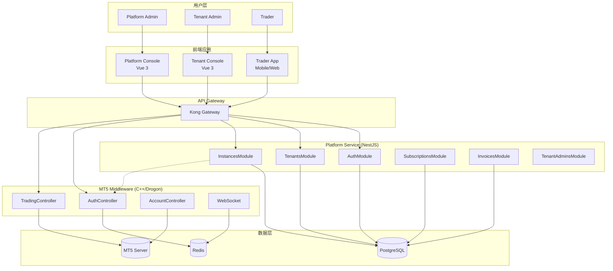
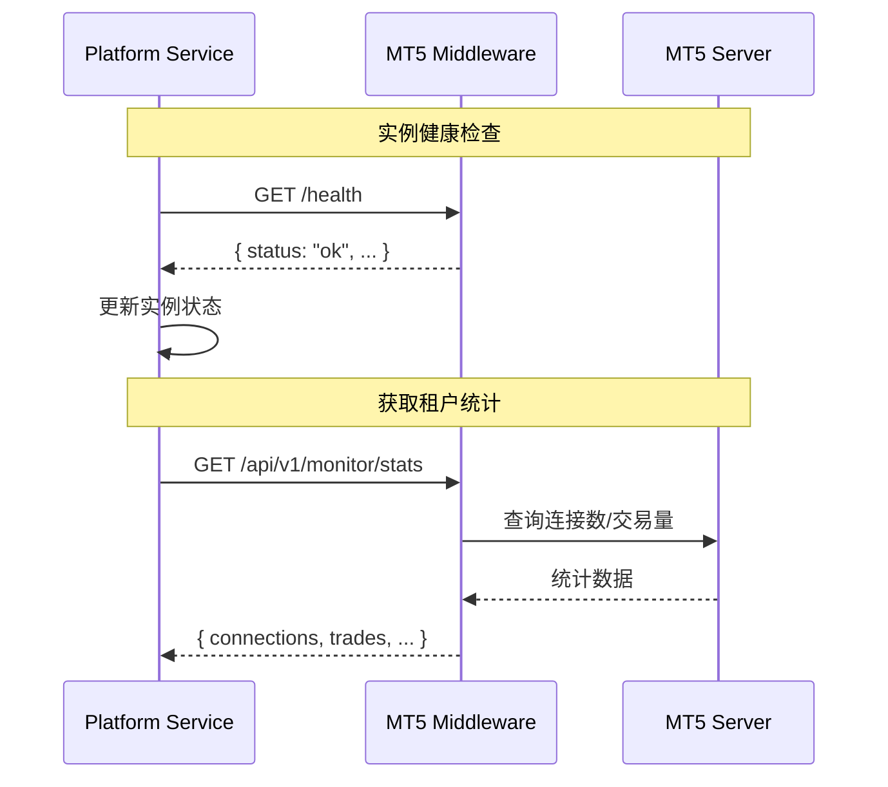

# 设计文档: 平台核心模块

## 概述

本设计文档描述 MT5 Middleware SaaS Platform 核心模块的技术实现方案。平台将与现有的 **MT5 中间件** (C++/Drogon) 集成，实现多租户 SaaS 管理功能。

### 系统定位

```
┌─────────────────────────────────────────────────────────────────────────┐
│                         SaaS Platform (本次开发)                          │
│  ┌─────────────────────────────────────────────────────────────────────┐ │
│  │  Platform Service (NestJS)          Platform Console (Vue 3)        │ │
│  │  - 租户管理                          - 管理界面                       │ │
│  │  - 订阅计费                          - 数据可视化                     │ │
│  │  - 实例管理                                                          │ │
│  └─────────────────────────────────────────────────────────────────────┘ │
└────────────────────────────────────┬────────────────────────────────────┘
                                     │ 集成
┌────────────────────────────────────▼────────────────────────────────────┐
│                    MT5 Middleware (已实现, C++/Drogon)                    │
│  - REST API: 交易、账户、行情                                             │
│  - WebSocket: 实时推送                                                    │
│  - MT5 Manager API 集成                                                   │
│  - PostgreSQL + Redis                                                     │
└─────────────────────────────────────────────────────────────────────────┘
```

### 现有中间件能力

| 模块 | 能力 | API 端点 |
|------|------|----------|
| 认证 | JWT + Refresh Token | `/api/v1/auth/*` |
| 交易 | 市价/挂单/批量/异步 | `/api/v1/trading/*` |
| 账户 | 账户信息/余额/持仓 | `/api/v1/account/*` |
| 行情 | 品种/报价/K线 | `/api/v1/symbols/*`, `/api/v1/market/*` |
| WebSocket | 行情推送/交易推送 | `/ws/market`, `/ws/trading` |

**本次设计目标**:
- 在 Platform Service 层实现多租户管理
- 复用中间件的交易和认证能力
- 添加租户、订阅、账单管理功能

## 技术标准对齐

### 技术栈

| 层级 | 技术选型 | 说明 |
|------|---------|------|
| SaaS 后端 | NestJS 10.x + Prisma 5.x | 租户管理、计费 |
| SaaS 前端 | Vue 3.4 + Arco Design | 管理控制台 |
| 中间件 | C++ / Drogon | 已实现，交易核心 |
| 数据库 | PostgreSQL 15.x | 共享或独立 |
| 缓存 | Redis | 会话、行情缓存 |

### 项目结构

```
mt5-platform/
├── apps/
│   ├── platform-service/        # SaaS 后端 (NestJS)
│   │   ├── src/
│   │   │   ├── common/          # 公共模块 (新增)
│   │   │   │   ├── filters/     # 异常过滤器
│   │   │   │   ├── interceptors/# 响应拦截器
│   │   │   │   └── dto/         # 公共 DTO
│   │   │   ├── modules/
│   │   │   │   ├── auth/        # 认证 (已有)
│   │   │   │   ├── tenants/     # 租户管理 (已有，需扩展)
│   │   │   │   ├── instances/   # 实例管理 (已有，需扩展)
│   │   │   │   ├── subscriptions/ # 订阅计划 (新增)
│   │   │   │   ├── invoices/    # 账单管理 (新增)
│   │   │   │   └── tenant-admins/ # 租户管理员 (新增)
│   │   │   └── prisma/          # Prisma 模块
│   │   └── prisma/
│   │       └── schema.prisma    # 数据模型
│   └── platform-console/        # SaaS 前端 (Vue 3)
│
└── MT5-middleware/              # 已实现的中间件 (独立项目)
    ├── src/
    │   ├── controllers/         # HTTP 控制器
    │   ├── services/            # 业务服务
    │   └── main.cpp
    └── configs/
        └── config.json
```

## 代码复用分析

### Platform Service 现有组件

| 组件 | 路径 | 复用方式 |
|------|------|---------|
| PrismaService | `src/prisma/prisma.service.ts` | 所有模块依赖注入 |
| JwtAuthGuard | `src/modules/auth/guards/jwt-auth.guard.ts` | 所有 API 端点复用 |
| RolesGuard | `src/modules/auth/guards/roles.guard.ts` | 权限控制 |
| TenantsService | `src/modules/tenants/tenants.service.ts` | 扩展白标配置 |
| AuthService | `src/modules/auth/auth.service.ts` | 扩展密码重置 |

### MT5 中间件集成点

| 中间件 API | Platform Service 集成方式 |
|-----------|-------------------------|
| `/api/v1/auth/login` | Trader App 认证透传 |
| `/api/v1/account/info` | 租户统计数据获取 |
| `/health` | 实例健康检查 |
| `/api/v1/monitor/stats` | 实例监控数据 |

## 架构设计

### 整体架构图



### 请求路由策略

```
Kong API Gateway 路由规则:

/api/v1/platform/*     → Platform Service (租户/实例/计费管理)
/api/v1/tenant/*       → Platform Service (租户管理员API)
/api/v1/auth/*         → MT5 Middleware (Trader认证)
/api/v1/trading/*      → MT5 Middleware (交易API)
/api/v1/account/*      → MT5 Middleware (账户API)
/api/v1/symbols/*      → MT5 Middleware (品种API)
/api/v1/market/*       → MT5 Middleware (行情API)
/ws/*                  → MT5 Middleware (WebSocket)
```

### Platform Service 与中间件通信



## 组件与接口设计

### 1. 公共模块 (Common Module) - 新增

#### HttpExceptionFilter
- **用途**: 统一异常响应格式
- **响应格式**:

```typescript
interface ErrorResponse {
  success: false;
  error: {
    code: string;        // 如 TENANT_404_001
    message: string;
    details?: object;
    timestamp: string;
    traceId: string;
  };
}
```

#### ResponseInterceptor
- **用途**: 统一成功响应格式
- **响应格式**:

```typescript
interface SuccessResponse<T> {
  success: true;
  data: T;
  meta?: {
    page?: number;
    limit?: number;
    total?: number;
    totalPages?: number;
  };
}
```

### 2. 租户模块扩展 (Tenants Module)

#### TenantsService 新增方法

```typescript
// 白标配置
updateBranding(id: string, dto: UpdateBrandingDto): Promise<Tenant>

// 状态管理
terminate(id: string): Promise<Tenant>
validateStatusTransition(current: TenantStatus, target: TenantStatus): boolean

// 统计
getTenantStats(id: string): Promise<TenantStatsDto>
```

#### 状态转换规则

```
PENDING → ACTIVE (审核通过)
PENDING → CANCELLED (取消)
ACTIVE → SUSPENDED (暂停)
ACTIVE → EXPIRED (过期)
SUSPENDED → ACTIVE (恢复)
SUSPENDED → CANCELLED (终止)
EXPIRED → ACTIVE (续费)
EXPIRED → CANCELLED (终止)
```

### 3. 实例模块扩展 (Instances Module)

#### InstancesService 新增方法

```typescript
// 健康检查 - 调用中间件 /health 端点
checkHealth(id: string): Promise<HealthCheckResult>

// 配额验证
validateQuota(tenantId: string): Promise<boolean>

// MT5 服务器配置
updateMt5Servers(id: string, servers: Mt5ServerConfig[]): Promise<Instance>

// 获取实例监控数据 - 调用中间件 /api/v1/monitor/stats
getMonitorStats(id: string): Promise<MonitorStatsDto>
```

#### HealthCheckResult 结构

```typescript
interface HealthCheckResult {
  status: 'online' | 'offline' | 'error';
  responseTime: number;      // 毫秒
  mt5Connection: boolean;
  redisConnection: boolean;
  dbConnection: boolean;
  activeConnections: number;
  timestamp: Date;
}
```

### 4. 订阅计划模块 (Subscriptions Module) - 新增

#### SubscriptionsService

```typescript
class SubscriptionsService {
  // 获取所有计划
  getPlans(): Promise<SubscriptionPlan[]>

  // 获取指定计划
  getPlanByName(name: string): Promise<SubscriptionPlan>

  // 变更租户订阅
  changeTenantPlan(tenantId: string, plan: string): Promise<Tenant>

  // 检查降级影响
  checkDowngradeImpact(tenantId: string, targetPlan: string): Promise<DowngradeImpact>
}
```

#### 订阅计划配置

```typescript
const SUBSCRIPTION_PLANS = {
  TRIAL: {
    name: 'Trial',
    price: 0,
    duration: 14,           // 天
    maxInstances: 1,
    maxAdmins: 2,
    maxMt5Servers: 2,
    maxTraders: 100,
    supportLevel: 'basic',
  },
  BASIC: {
    name: 'Basic',
    price: 99,              // USD/月
    maxInstances: 1,
    maxAdmins: 5,
    maxMt5Servers: 2,
    maxTraders: 500,
    supportLevel: 'email',
  },
  PROFESSIONAL: {
    name: 'Professional',
    price: 299,
    maxInstances: 3,
    maxAdmins: 10,
    maxMt5Servers: 5,
    maxTraders: 2000,
    supportLevel: 'priority',
  },
  ENTERPRISE: {
    name: 'Enterprise',
    price: null,            // 定制报价
    maxInstances: -1,       // 无限制
    maxAdmins: -1,
    maxMt5Servers: -1,
    maxTraders: -1,
    supportLevel: 'dedicated',
  },
};
```

### 5. 账单模块 (Invoices Module) - 新增

#### InvoicesService

```typescript
class InvoicesService {
  // 创建账单
  create(tenantId: string, period: BillingPeriod): Promise<Invoice>

  // 查询账单
  findAll(query: InvoiceQueryDto): Promise<PaginatedInvoices>
  findOne(id: string): Promise<Invoice>
  findByTenant(tenantId: string): Promise<Invoice[]>

  // 状态更新
  markAsPaid(id: string): Promise<Invoice>
  cancel(id: string): Promise<Invoice>

  // 生成账单号
  generateInvoiceNo(): string  // INV-YYYYMM-XXXX
}
```

### 6. 租户管理员模块 (TenantAdmins Module) - 新增

#### TenantAdminsService

```typescript
class TenantAdminsService {
  // 创建管理员
  create(tenantId: string, dto: CreateTenantAdminDto): Promise<TenantAdmin>

  // 查询
  findByTenant(tenantId: string): Promise<TenantAdmin[]>
  findOne(id: string): Promise<TenantAdmin>

  // 账号管理
  resetPassword(id: string): Promise<void>
  disable(id: string): Promise<TenantAdmin>
  enable(id: string): Promise<TenantAdmin>
}
```

### 7. 交易数据模块 (Trading Data Module) - 新增

#### TradingDataService

```typescript
class TradingDataService {
  // 全局统计
  getGlobalStats(query: StatsQueryDto): Promise<GlobalTradingStats>

  // 租户交易数据 (调用中间件 API)
  getTenantTradingStats(tenantId: string, query: StatsQueryDto): Promise<TenantTradingStats>

  // 交易记录查询 (调用中间件 API)
  getTradeHistory(query: TradeHistoryQueryDto): Promise<PaginatedTrades>

  // 持仓查询 (调用中间件 API)
  getPositions(tenantId: string, query: PositionQueryDto): Promise<Position[]>

  // 聚合多实例数据
  aggregateInstancesData(instanceIds: string[]): Promise<AggregatedStats>
}
```

#### 数据结构

```typescript
interface GlobalTradingStats {
  totalOrders: number;           // 总订单数
  totalDeals: number;            // 总成交数
  totalVolume: number;           // 总交易量 (手)
  totalProfit: number;           // 总盈亏
  activePositions: number;       // 活跃持仓数
  tenantRanking: {               // 租户排名
    tenantId: string;
    tenantName: string;
    orderCount: number;
    volume: number;
  }[];
  period: {
    from: Date;
    to: Date;
  };
}

interface TradeHistoryQueryDto {
  tenantId?: string;             // 可选，按租户筛选
  symbol?: string;               // 交易品种
  from?: Date;                   // 开始时间
  to?: Date;                     // 结束时间
  page?: number;
  limit?: number;
}
```

#### 中间件 API 调用

```typescript
// 调用中间件获取交易历史
async getTenantTradeHistory(instanceId: string, query: TradeHistoryQueryDto) {
  const instance = await this.instancesService.findOne(instanceId);
  const settings = instance.settings as MiddlewareSettings;

  const response = await this.httpService.get(
    `${settings.apiEndpoint}/api/v1/trading/history/orders`,
    {
      headers: { 'X-API-Key': settings.apiKey },
      params: {
        from: query.from?.getTime(),
        to: query.to?.getTime(),
        symbol: query.symbol,
        page: query.page,
        limit: query.limit,
      },
      timeout: 30000,
    }
  ).toPromise();

  return response.data;
}

// 调用中间件获取监控统计
async getTenantMonitorStats(instanceId: string) {
  const instance = await this.instancesService.findOne(instanceId);
  const settings = instance.settings as MiddlewareSettings;

  const response = await this.httpService.get(
    `${settings.apiEndpoint}/api/v1/monitor/stats`,
    {
      headers: { 'X-API-Key': settings.apiKey },
      timeout: 10000,
    }
  ).toPromise();

  return response.data;
}
```

## 数据模型

### Tenant 模型扩展

```prisma
model Tenant {
  // 现有字段...

  // 白标配置 (新增)
  displayName   String?   // 显示名称
  primaryColor  String?   // 主题色 (#XXXXXX)

  // 关系保持不变
}
```

### 中间件配置模型 (新增)

```typescript
// 存储在 MiddlewareInstance.settings JSON 字段
interface MiddlewareSettings {
  // 中间件连接配置
  apiEndpoint: string;       // 如 http://localhost:8082
  apiKey: string;            // 中间件 API 密钥

  // MT5 服务器配置
  mt5Servers: {
    name: string;
    server: string;          // MT5 服务器地址
    managerLogin: number;
    // managerPassword 加密存储
  }[];

  // 限制配置
  maxConnections: number;
  maxTraders: number;
}
```

## 错误处理

### 错误码定义

| 模块 | 错误码 | HTTP状态 | 描述 |
|------|--------|----------|------|
| AUTH | AUTH_401_001 | 401 | Token无效或已过期 |
| AUTH | AUTH_401_002 | 401 | 用户名或密码错误 |
| AUTH | AUTH_403_002 | 403 | 账号已被禁用 |
| TENANT | TENANT_404_001 | 404 | 租户不存在 |
| TENANT | TENANT_409_001 | 409 | 租户编码已存在 |
| TENANT | TENANT_422_001 | 422 | 租户已过期 |
| TENANT | TENANT_422_002 | 422 | 已达最大实例数限制 |
| TENANT | TENANT_422_003 | 422 | 无效的状态转换 |
| INSTANCE | INSTANCE_404_001 | 404 | 实例不存在 |
| INSTANCE | INSTANCE_422_001 | 422 | 实例健康检查失败 |
| INSTANCE | INSTANCE_422_002 | 422 | 无法连接中间件 |
| INVOICE | INVOICE_404_001 | 404 | 账单不存在 |
| INVOICE | INVOICE_422_001 | 422 | 账单已支付,无法取消 |

## 与中间件集成

### 健康检查集成

```typescript
// InstancesService
async checkHealth(id: string): Promise<HealthCheckResult> {
  const instance = await this.findOne(id);
  const settings = instance.settings as MiddlewareSettings;

  try {
    const response = await this.httpService.get(
      `${settings.apiEndpoint}/health`,
      { timeout: 5000 }
    ).toPromise();

    return {
      status: 'online',
      responseTime: response.config.metadata.duration,
      ...response.data,
      timestamp: new Date(),
    };
  } catch (error) {
    return {
      status: 'offline',
      responseTime: -1,
      timestamp: new Date(),
    };
  }
}
```

### 监控数据获取

```typescript
// InstancesService
async getMonitorStats(id: string): Promise<MonitorStatsDto> {
  const instance = await this.findOne(id);
  const settings = instance.settings as MiddlewareSettings;

  const response = await this.httpService.get(
    `${settings.apiEndpoint}/api/v1/monitor/stats`,
    {
      headers: { 'X-API-Key': settings.apiKey },
      timeout: 10000,
    }
  ).toPromise();

  return response.data;
}
```

## 测试策略

### 单元测试

- **测试框架**: Jest
- **覆盖目标**: 所有 Service 方法
- **Mock**: 中间件 HTTP 调用使用 Mock

### 集成测试

- **测试框架**: Jest + Supertest
- **测试数据库**: PostgreSQL (测试实例)
- **中间件**: 使用 Mock Server 或测试实例

### 关键测试场景

1. 租户生命周期: 创建 → 激活 → 暂停 → 恢复 → 终止
2. 实例健康检查: 在线/离线状态检测
3. 订阅升降级: 配额验证和影响检查
4. 账单流程: 生成 → 支付 → 状态更新

## API 端点汇总

### Platform Admin API

| 方法 | 端点 | 描述 |
|------|------|------|
| POST | `/api/v1/platform/auth/login` | 平台管理员登录 |
| GET | `/api/v1/platform/tenants` | 租户列表 |
| POST | `/api/v1/platform/tenants` | 创建租户 |
| GET | `/api/v1/platform/tenants/:id` | 租户详情 |
| PATCH | `/api/v1/platform/tenants/:id` | 更新租户 |
| PATCH | `/api/v1/platform/tenants/:id/branding` | 更新白标 |
| POST | `/api/v1/platform/tenants/:id/activate` | 激活租户 |
| POST | `/api/v1/platform/tenants/:id/suspend` | 暂停租户 |
| POST | `/api/v1/platform/tenants/:id/terminate` | 终止租户 |
| GET | `/api/v1/platform/instances` | 实例列表 |
| POST | `/api/v1/platform/instances` | 创建实例 |
| GET | `/api/v1/platform/instances/:id` | 实例详情 |
| POST | `/api/v1/platform/instances/:id/health-check` | 健康检查 |
| GET | `/api/v1/platform/subscriptions/plans` | 订阅计划列表 |
| POST | `/api/v1/platform/tenants/:id/subscription` | 变更订阅 |
| GET | `/api/v1/platform/invoices` | 账单列表 |
| POST | `/api/v1/platform/invoices` | 创建账单 |
| POST | `/api/v1/platform/invoices/:id/pay` | 标记已支付 |

### Tenant Admin API

| 方法 | 端点 | 描述 |
|------|------|------|
| POST | `/api/v1/tenant/auth/login` | 租户管理员登录 |
| GET | `/api/v1/tenant/profile` | 租户信息 |
| GET | `/api/v1/tenant/admins` | 管理员列表 |
| POST | `/api/v1/tenant/admins` | 创建管理员 |
| POST | `/api/v1/tenant/admins/:id/reset-password` | 重置密码 |

### Trader API (透传到中间件)

| 方法 | 端点 | 描述 |
|------|------|------|
| POST | `/api/v1/auth/login` | Trader 登录 (MT5) |
| GET | `/api/v1/account/info` | 账户信息 |
| POST | `/api/v1/trading/orders/market` | 市价下单 |
| GET | `/ws/trading` | 交易 WebSocket |
| GET | `/ws/market` | 行情 WebSocket |
