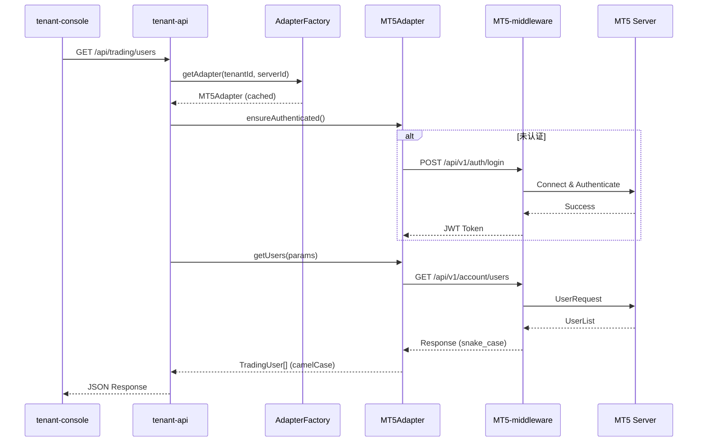

# Design Document: SaaS Middleware Integration

## Overview

本设计文档描述SaaS多租户平台与MT5中间件的完整集成方案。系统采用适配器模式实现多平台支持（MT5/MT4），通过工厂模式管理适配器实例，使用熔断器保护系统稳定性。

### 系统边界

```
┌─────────────────────────────────────────────────────────────────────────┐
│                         tenant-console (Vue.js)                         │
│                              前端控制台                                  │
└─────────────────────────────────┬───────────────────────────────────────┘
                                  │ REST API
                                  ▼
┌─────────────────────────────────────────────────────────────────────────┐
│                          tenant-api (NestJS)                            │
│  ┌──────────────┐  ┌──────────────┐  ┌──────────────────────────────┐  │
│  │ TenantModule │  │ TradingModule│  │   MiddlewareProxyModule      │  │
│  │              │  │              │  │  ┌────────────────────────┐  │  │
│  │ MT服务器配置  │  │  交易数据API │  │  │   TradingService      │  │  │
│  │    CRUD      │  │              │  │  │   (多租户路由)         │  │  │
│  └──────────────┘  └──────────────┘  │  └────────────────────────┘  │  │
│                                      │  ┌────────────────────────┐  │  │
│                                      │  │   AdapterFactory       │  │  │
│                                      │  │   (适配器工厂)         │  │  │
│                                      │  └────────────────────────┘  │  │
│                                      │  ┌─────────┐ ┌─────────┐    │  │
│                                      │  │MT5Adapter│ │MT4Adapter│   │  │
│                                      │  └─────────┘ └─────────┘    │  │
│                                      └──────────────────────────────┘  │
└─────────────────────────────────────┬───────────────────────────────────┘
                                      │ HTTP/REST
                                      ▼
┌─────────────────────────────────────────────────────────────────────────┐
│                       MT5-middleware (C++ Drogon)                       │
│  ┌────────────────┐  ┌────────────────┐  ┌────────────────────────┐   │
│  │ AuthController │  │ UsersController│  │ MarketDataController   │   │
│  │ /api/v1/auth   │  │/api/v1/account │  │   /api/v1/symbols      │   │
│  └────────────────┘  └────────────────┘  └────────────────────────┘   │
│                              │                                          │
│                              ▼                                          │
│                    ┌──────────────────┐                                │
│                    │   MT5 Manager    │                                │
│                    │   (MT5 API SDK)  │                                │
│                    └────────┬─────────┘                                │
└─────────────────────────────┼───────────────────────────────────────────┘
                              │ MT5 Protocol
                              ▼
                    ┌──────────────────┐
                    │   MT5 Server     │
                    │   (MetaTrader)   │
                    └──────────────────┘
```

## Code Reuse Analysis

### Existing Components to Leverage

| 组件 | 位置 | 用途 |
|-----|------|------|
| **MtServerService** | `middleware-proxy/services/mt-server.service.ts` | MT服务器配置CRUD，密码加密 |
| **AdapterFactory** | `middleware-proxy/adapters/adapter.factory.ts` | 适配器实例管理，熔断器 |
| **MT5Adapter** | `middleware-proxy/adapters/mt5.adapter.ts` | MT5 API调用实现 |
| **MT4Adapter** | `middleware-proxy/adapters/mt4.adapter.ts` | MT4 API调用实现 |
| **TradingService** | `middleware-proxy/services/trading.service.ts` | 多租户路由，交易数据获取 |
| **TenantController** | `tenant/tenant.controller.ts` | 租户管理API |

### Integration Points

| 集成点 | 现有实现 | 待补充 |
|-------|---------|--------|
| **数据库** | Prisma + MtServer模型 | 无需修改 |
| **认证** | JWT令牌缓存 | 令牌刷新机制完善 |
| **适配器** | MT5/MT4适配器 | 连接测试端点 |
| **前端** | tenant-console | MT服务器管理页面 |

## Architecture

### Modular Design Principles

- **Single File Responsibility**: 每个服务/适配器文件只负责单一职责
- **Component Isolation**: 适配器与服务层分离，易于单独测试
- **Service Layer Separation**: Controller → Service → Adapter → 中间件
- **Utility Modularity**: 加密、响应转换等工具独立封装

### 数据流架构



## Components and Interfaces

### Component 1: MtServerController (新增)

- **Purpose:** 提供MT服务器配置的REST API端点
- **Interfaces:**
  ```typescript
  GET    /api/mt-servers              // 获取服务器列表
  GET    /api/mt-servers/:serverId    // 获取单个服务器
  POST   /api/mt-servers              // 创建服务器
  PUT    /api/mt-servers/:serverId    // 更新服务器
  DELETE /api/mt-servers/:serverId    // 删除服务器
  POST   /api/mt-servers/:serverId/test-connection  // 测试连接
  POST   /api/mt-servers/:serverId/set-default      // 设置默认
  ```
- **Dependencies:** MtServerService, TradingService
- **Reuses:** JwtAuthGuard, TenantContext装饰器

### Component 2: MtServerService (已实现，需扩展)

- **Purpose:** MT服务器配置的业务逻辑
- **Interfaces:**
  ```typescript
  getServers(tenantId): Promise<MtServerListResponseDto>
  getServer(tenantId, serverId): Promise<MtServerDto>
  createServer(tenantId, dto): Promise<MtServerDto>
  updateServer(tenantId, serverId, dto): Promise<MtServerDto>
  deleteServer(tenantId, serverId): Promise<void>
  testConnection(tenantId, serverId): Promise<ConnectionTestResult> // 新增
  ```
- **Dependencies:** PrismaService, AdapterFactory
- **Reuses:** 现有加密工具

### Component 3: TradingService (已实现，需完善)

- **Purpose:** 多租户交易数据路由
- **Interfaces:**
  ```typescript
  getAdapter(ctx: TenantContext): Promise<TradingPlatformAdapter>
  authenticate(ctx): Promise<string>
  getUsers(ctx, params): Promise<PaginatedResult<TradingUser>>
  getPositions(ctx, params): Promise<TradingPosition[]>
  getOrders(ctx, params): Promise<TradingOrder[]>
  getQuotes(ctx, symbols): Promise<TradingQuote[]>
  ```
- **Dependencies:** MtServerService, AdapterFactory
- **Reuses:** 现有适配器缓存机制

### Component 4: AdapterFactory (已实现)

- **Purpose:** 适配器实例管理，熔断器保护
- **Interfaces:**
  ```typescript
  getAdapter(config: MtServerConfig): Promise<TradingPlatformAdapter>
  removeAdapter(tenantId, serverId): Promise<boolean>
  removeAdaptersByTenant(tenantId): Promise<number>
  isCircuitBreakerOpen(tenantId, serverId): boolean
  recordSuccess(tenantId, serverId): void
  recordFailure(tenantId, serverId): void
  ```
- **Dependencies:** HttpService
- **Reuses:** 现有熔断器逻辑

### Component 5: MT5Adapter / MT4Adapter (已实现)

- **Purpose:** 平台特定的API调用实现
- **Interfaces:**
  ```typescript
  authenticate(login, password): Promise<string>
  refreshToken(): Promise<string>
  getUsers(params): Promise<PaginatedResult<TradingUser>>
  getPositions(params): Promise<TradingPosition[]>
  getOrders(params): Promise<TradingOrder[]>
  getSymbols(params): Promise<TradingSymbol[]>
  getQuote(symbol): Promise<TradingQuote>
  testConnection(): Promise<boolean>
  getServerStatus(): Promise<ServerStatus>
  ```
- **Dependencies:** HttpService
- **Reuses:** TradingPlatformAdapter基类

## Data Models

### MtServer (Prisma Model - 已存在)

```prisma
model MtServer {
  id                       String       @id @default(uuid())
  tenantId                 String       @map("tenant_id")
  serverId                 String       @map("server_id")
  displayName              String?      @map("display_name")
  platformType             PlatformType @default(MT5)
  middlewareUrl            String       @map("middleware_url")
  serverAddress            String       @map("server_address")
  managerLogin             BigInt       @map("manager_login")
  managerPasswordEncrypted String       @map("manager_password_encrypted")
  isActive                 Boolean      @default(true)
  isDefault                Boolean      @default(false)
  createdAt                DateTime     @default(now())
  updatedAt                DateTime     @updatedAt

  tenant                   Tenant       @relation(fields: [tenantId], references: [id])

  @@unique([tenantId, serverId])
  @@map("mt_servers")
}
```

### ConnectionTestResult (新增DTO)

```typescript
interface ConnectionTestResult {
  success: boolean;
  serverTime?: Date;
  version?: string;
  connectedUsers?: number;
  latencyMs: number;
  error?: {
    code: string;
    message: string;
  };
}
```

### API契约映射表

| tenant-api 字段 | MT5中间件字段 | 说明 |
|----------------|---------------|------|
| `marginFree` | `margin_free` | 驼峰 ↔ 下划线转换 |
| `openPrice` | `open_price` | |
| `currentPrice` | `current_price` | |
| `openTime` | `open_time` | |
| `timeSetup` | `time_setup` | |
| `timeDone` | `time_done` | |
| `contractSize` | `contract_size` | |
| `tickSize` | `tick_size` | |
| `volumeMin` | `volume_min` | |
| `volumeMax` | `volume_max` | |
| `volumeStep` | `volume_step` | |

## Error Handling

### Error Scenarios

1. **中间件连接失败**
   - **Handling:** 熔断器记录失败，超过阈值(5次)后熔断30秒
   - **User Impact:** 显示"MT服务器暂时不可用，请稍后重试"

2. **认证失败**
   - **Handling:** 清除缓存令牌，返回401错误
   - **User Impact:** 显示"服务器凭证无效，请检查管理员登录名和密码"

3. **请求超时**
   - **Handling:** 配置5秒超时，超时后返回504
   - **User Impact:** 显示"请求超时，请检查网络连接"

4. **数据格式不匹配**
   - **Handling:** 转换层捕获异常，记录详细日志
   - **User Impact:** 显示"数据处理错误"，日志包含完整错误信息

5. **熔断器打开**
   - **Handling:** 直接返回503，不发起实际请求
   - **User Impact:** 显示"服务正在恢复中，请30秒后重试"

### 错误码映射

| 中间件错误码 | tenant-api错误码 | HTTP状态 |
|-------------|-----------------|---------|
| `AUTH_FAILED` | `MIDDLEWARE_AUTH_FAILED` | 401 |
| `USER_NOT_FOUND` | `TRADING_USER_NOT_FOUND` | 404 |
| `SERVER_UNAVAILABLE` | `MIDDLEWARE_UNAVAILABLE` | 503 |
| `RATE_LIMITED` | `MIDDLEWARE_RATE_LIMITED` | 429 |
| `INVALID_REQUEST` | `MIDDLEWARE_INVALID_REQUEST` | 400 |

## Testing Strategy

### Unit Testing

- **MtServerService**: 测试CRUD操作、密码加密/解密、默认服务器逻辑
- **AdapterFactory**: 测试适配器缓存、熔断器状态转换
- **MT5Adapter**: 测试数据转换、错误处理（使用Mock HTTP）
- **TradingService**: 测试多租户路由、认证流程

### Integration Testing

- **API端点测试**: 使用Supertest测试Controller端点
- **数据库测试**: 使用测试数据库验证Prisma操作
- **Mock中间件测试**: 使用MSW模拟中间件响应

### End-to-End Testing

- **完整流程测试**:
  1. 创建MT服务器配置
  2. 测试连接
  3. 获取用户列表
  4. 获取持仓数据
  5. 获取实时行情

- **Mock服务器**: 实现轻量级Mock服务器模拟中间件响应
- **真实服务器测试**: 可选模式，需要真实MT5服务器

### 测试覆盖率目标

| 模块 | 目标覆盖率 |
|-----|-----------|
| MtServerService | 90% |
| AdapterFactory | 85% |
| MT5Adapter | 80% |
| TradingService | 85% |
| Controllers | 80% |

## 前端集成设计

### 页面结构

```
tenant-console/
├── src/views/
│   ├── mt-servers/
│   │   ├── MtServerList.vue       // 服务器列表页
│   │   ├── MtServerForm.vue       // 添加/编辑表单
│   │   └── MtServerDetail.vue     // 服务器详情
│   └── trading/
│       ├── TradingUsers.vue       // 交易用户列表
│       ├── TradingPositions.vue   // 持仓列表
│       └── TradingQuotes.vue      // 实时行情
├── src/api/
│   ├── mt-servers.ts              // MT服务器API
│   └── trading.ts                 // 交易数据API (已存在)
└── src/stores/
    └── mt-servers.ts              // MT服务器状态管理
```

### API调用示例

```typescript
// api/mt-servers.ts
export const mtServersApi = {
  getServers: () => request.get('/api/mt-servers'),
  createServer: (data: CreateMtServerDto) => request.post('/api/mt-servers', data),
  testConnection: (serverId: string) => request.post(`/api/mt-servers/${serverId}/test-connection`),
  setDefault: (serverId: string) => request.post(`/api/mt-servers/${serverId}/set-default`),
};
```
