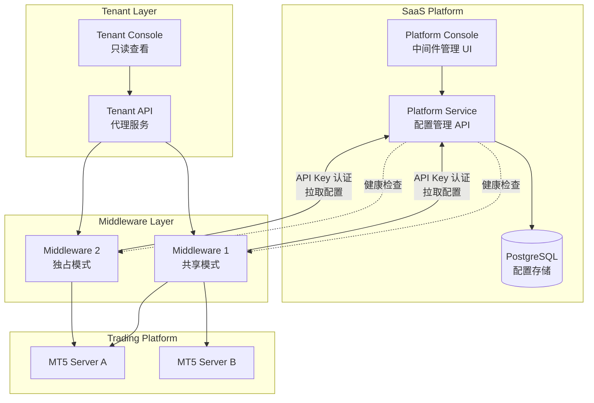
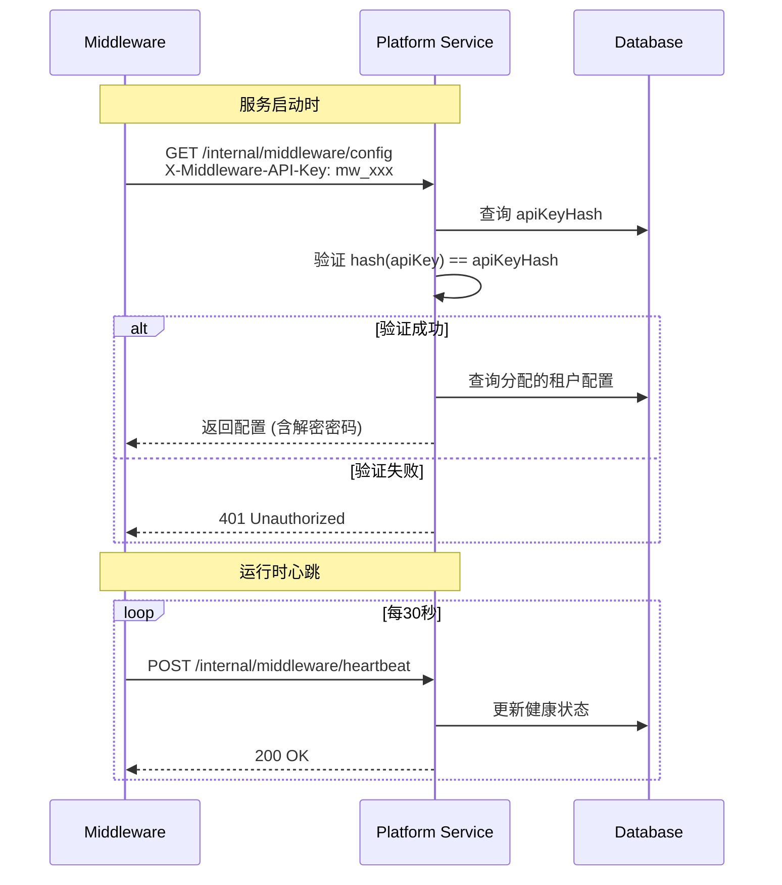

# Design Document: SaaS Middleware Management

## Overview

本设计文档描述 SaaS 中间件管理功能的技术架构。核心目标是将 MT5 服务器和中间件的管理权限从租户层面提升到 SaaS 平台层面，实现集中化管理、动态配置和健康监控。

## Steering Document Alignment

### Technical Standards (tech.md)
- 遵循 NestJS 模块化架构
- 使用 Prisma ORM 进行数据库操作
- JWT 认证 + API Key 服务间认证
- Vue 3 + TypeScript 前端架构

### Project Structure (structure.md)
- Platform Service: 新增 `middleware` 和 `mt-server-config` 模块
- Platform Console: 新增中间件管理页面
- Tenant Console: MT 服务器页面改为只读模式

## Code Reuse Analysis

### Existing Components to Leverage
- **PrismaService**: 数据库访问层，复用现有 Prisma 模块
- **JwtAuthGuard**: 平台管理员认证，复用现有 JWT 策略
- **ResponseInterceptor**: 统一响应格式，复用现有拦截器
- **HttpExceptionFilter**: 异常处理，复用现有过滤器
- **EncryptionService**: 密码加密，复用或扩展现有安全模块

### Integration Points
- **MiddlewareInstance 表**: 扩展现有数据模型，添加 API Key 和分配模式
- **MtServer 表**: 复用现有模型，添加关联到中间件实例
- **Tenant 表**: 添加中间件分配关系
- **Platform Service API**: 新增中间件管理端点
- **Middleware HTTP API**: 新增配置拉取端点

---

## Architecture

### 系统架构图



### 模块化设计原则

- **Single File Responsibility**: 每个文件处理单一职责
  - `middleware.controller.ts`: 中间件 CRUD API
  - `middleware.service.ts`: 中间件业务逻辑
  - `middleware-health.service.ts`: 健康检查逻辑
  - `mt-server-config.service.ts`: MT 服务器配置管理

- **Component Isolation**: 独立模块
  - `MiddlewareModule`: 中间件管理
  - `MtServerConfigModule`: MT 服务器配置
  - `MiddlewareAssignmentModule`: 分配策略

- **Service Layer Separation**: 分层
  - Controller: HTTP 端点定义
  - Service: 业务逻辑
  - Repository: 数据访问 (通过 Prisma)

---

## Components and Interfaces

### Component 1: MiddlewareModule (Platform Service)

- **Purpose:** 中间件实例的 CRUD 管理和健康监控
- **Location:** `apps/platform-service/src/modules/middleware/`
- **Interfaces:**
  ```typescript
  // Controller Endpoints
  GET    /api/v1/platform/middleware           // 列表
  POST   /api/v1/platform/middleware           // 创建
  GET    /api/v1/platform/middleware/:id       // 详情
  PUT    /api/v1/platform/middleware/:id       // 更新
  DELETE /api/v1/platform/middleware/:id       // 删除
  GET    /api/v1/platform/middleware/:id/health // 健康状态
  POST   /api/v1/platform/middleware/:id/test  // 测试连接
  ```
- **Dependencies:** PrismaService, EncryptionService, HttpService
- **Reuses:** 现有的 JwtAuthGuard, ResponseInterceptor

### Component 2: MtServerConfigModule (Platform Service)

- **Purpose:** 为租户配置 MT5 服务器连接信息
- **Location:** `apps/platform-service/src/modules/mt-server-config/`
- **Interfaces:**
  ```typescript
  // Controller Endpoints
  GET    /api/v1/platform/tenants/:tenantId/mt-servers       // 租户的MT服务器列表
  POST   /api/v1/platform/tenants/:tenantId/mt-servers       // 添加MT服务器
  PUT    /api/v1/platform/tenants/:tenantId/mt-servers/:id   // 更新MT服务器
  DELETE /api/v1/platform/tenants/:tenantId/mt-servers/:id   // 删除MT服务器
  ```
- **Dependencies:** PrismaService, EncryptionService
- **Reuses:** 现有的 MtServer Prisma Model

### Component 3: MiddlewareAssignmentModule (Platform Service)

- **Purpose:** 中间件与租户的分配管理
- **Location:** `apps/platform-service/src/modules/middleware-assignment/`
- **Interfaces:**
  ```typescript
  // Controller Endpoints
  GET    /api/v1/platform/middleware/:id/tenants        // 中间件已分配的租户
  POST   /api/v1/platform/middleware/:id/assign         // 分配租户
  DELETE /api/v1/platform/middleware/:id/unassign/:tenantId // 取消分配
  GET    /api/v1/platform/tenants/:tenantId/middleware  // 租户的中间件
  ```
- **Dependencies:** PrismaService, MiddlewareService

### Component 4: MiddlewareConfigAPI (Platform Service)

- **Purpose:** 供中间件拉取配置的 API (服务间认证)
- **Location:** `apps/platform-service/src/modules/middleware-config/`
- **Interfaces:**
  ```typescript
  // Controller Endpoints (API Key Auth)
  GET    /api/v1/internal/middleware/config   // 获取配置
  POST   /api/v1/internal/middleware/heartbeat // 心跳上报
  ```
- **Dependencies:** PrismaService, ApiKeyGuard
- **Authentication:** API Key (Header: X-Middleware-API-Key)

### Component 5: MiddlewareManagementPage (Platform Console)

- **Purpose:** 中间件管理界面
- **Location:** `apps/platform-console/src/views/middleware/`
- **Interfaces:**
  - `MiddlewareListPage.vue`: 中间件列表
  - `MiddlewareDetailPage.vue`: 中间件详情和健康状态
  - `MiddlewareFormModal.vue`: 添加/编辑中间件
- **Dependencies:** API Client, Pinia Store

### Component 6: TenantMtServerReadOnlyPage (Tenant Console)

- **Purpose:** 租户查看 MT 服务器配置 (只读)
- **Location:** `apps/tenant-console/src/views/mt-servers/` (修改现有)
- **Changes:**
  - 移除添加/编辑/删除按钮
  - 显示只读服务器信息
  - 未配置时显示提示信息

---

## Data Models

### Model 1: Middleware (扩展现有 MiddlewareInstance)

```prisma
model Middleware {
  id                String   @id @default(uuid())
  name              String   // 中间件名称
  description       String?  // 描述
  url               String   // 中间件 URL (e.g., http://192.168.1.100:8083)
  apiKey            String   @unique // API Key (用于服务间认证)
  apiKeyHash        String   // API Key 哈希 (用于验证)

  // 分配模式
  assignmentMode    AssignmentMode @default(SHARED) // SHARED | DEDICATED
  maxTenants        Int      @default(10) // 最大租户数 (共享模式)

  // 健康状态
  status            MiddlewareStatus @default(UNKNOWN)
  lastHeartbeat     DateTime?
  serverIp          String?  // 中间件服务器IP
  activeSessions    Int      @default(0)
  memoryUsage       Float?   // 内存使用率 (%)
  cpuUsage          Float?   // CPU使用率 (%)
  cacheStatus       Json?    // 缓存状态 { redisConnected, hitRate }

  // 时间戳
  createdAt         DateTime @default(now())
  updatedAt         DateTime @updatedAt

  // 关系
  assignments       MiddlewareAssignment[]

  @@map("middlewares")
}

enum AssignmentMode {
  SHARED     // 多租户共享
  DEDICATED  // 单租户独占
}

enum MiddlewareStatus {
  ONLINE
  OFFLINE
  DEGRADED
  UNKNOWN
}
```

### Model 2: MiddlewareAssignment (中间件-租户分配)

```prisma
model MiddlewareAssignment {
  id            String     @id @default(uuid())
  middlewareId  String
  tenantId      String
  assignedAt    DateTime   @default(now())
  assignedBy    String     // 分配人 (platform admin id)

  // 关系
  middleware    Middleware @relation(fields: [middlewareId], references: [id])
  tenant        Tenant     @relation(fields: [tenantId], references: [id])

  @@unique([middlewareId, tenantId])
  @@map("middleware_assignments")
}
```

### Model 3: MtServer (扩展现有)

```prisma
model MtServer {
  id                      String   @id @default(uuid())
  tenantId                String
  serverId                String   // 唯一标识 (e.g., main-server)
  displayName             String
  platformType            PlatformType @default(MT5)
  serverAddress           String   // MT服务器地址:端口
  managerLogin            String   // 管理员登录
  managerPasswordEncrypted String  // 加密的密码
  isActive                Boolean  @default(true)
  isDefault               Boolean  @default(false)

  // 新增: 配置版本用于变更通知
  configVersion           Int      @default(1)
  lastModifiedAt          DateTime @default(now())
  lastModifiedBy          String?  // platform admin id

  // 关系
  tenant                  Tenant   @relation(fields: [tenantId], references: [id])

  @@unique([tenantId, serverId])
  @@map("mt_servers")
}
```

### Model 4: Tenant (扩展现有)

```prisma
model Tenant {
  // ... 现有字段 ...

  // 新增关系
  middlewareAssignments   MiddlewareAssignment[]

  // ... 其他关系 ...
}
```

---

## API Specifications

### 中间件管理 API

#### POST /api/v1/platform/middleware
创建中间件实例

**Request:**
```json
{
  "name": "Middleware-01",
  "description": "Production middleware for small tenants",
  "url": "http://192.168.1.100:8083",
  "assignmentMode": "SHARED",
  "maxTenants": 10
}
```

**Response:**
```json
{
  "success": true,
  "data": {
    "id": "uuid-xxx",
    "name": "Middleware-01",
    "url": "http://192.168.1.100:8083",
    "apiKey": "mw_xxxxxxxxxxxxxxxxxxxxxxxxxxxxxxxx",
    "assignmentMode": "SHARED",
    "maxTenants": 10,
    "status": "UNKNOWN"
  }
}
```

#### GET /api/v1/platform/middleware/:id/health
获取中间件健康状态

**Response:**
```json
{
  "success": true,
  "data": {
    "status": "ONLINE",
    "serverIp": "192.168.1.100",
    "lastHeartbeat": "2024-01-15T10:30:00Z",
    "activeSessions": 25,
    "memoryUsage": 45.2,
    "cpuUsage": 12.5,
    "cacheStatus": {
      "redisConnected": true,
      "hitRate": 0.85
    }
  }
}
```

### 配置拉取 API (服务间)

#### GET /api/v1/internal/middleware/config
中间件拉取配置

**Request Headers:**
```
X-Middleware-API-Key: mw_xxxxxxxxxxxxxxxxxxxxxxxxxxxxxxxx
```

**Response:**
```json
{
  "success": true,
  "data": {
    "middlewareId": "uuid-xxx",
    "tenants": [
      {
        "tenantId": "tenant-uuid-1",
        "tenantCode": "company-a",
        "servers": [
          {
            "serverId": "main-server",
            "platformType": "MT5",
            "serverAddress": "mt5.broker.com:443",
            "managerLogin": "1001",
            "managerPassword": "decrypted-password",
            "isDefault": true
          }
        ]
      },
      {
        "tenantId": "tenant-uuid-2",
        "tenantCode": "company-b",
        "servers": [...]
      }
    ],
    "configVersion": 5,
    "lastUpdated": "2024-01-15T10:00:00Z"
  }
}
```

#### POST /api/v1/internal/middleware/heartbeat
中间件心跳上报

**Request Headers:**
```
X-Middleware-API-Key: mw_xxxxxxxxxxxxxxxxxxxxxxxxxxxxxxxx
```

**Request:**
```json
{
  "serverIp": "192.168.1.100",
  "activeSessions": 25,
  "memoryUsage": 45.2,
  "cpuUsage": 12.5,
  "cacheStatus": {
    "redisConnected": true,
    "hitRate": 0.85
  }
}
```

---

## Security Design

### API Key 认证机制



### 密码加密

- **加密算法**: AES-256-GCM
- **密钥管理**: 使用环境变量 `MT_PASSWORD_ENCRYPTION_KEY`
- **存储**: 数据库存储 IV + 密文
- **解密**: 仅在中间件拉取配置时解密

### API Key 生成

```typescript
// 生成规则: mw_ + 32字符随机字符串
const apiKey = `mw_${crypto.randomBytes(24).toString('base64url')}`;
// 存储: hash(apiKey) 使用 SHA-256
```

---

## Error Handling

### Error Scenarios

1. **中间件连接失败**
   - **Handling:** 健康检查标记为 OFFLINE，记录错误日志
   - **User Impact:** UI 显示红色离线状态，管理员可查看错误详情

2. **API Key 无效**
   - **Handling:** 返回 401 Unauthorized
   - **User Impact:** 中间件无法获取配置，需要管理员重新配置

3. **删除已分配中间件**
   - **Handling:** 返回 400 Bad Request，提示先取消分配
   - **User Impact:** 显示错误消息，列出已分配租户

4. **配置租户无中间件**
   - **Handling:** 分配时检查，警告管理员
   - **User Impact:** 租户管理页面显示警告图标

5. **中间件达到租户上限**
   - **Handling:** 分配时检查 maxTenants 限制
   - **User Impact:** 显示错误消息，建议使用其他中间件

---

## Testing Strategy

### Unit Testing

- **Service 层测试**: 使用 Jest + Mock PrismaService
- **关键测试点**:
  - API Key 生成和验证
  - 密码加密/解密
  - 分配逻辑 (容量检查、独占模式)
  - 健康状态更新

### Integration Testing

- **API 端点测试**: 使用 supertest
- **关键测试流程**:
  - 创建中间件 → 获取列表 → 更新 → 删除
  - 分配租户 → 检查配置 → 取消分配
  - 模拟心跳 → 验证状态更新

### End-to-End Testing

- **关键场景**:
  - 管理员创建中间件并分配租户
  - 中间件使用 API Key 拉取配置
  - 租户控制台查看只读 MT 服务器信息
  - 健康状态实时更新显示

---

## Migration Plan

### Phase 1: 数据库迁移
1. 创建 `middlewares` 表
2. 创建 `middleware_assignments` 表
3. 扩展 `mt_servers` 表 (添加 configVersion, lastModifiedBy)
4. 迁移现有 MiddlewareInstance 数据

### Phase 2: Platform Service API
1. 实现 MiddlewareModule
2. 实现 MtServerConfigModule
3. 实现 MiddlewareAssignmentModule
4. 实现 MiddlewareConfigAPI (服务间)

### Phase 3: Platform Console UI
1. 中间件列表页面
2. 中间件详情/健康页面
3. MT 服务器配置页面 (在租户详情中)
4. 分配管理界面

### Phase 4: Tenant Console 调整
1. 移除 MT 服务器编辑功能
2. 改为只读显示
3. 添加"联系管理员"提示

### Phase 5: 中间件适配
1. 中间件增加配置拉取功能
2. 中间件增加心跳上报功能
3. 中间件支持动态配置刷新
