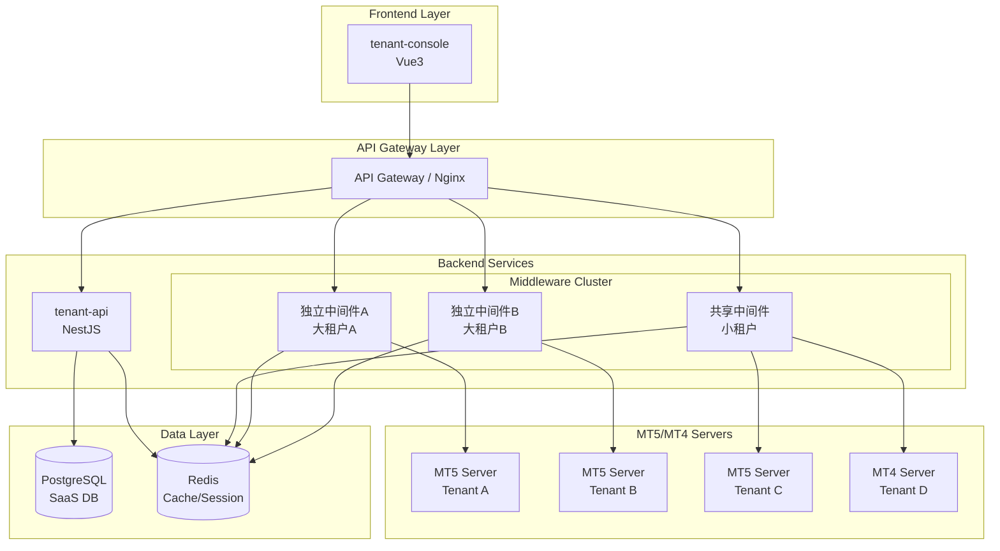
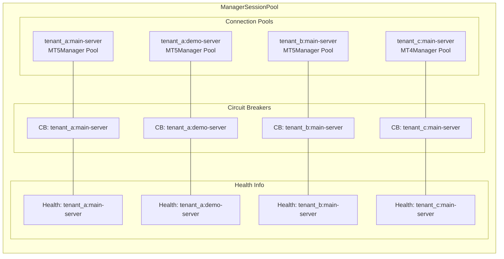
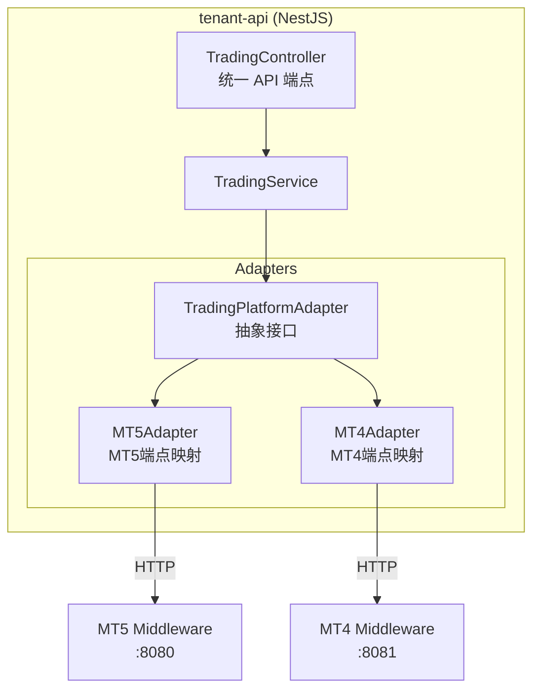

# Design Document: SaaS Multi-Tenant Architecture

## Overview

本设计文档描述 MT5 SaaS 平台的多租户架构升级，核心目标是：
1. 实现租户级别的连接池和熔断器隔离
2. 支持混合部署（大租户独立/小租户共享）
3. 提供完整的用户管理 API
4. **支持 MT4/MT5 多平台接入（通过 TypeScript 适配层）**

## 架构核心原则

**重要说明：** MT4 中间件和 MT5 中间件是两个**独立的 C++ 程序**，各自独立部署运行。
- C++ 中间件代码：仅需支持多租户，**不需要抽象层**
- TypeScript 层（tenant-api）：负责多平台适配和统一 API

## Steering Document Alignment

### Technical Standards
- **C++ 层**：C++ 17 标准，Drogon Framework，spdlog 日志
- **TypeScript 层**：NestJS，TypeScript 5.x，Prisma ORM

### Project Structure
```
mt5-platform/
├── apps/
│   └── tenant-api/                    # NestJS 后端
│       └── src/
│           ├── trading/               # 新增：交易平台模块
│           │   ├── adapters/          # MT4/MT5 适配器
│           │   │   ├── trading-platform.adapter.ts
│           │   │   ├── mt5.adapter.ts
│           │   │   └── mt4.adapter.ts
│           │   ├── trading.service.ts
│           │   └── trading.controller.ts
│           └── tenant/                # 租户管理模块
│
MT5-middleware/                        # MT5 中间件（独立程序）
├── include/
│   ├── services/
│   │   ├── MT5ManagerSessionPool.h    # 重命名+修改：多租户支持
│   │   └── MT5Manager.h               # 保持不变
│   └── controllers/
│       ├── UsersController.h          # 新增：用户管理
│       └── HealthController.h         # 新增：健康检查
│
MT4-middleware/                        # MT4 中间件（独立程序，已实现）
└── ...                                # 保持不变
```

## Code Reuse Analysis

### Existing Components to Leverage
- **CircuitBreaker**: 已实现完整的熔断器，需要按租户粒度实例化
- **ManagerSessionPool → MT5ManagerSessionPool**: 重命名并扩展支持 `tenant_id:server_id` Key
- **MT5Manager**: 已有 MT5 API 封装，**保持不变**
- **MT4-middleware**: 已实现的 MT4 中间件，**保持不变**（含 MT4ManagerSessionPool）
- **ResponseBuilder**: 复用现有响应构建模式
- **JWTFilter**: 扩展以提取 `tenant_id`

### Integration Points
- **tenant-api (NestJS)**: JWT 签发时携带 `tenant_id`、`server_id`、`platform_type`
- **Redis**: 存储租户配置缓存和会话数据
- **PostgreSQL (SaaS DB)**: 存储租户和服务器配置（含 platform_type）

---

## Architecture

### 整体架构图



### 多租户连接池架构



---

## 核心设计：TypeScript 平台适配层

### 设计原则

MT4 和 MT5 中间件是**独立的 C++ 程序**，API 端点和字段有差异。
通过 TypeScript 适配层实现统一 API，**不修改任何中间件代码**。

### 适配器架构



### TradingPlatformAdapter 接口 (TypeScript)

```typescript
// apps/tenant-api/src/trading/adapters/trading-platform.adapter.ts

export enum PlatformType {
  MT5 = 'MT5',
  MT4 = 'MT4',
}

// 统一用户模型（对外暴露）
export interface TradingUser {
  login: number;
  name: string;
  group: string;
  email: string;
  phone: string;
  leverage: number;
  balance: number;
  equity: number;
  margin: number;
  marginFree: number;
  isEnabled: boolean;
  registrationTime: Date;
  lastAccessTime: Date;
}

// 统一持仓模型
export interface TradingPosition {
  ticket: number;
  symbol: string;
  action: 'buy' | 'sell';
  volume: number;
  openPrice: number;
  currentPrice: number;
  profit: number;
  sl: number;
  tp: number;
  openTime: Date;
}

// 统一组模型
export interface TradingGroup {
  name: string;
  description: string;
  leverage: number;
  currency: string;
}

// 适配器抽象接口
export abstract class TradingPlatformAdapter {
  abstract readonly platformType: PlatformType;

  constructor(protected readonly baseUrl: string) {}

  // 用户管理
  abstract getUsers(params: GetUsersParams): Promise<PaginatedResult<TradingUser>>;
  abstract getUser(login: number): Promise<TradingUser | null>;
  abstract updateUserGroup(login: number, newGroup: string): Promise<boolean>;
  abstract updateUserLeverage(login: number, leverage: number): Promise<boolean>;
  abstract updateUserStatus(login: number, enabled: boolean): Promise<boolean>;

  // 组管理
  abstract getGroups(): Promise<TradingGroup[]>;

  // 持仓和历史
  abstract getUserPositions(login: number): Promise<TradingPosition[]>;
  abstract getUserHistory(login: number, from: Date, to: Date, page?: number, limit?: number): Promise<any>;

  // 认证
  abstract authenticateUser(login: number, password: string): Promise<boolean>;

  // 健康检查
  abstract healthCheck(): Promise<HealthStatus>;
}
```

### MT5Adapter 实现

```typescript
// apps/tenant-api/src/trading/adapters/mt5.adapter.ts

export class MT5Adapter extends TradingPlatformAdapter {
  readonly platformType = PlatformType.MT5;

  async getUsers(params: GetUsersParams): Promise<PaginatedResult<TradingUser>> {
    // MT5 端点: GET /api/v1/account/users
    const response = await this.http.get(`${this.baseUrl}/api/v1/account/users`, {
      params: {
        group: params.group,
        page: params.page,
        limit: params.limit,
        keyword: params.keyword,
      },
    });

    // MT5 响应字段直接映射（假设字段一致）
    return {
      data: response.data.users.map(this.mapMT5User),
      total: response.data.total,
      page: params.page,
      limit: params.limit,
    };
  }

  async getUser(login: number): Promise<TradingUser | null> {
    // MT5 端点: GET /api/v1/account/users/:login
    const response = await this.http.get(`${this.baseUrl}/api/v1/account/users/${login}`);
    return response.data ? this.mapMT5User(response.data) : null;
  }

  // 字段映射（MT5 -> 统一模型）
  private mapMT5User(mt5User: any): TradingUser {
    return {
      login: mt5User.login,
      name: mt5User.name,
      group: mt5User.group,
      email: mt5User.email,
      phone: mt5User.phone,
      leverage: mt5User.leverage,
      balance: mt5User.balance,
      equity: mt5User.equity,
      margin: mt5User.margin,
      marginFree: mt5User.margin_free,  // 字段名转换
      isEnabled: mt5User.is_enabled,
      registrationTime: new Date(mt5User.registration_time * 1000),
      lastAccessTime: new Date(mt5User.last_access_time * 1000),
    };
  }

  // ... 其他方法实现
}
```

### MT4Adapter 实现

```typescript
// apps/tenant-api/src/trading/adapters/mt4.adapter.ts

export class MT4Adapter extends TradingPlatformAdapter {
  readonly platformType = PlatformType.MT4;

  async getUsers(params: GetUsersParams): Promise<PaginatedResult<TradingUser>> {
    // MT4 端点可能不同: GET /api/v1/accounts
    const response = await this.http.get(`${this.baseUrl}/api/v1/accounts`, {
      params: {
        group: params.group,
        offset: (params.page - 1) * params.limit,  // MT4 用 offset
        count: params.limit,                        // MT4 用 count
        search: params.keyword,                     // MT4 用 search
      },
    });

    // MT4 响应字段映射
    return {
      data: response.data.accounts.map(this.mapMT4User),
      total: response.data.total_count,  // 字段名不同
      page: params.page,
      limit: params.limit,
    };
  }

  async getUser(login: number): Promise<TradingUser | null> {
    // MT4 端点: GET /api/v1/accounts/:account_id
    const response = await this.http.get(`${this.baseUrl}/api/v1/accounts/${login}`);
    return response.data ? this.mapMT4User(response.data) : null;
  }

  // 字段映射（MT4 -> 统一模型）
  private mapMT4User(mt4User: any): TradingUser {
    return {
      login: mt4User.account_id,         // MT4 用 account_id
      name: mt4User.account_name,        // MT4 用 account_name
      group: mt4User.group_name,         // MT4 用 group_name
      email: mt4User.email,
      phone: mt4User.phone_number,       // MT4 用 phone_number
      leverage: mt4User.leverage,
      balance: mt4User.balance,
      equity: mt4User.equity,
      margin: mt4User.margin,
      marginFree: mt4User.free_margin,   // MT4 用 free_margin
      isEnabled: !mt4User.disabled,      // MT4 用 disabled (反转)
      registrationTime: new Date(mt4User.reg_date),
      lastAccessTime: new Date(mt4User.last_date),
    };
  }

  // ... 其他方法实现
}
```

### AdapterFactory 工厂

```typescript
// apps/tenant-api/src/trading/adapters/adapter.factory.ts

@Injectable()
export class TradingAdapterFactory {
  createAdapter(platformType: PlatformType, baseUrl: string): TradingPlatformAdapter {
    switch (platformType) {
      case PlatformType.MT5:
        return new MT5Adapter(baseUrl);
      case PlatformType.MT4:
        return new MT4Adapter(baseUrl);
      default:
        throw new Error(`Unsupported platform type: ${platformType}`);
    }
  }
}
```

---

## Components and Interfaces

### Component 1: TradingService（交易服务 - TypeScript）

**Purpose:** 统一交易平台服务层，根据租户配置选择适配器调用中间件

**File:** `apps/tenant-api/src/trading/trading.service.ts`

```typescript
// apps/tenant-api/src/trading/trading.service.ts

@Injectable()
export class TradingService {
  private adapterCache = new Map<string, TradingPlatformAdapter>();

  constructor(
    private readonly prisma: PrismaService,
    private readonly adapterFactory: TradingAdapterFactory,
    private readonly configService: ConfigService,
  ) {}

  /**
   * 根据租户和服务器获取适配器
   */
  async getAdapter(tenantId: string, serverId: string): Promise<TradingPlatformAdapter> {
    const cacheKey = `${tenantId}:${serverId}`;

    if (this.adapterCache.has(cacheKey)) {
      return this.adapterCache.get(cacheKey)!;
    }

    // 从数据库获取服务器配置
    const server = await this.prisma.mtServer.findFirst({
      where: { tenantId, serverId, isActive: true },
    });

    if (!server) {
      throw new NotFoundException(`Server ${serverId} not found for tenant`);
    }

    // 创建适配器
    const adapter = this.adapterFactory.createAdapter(
      server.platformType as PlatformType,
      server.middlewareUrl,
    );

    this.adapterCache.set(cacheKey, adapter);
    return adapter;
  }

  /**
   * 获取用户列表
   */
  async getUsers(
    tenantId: string,
    serverId: string,
    params: GetUsersParams,
  ): Promise<PaginatedResult<TradingUser>> {
    const adapter = await this.getAdapter(tenantId, serverId);
    return adapter.getUsers(params);
  }

  /**
   * 获取单个用户
   */
  async getUser(
    tenantId: string,
    serverId: string,
    login: number,
  ): Promise<TradingUser | null> {
    const adapter = await this.getAdapter(tenantId, serverId);
    return adapter.getUser(login);
  }

  /**
   * 更新用户组
   */
  async updateUserGroup(
    tenantId: string,
    serverId: string,
    login: number,
    newGroup: string,
  ): Promise<boolean> {
    const adapter = await this.getAdapter(tenantId, serverId);
    return adapter.updateUserGroup(login, newGroup);
  }

  // ... 其他方法
}
```

**Dependencies:** PrismaService, TradingAdapterFactory
**Reuses:** 现有的 NestJS 依赖注入和配置系统

---

### Component 2: MT5ManagerSessionPool（多租户连接池 - C++）

**Purpose:** MT5 中间件多租户连接池管理，支持 `tenant_id:server_id` 粒度隔离

**File:** `MT5-middleware/include/services/MT5ManagerSessionPool.h` (重命名自 ManagerSessionPool.h)

**说明：**
- 明确命名为 `MT5ManagerSessionPool`，表示只管理 MT5Manager 连接
- MT4 中间件有独立的 `MT4ManagerSessionPool`（已实现）
- 平台适配在 TypeScript 层完成

**关键设计：**

```cpp
// MT5-middleware/include/services/MT5ManagerSessionPool.h

#pragma once
#include <string>
#include <memory>
#include <shared_mutex>
#include <unordered_map>
#include "MT5Manager.h"
#include "utils/CircuitBreaker.h"

namespace services {

// 连接池 Key 格式
struct PoolKey {
    std::string tenantId;
    std::string serverId;

    std::string toString() const { return tenantId + ":" + serverId; }

    bool operator==(const PoolKey& other) const {
        return tenantId == other.tenantId && serverId == other.serverId;
    }
};

// 为 PoolKey 提供 hash
struct PoolKeyHash {
    size_t operator()(const PoolKey& key) const {
        return std::hash<std::string>()(key.toString());
    }
};

// 服务器配置（从请求或配置文件加载）
struct MT5ServerConfig {
    std::string tenantId;
    std::string serverId;
    std::string address;           // "192.168.1.100:1950"
    uint64_t managerLogin;
    std::string managerPassword;
    bool isActive = true;
};

class MT5ManagerSessionPool {
public:
    // 获取 MT5Manager 连接（多租户）
    std::shared_ptr<MT5Manager> getConnection(
        const std::string& tenantId,
        const std::string& serverId
    );

    // 带熔断器保护的执行
    template<typename Func>
    auto executeWithCircuitBreaker(
        const std::string& tenantId,
        const std::string& serverId,
        Func&& func
    ) -> std::optional<decltype(func(std::declval<MT5Manager&>()))>;

    // 健康状态查询
    ServerHealthInfo getServerHealth(const std::string& tenantId,
                                      const std::string& serverId);
    Json::Value getAllServerHealth();

    // 动态租户管理
    bool addTenantServer(const MT5ServerConfig& config);
    bool removeTenantServer(const std::string& tenantId, const std::string& serverId);

    // 配置加载（从 JSON 配置或 API 请求）
    bool loadConfig(const Json::Value& config);

private:
    // 使用 PoolKey 作为 Key
    std::unordered_map<PoolKey, std::shared_ptr<MT5Manager>, PoolKeyHash> m_connections;
    std::unordered_map<PoolKey, std::unique_ptr<CircuitBreaker>, PoolKeyHash> m_circuitBreakers;
    std::unordered_map<PoolKey, ServerHealthInfo, PoolKeyHash> m_healthInfo;
    std::unordered_map<PoolKey, MT5ServerConfig, PoolKeyHash> m_configs;

    mutable std::shared_mutex m_mutex;

    // 创建或获取连接
    std::shared_ptr<MT5Manager> getOrCreateConnection(const PoolKey& key);
};

} // namespace services
```

**MT4 中间件对应组件：**
- `MT4ManagerSessionPool`（已实现，结构类似）

---

### Component 3: UsersController（MT5 中间件用户管理 - C++）

**Purpose:** MT5 中间件的用户管理 REST API（MT4 中间件有自己独立的控制器）

**File:** `MT5-middleware/include/controllers/UsersController.h`

**说明：** 此控制器仅在 MT5 中间件中实现，tenant-api 通过 MT5Adapter 调用

```cpp
// MT5-middleware/include/controllers/UsersController.h

#pragma once
#include <drogon/HttpController.h>
#include "services/ManagerSessionPool.h"

namespace api::v1 {

class UsersController : public drogon::HttpController<UsersController> {
public:
    METHOD_LIST_BEGIN
    // 读取端点（从 JWT 提取 tenant_id 和 server_id）
    ADD_METHOD_TO(UsersController::getUsers, "/api/v1/account/users",
                  drogon::Get, "JWTFilter");
    ADD_METHOD_TO(UsersController::getUser, "/api/v1/account/users/{login}",
                  drogon::Get, "JWTFilter");
    ADD_METHOD_TO(UsersController::getGroups, "/api/v1/account/groups",
                  drogon::Get, "JWTFilter");
    ADD_METHOD_TO(UsersController::getUserPositions, "/api/v1/account/users/{login}/positions",
                  drogon::Get, "JWTFilter");
    ADD_METHOD_TO(UsersController::getUserHistory, "/api/v1/account/users/{login}/history",
                  drogon::Get, "JWTFilter");

    // 写入端点 (需要 Admin 权限)
    ADD_METHOD_TO(UsersController::updateUserGroup, "/api/v1/account/users/{login}/group",
                  drogon::Put, "JWTFilter", "AdminFilter");
    ADD_METHOD_TO(UsersController::updateUserLeverage, "/api/v1/account/users/{login}/leverage",
                  drogon::Put, "JWTFilter", "AdminFilter");
    ADD_METHOD_TO(UsersController::updateUserStatus, "/api/v1/account/users/{login}/status",
                  drogon::Put, "JWTFilter", "AdminFilter");
    METHOD_LIST_END

    // API 方法声明
    void getUsers(const drogon::HttpRequestPtr& req,
                  std::function<void(const drogon::HttpResponsePtr&)>&& callback);
    void getUser(const drogon::HttpRequestPtr& req,
                 std::function<void(const drogon::HttpResponsePtr&)>&& callback,
                 uint64_t login);
    // ... 其他方法

    static void initServices(std::shared_ptr<services::ManagerSessionPool> sessionPool);

private:
    static std::shared_ptr<services::ManagerSessionPool> s_sessionPool;

    // 从 JWT 中提取租户信息
    std::pair<std::string, std::string> extractTenantInfo(const drogon::HttpRequestPtr& req);
};

} // namespace api::v1
```

**MT4 中间件对应 API（已实现，端点可能不同）：**
```
GET  /api/v1/accounts           # MT4 用户列表
GET  /api/v1/accounts/:id       # MT4 用户详情
PUT  /api/v1/accounts/:id/group # MT4 更新用户组
...
```

---

### Component 4: HealthController（健康检查控制器）

**Purpose:** 提供服务器健康状态和熔断器管理 API

**File:** `include/controllers/HealthController.h`, `src/controllers/HealthController.cpp`

```cpp
// include/controllers/HealthController.h

#pragma once
#include <drogon/HttpController.h>
#include "services/ManagerSessionPool.h"

namespace api::v1 {

class HealthController : public drogon::HttpController<HealthController> {
public:
    METHOD_LIST_BEGIN
    // 健康检查端点
    ADD_METHOD_TO(HealthController::getHealth, "/api/v1/health", drogon::Get);
    ADD_METHOD_TO(HealthController::getServerHealth, "/api/v1/health/servers",
                  drogon::Get, "JWTFilter");
    ADD_METHOD_TO(HealthController::getServerDetail,
                  "/api/v1/health/servers/{tenant_id}/{server_id}",
                  drogon::Get, "JWTFilter");
    ADD_METHOD_TO(HealthController::resetCircuitBreaker,
                  "/api/v1/health/servers/{tenant_id}/{server_id}/reset",
                  drogon::Post, "JWTFilter", "AdminFilter");
    METHOD_LIST_END

    void getHealth(const drogon::HttpRequestPtr& req,
                   std::function<void(const drogon::HttpResponsePtr&)>&& callback);
    void getServerHealth(const drogon::HttpRequestPtr& req,
                         std::function<void(const drogon::HttpResponsePtr&)>&& callback);
    void getServerDetail(const drogon::HttpRequestPtr& req,
                         std::function<void(const drogon::HttpResponsePtr&)>&& callback,
                         const std::string& tenantId, const std::string& serverId);
    void resetCircuitBreaker(const drogon::HttpRequestPtr& req,
                             std::function<void(const drogon::HttpResponsePtr&)>&& callback,
                             const std::string& tenantId, const std::string& serverId);

    static void initServices(std::shared_ptr<services::ManagerSessionPool> sessionPool);

private:
    static std::shared_ptr<services::ManagerSessionPool> s_sessionPool;
};

} // namespace api::v1
```

---

## Data Models

### JWT Payload (扩展)

```json
{
  "sub": "43d701a0-e95d-44bf-bdf6-e3f1a0f0b7bd",   // 用户 UUID
  "login": 30092,                                   // MT5 login
  "email": "user@example.com",
  "role": "admin",                                  // user/admin/owner
  "tenant_id": "e0cd8035-ac4c-4b54-9198-35c6fcbcaddc",
  "server_id": "main-server",
  "platform_type": "MT5",                           // MT5/MT4
  "iat": 1764842243,
  "exp": 1764843143
}
```

### ServerHealthInfo (C++ 结构体 - MT5 中间件)

```cpp
struct ServerHealthInfo {
    ServerHealthStatus status;      // HEALTHY, DEGRADED, UNHEALTHY, UNKNOWN
    int successCount;
    int failureCount;
    int rejectedCount;
    std::chrono::system_clock::time_point lastSuccessTime;
    std::chrono::system_clock::time_point lastFailureTime;
    std::string lastError;
    CircuitBreaker::State circuitState;  // CLOSED, OPEN, HALF_OPEN
    std::string tenantId;                // 租户 ID
    std::string serverId;                // 服务器 ID

    Json::Value toJson() const;
};
```

**说明：** MT4 中间件有自己独立的健康检查实现，tenant-api 通过 Adapter 分别获取两者的健康状态

### Database Schema (SaaS DB)

```sql
-- 租户表
CREATE TABLE tenants (
    id UUID PRIMARY KEY DEFAULT gen_random_uuid(),
    code VARCHAR(50) UNIQUE NOT NULL,          -- "company-a"
    name VARCHAR(255) NOT NULL,                 -- "Company A Trading"
    status VARCHAR(20) DEFAULT 'active',        -- active/suspended/deleted
    deployment_mode VARCHAR(20) DEFAULT 'shared', -- shared/dedicated
    theme JSONB DEFAULT '{}',
    created_at TIMESTAMP DEFAULT NOW(),
    updated_at TIMESTAMP DEFAULT NOW()
);

-- MT5/MT4 服务器配置表
CREATE TABLE mt_servers (
    id UUID PRIMARY KEY DEFAULT gen_random_uuid(),
    tenant_id UUID REFERENCES tenants(id) ON DELETE CASCADE,
    server_id VARCHAR(50) NOT NULL,             -- "main-server"
    display_name VARCHAR(100),                  -- "主服务器"
    platform_type VARCHAR(10) NOT NULL DEFAULT 'MT5',  -- MT5 or MT4
    middleware_url VARCHAR(255) NOT NULL,       -- "http://mt5-mw:8080" 中间件地址
    server_address VARCHAR(255) NOT NULL,       -- MT5/MT4 服务器地址（中间件连接用）
    manager_login BIGINT NOT NULL,
    manager_password_encrypted TEXT NOT NULL,
    is_active BOOLEAN DEFAULT true,
    is_default BOOLEAN DEFAULT false,
    created_at TIMESTAMP DEFAULT NOW(),
    updated_at TIMESTAMP DEFAULT NOW(),
    UNIQUE(tenant_id, server_id)
);

-- 域名映射表 (白标域名)
CREATE TABLE tenant_domains (
    id UUID PRIMARY KEY DEFAULT gen_random_uuid(),
    tenant_id UUID REFERENCES tenants(id) ON DELETE CASCADE,
    domain VARCHAR(255) UNIQUE NOT NULL,        -- "trade.company-a.com"
    is_primary BOOLEAN DEFAULT false,
    ssl_enabled BOOLEAN DEFAULT true,
    created_at TIMESTAMP DEFAULT NOW()
);

-- 索引
CREATE INDEX idx_tenants_code ON tenants(code);
CREATE INDEX idx_tenants_status ON tenants(status);
CREATE INDEX idx_mt_servers_tenant ON mt_servers(tenant_id);
CREATE INDEX idx_mt_servers_platform ON mt_servers(platform_type);
CREATE INDEX idx_tenant_domains_domain ON tenant_domains(domain);
```

### Prisma Schema (对应)

```prisma
// prisma/schema.prisma

model Tenant {
  id             String   @id @default(uuid())
  code           String   @unique
  name           String
  status         String   @default("active")
  deploymentMode String   @default("shared") @map("deployment_mode")
  theme          Json     @default("{}")
  createdAt      DateTime @default(now()) @map("created_at")
  updatedAt      DateTime @updatedAt @map("updated_at")

  servers MtServer[]
  domains TenantDomain[]

  @@map("tenants")
}

model MtServer {
  id                       String   @id @default(uuid())
  tenantId                 String   @map("tenant_id")
  serverId                 String   @map("server_id")
  displayName              String?  @map("display_name")
  platformType             String   @default("MT5") @map("platform_type")
  middlewareUrl            String   @map("middleware_url")
  serverAddress            String   @map("server_address")
  managerLogin             BigInt   @map("manager_login")
  managerPasswordEncrypted String   @map("manager_password_encrypted")
  isActive                 Boolean  @default(true) @map("is_active")
  isDefault                Boolean  @default(false) @map("is_default")
  createdAt                DateTime @default(now()) @map("created_at")
  updatedAt                DateTime @updatedAt @map("updated_at")

  tenant Tenant @relation(fields: [tenantId], references: [id], onDelete: Cascade)

  @@unique([tenantId, serverId])
  @@map("mt_servers")
}

model TenantDomain {
  id         String   @id @default(uuid())
  tenantId   String   @map("tenant_id")
  domain     String   @unique
  isPrimary  Boolean  @default(false) @map("is_primary")
  sslEnabled Boolean  @default(true) @map("ssl_enabled")
  createdAt  DateTime @default(now()) @map("created_at")

  tenant Tenant @relation(fields: [tenantId], references: [id], onDelete: Cascade)

  @@map("tenant_domains")
}
```

---

## Error Handling

### Error Scenarios

1. **熔断器打开 (Circuit Breaker Open)**
   - **Code:** 503
   - **Handling:** 快速返回，不尝试连接
   - **Response:**
   ```json
   {
     "code": 1503,
     "message": "Service temporarily unavailable",
     "error_code": "CIRCUIT_BREAKER_OPEN",
     "details": {
       "tenant_id": "xxx",
       "server_id": "main-server",
       "retry_after_seconds": 30
     }
   }
   ```

2. **租户不存在**
   - **Code:** 404
   - **Handling:** 查询租户配置时未找到
   - **Response:**
   ```json
   {
     "code": 1404,
     "message": "Tenant not found",
     "error_code": "TENANT_NOT_FOUND"
   }
   ```

3. **服务器配置不存在**
   - **Code:** 404
   - **Handling:** 指定的 server_id 在租户配置中不存在
   - **Response:**
   ```json
   {
     "code": 1405,
     "message": "Server not found for tenant",
     "error_code": "SERVER_NOT_FOUND"
   }
   ```

4. **请求超时**
   - **Code:** 504
   - **Handling:** MT5/MT4 API 调用超时
   - **Response:**
   ```json
   {
     "code": 1504,
     "message": "Gateway timeout",
     "error_code": "REQUEST_TIMEOUT",
     "details": {
       "timeout_ms": 10000
     }
   }
   ```

5. **JWT 缺少租户信息**
   - **Code:** 401
   - **Handling:** JWT 中没有 tenant_id 或 server_id
   - **Response:**
   ```json
   {
     "code": 1401,
     "message": "Invalid token: missing tenant information",
     "error_code": "INVALID_TOKEN"
   }
   ```

---

## Testing Strategy

### Unit Testing
- CircuitBreaker 状态转换测试
- TenantConfigManager 配置加载测试
- PoolKey hash 和相等性测试
- ITradingPlatform 接口 mock 测试

### Integration Testing
- 多租户连接池隔离测试
- 熔断器触发和恢复测试
- JWT 租户信息提取测试
- 用户管理 API 端到端测试

### End-to-End Testing
- 租户 A 服务器故障不影响租户 B
- 熔断器打开后 30 秒自动恢复测试
- 动态添加租户服务器测试
- 混合 MT5/MT4 平台测试（未来）

---

## 实现优先级

### Phase 1: 数据库 Schema 和基础设施 (P0)
1. 新增 Prisma Schema：`MtServer` 表（含 `platformType`, `middlewareUrl`）
2. 新增 `TenantDomain` 表（白标域名映射）
3. 数据库迁移

### Phase 2: TypeScript 适配层 (P0)
1. `TradingPlatformAdapter` 抽象类
2. `MT5Adapter` 实现（端点和字段映射）
3. `MT4Adapter` 实现（端点和字段映射）
4. `TradingAdapterFactory` 工厂
5. `TradingService` 统一服务层

### Phase 3: MT5 中间件多租户改造 (P0)
1. `ManagerSessionPool` → `MT5ManagerSessionPool` 重命名 + 多租户 PoolKey 支持
2. 熔断器按 `tenant_id:server_id` 粒度
3. JWT 扩展支持 `tenant_id`, `server_id`
4. `UsersController` 用户管理 API

### Phase 4: tenant-api 统一 API (P1)
1. `TradingController` 统一端点
2. JWT 签发携带 `tenant_id`, `server_id`, `platform_type`
3. 前端租户识别（域名解析）

### Phase 5: 健康监控 (P1)
1. MT5 中间件 `HealthController`
2. tenant-api 聚合健康状态
3. 熔断器手动重置 API

### Phase 6: 混合部署支持 (P2)
1. API Gateway 路由配置
2. 大租户独立部署
3. 小租户共享实例

### Phase 7: MT4 适配器完善 (P3)
1. 完善 `MT4Adapter` 所有端点映射
2. MT4 特有功能处理
3. 混合平台集成测试
