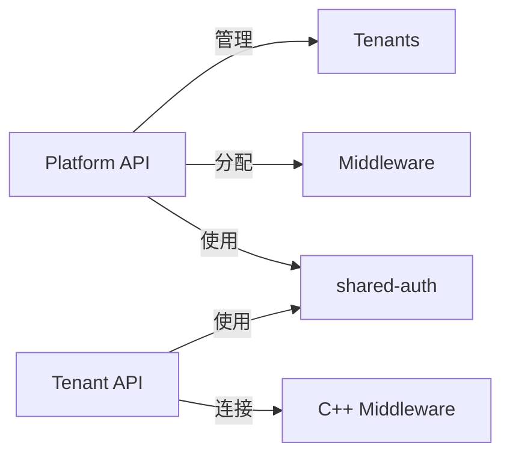
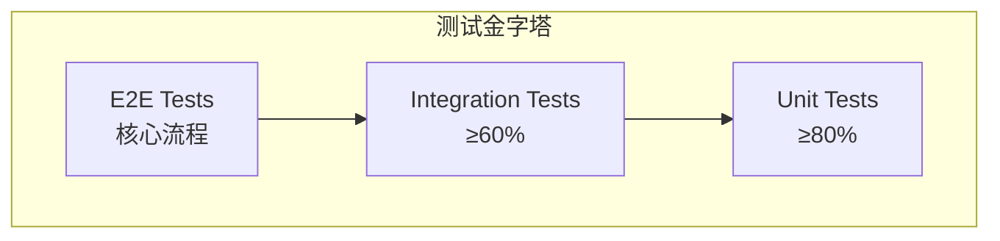

# Design Document - SaaS MVP Upgrade

## Overview

本设计文档描述 MT5 SaaS 平台 MVP 升级的技术实现方案，包含两个阶段：

1. **Phase 1: Platform API 升级** - 完善平台管理功能（租户、套餐、中间件）
2. **Phase 2: shared-auth 共享包** - 抽取认证逻辑为可复用包

> **注意**：Copy API 将在后续独立开发，不包含在本次升级范围内。

本设计遵循 `docs/ARCHITECTURE.md` 中确定的架构原则：
- 模块完全独立，互不调用
- 数据存储隔离（每模块独立 PostgreSQL + Redis）
- 去中心化鉴权（共享认证包，非独立 Auth Center）

---

## Steering Document Alignment

### Technical Standards (ARCHITECTURE.md)

| 标准 | 本设计遵循方式 |
|------|---------------|
| 模块独立架构 | Platform/Tenant API 完全解耦 |
| 轻量级 JWT Token | Access Token 15min + Refresh Token 7天 |
| 三层租户隔离 | Guard + DB中间件 + 自动化测试 |
| Adapter 设计模式 | 中间件适配器支持 MT5（MT4 预留） |
| 无 API Gateway | Nginx + 服务端鉴权 |

### Project Structure

```
mt5-platform/
├── apps/
│   ├── platform-service/     # Phase 1: 升级
│   └── tenant-api/           # Phase 2: 集成 shared-auth
│
├── packages/
│   └── shared-auth/          # Phase 2: 新建
│
└── docs/
    └── ARCHITECTURE.md       # 架构参考
```

---

## Code Reuse Analysis

### Existing Components to Leverage

| 组件 | 位置 | 复用方式 |
|------|------|---------|
| JWT 认证逻辑 | `tenant-api/src/auth/` | 抽取到 shared-auth |
| TenantAuthGuard | `tenant-api/src/auth/guards/` | 抽取到 shared-auth |
| 请求拦截器 | `tenant-api/src/common/interceptors/` | 抽取到 shared-auth |
| Response 格式 | `tenant-api/src/common/` | 保持统一格式 |

### Integration Points

| 集成点 | 说明 |
|--------|------|
| C++ Middleware | 各模块直接连接，通过 tenantId + mtServerId 路由 |
| Redis 缓存 | 租户状态/套餐缓存，TTL 5-10分钟 |
| PostgreSQL | 各模块独立实例，通过 tenantId 隔离 |

---

## Architecture

### 总体架构图

```mermaid
graph TB
    subgraph "Phase 1: Platform API"
        PA[Platform API :3001]
        PDB[(Platform DB)]
        PRedis[(Platform Redis)]
        PA --> PDB
        PA --> PRedis
    end

    subgraph "Phase 2: shared-auth"
        SA[packages/shared-auth]
        JwtGuard[JwtAuthGuard]
        TenantGuard[TenantAuthGuard]
        Decorators[@CurrentUser @CurrentTenant]
        RateLimit[RateLimitGuard]
        SA --> JwtGuard
        SA --> TenantGuard
        SA --> Decorators
        SA --> RateLimit
    end

    subgraph "Existing"
        TA[Tenant API :3000]
        TDB[(Tenant DB)]
        TRedis[(Tenant Redis)]
        MW[C++ Middleware]
    end

    TA -.-> SA
    PA -.-> SA
    TA --> MW
    PA -.-> MW
```

### 模块通信规则



---

## Components and Interfaces

### Phase 1: Platform API Components

#### 1.1 AuthModule (平台管理员认证)

```typescript
// src/modules/auth/auth.service.ts
interface PlatformAuthService {
  login(email: string, password: string): Promise<TokenPair>;
  refreshToken(refreshToken: string): Promise<TokenPair>;
  logout(userId: string): Promise<void>;
  validateAdmin(userId: string): Promise<PlatformAdmin>;
}

interface TokenPair {
  accessToken: string;   // 15 分钟
  refreshToken: string;  // 7 天，一次性使用
  expiresIn: number;
}
```

**Dependencies:** PrismaService, JwtService, Redis
**Reuses:** JWT 签名逻辑参考 tenant-api

#### 1.2 TenantsModule (租户管理)

```typescript
// src/modules/tenants/tenants.service.ts
interface TenantsService {
  create(dto: CreateTenantDto): Promise<Tenant>;
  findAll(query: TenantQueryDto): Promise<PaginatedResult<Tenant>>;
  findOne(id: string): Promise<Tenant>;
  update(id: string, dto: UpdateTenantDto): Promise<Tenant>;
  disable(id: string): Promise<void>;
  delete(id: string): Promise<void>; // 软删除
}

interface CreateTenantDto {
  name: string;
  domain: string;          // 唯一
  contactEmail: string;
  planId?: string;
}
```

**Dependencies:** PrismaService, Redis, AuditLogService
**缓存策略:** 禁用租户时清除 Redis 缓存

#### 1.3 SubscriptionsModule (套餐配置)

```typescript
// src/modules/subscriptions/subscriptions.service.ts
interface SubscriptionsService {
  createPlan(dto: CreatePlanDto): Promise<Plan>;
  assignPlan(tenantId: string, planId: string): Promise<Subscription>;
  updatePlan(planId: string, dto: UpdatePlanDto): Promise<Plan>;
  checkLimit(tenantId: string, resource: string): Promise<boolean>;
}

interface Plan {
  id: string;
  name: string;           // Basic / Pro / Enterprise
  modules: string[];      // ['tenant-api', 'copy-api', 'crm-api']
  limits: {
    maxMtServers: number;
    maxUsers: number;
    apiRateLimit: number; // requests per minute
  };
}
```

**Dependencies:** PrismaService, Redis
**缓存策略:** 套餐变更时清除租户套餐缓存（TTL 10分钟）

#### 1.4 MiddlewareModule (中间件管理)

```typescript
// src/modules/middleware/middleware.service.ts
interface MiddlewareService {
  create(dto: CreateMiddlewareDto): Promise<Middleware>;
  findAll(): Promise<Middleware[]>;
  healthCheck(id: string): Promise<HealthStatus>;
  updateStatus(id: string, status: 'online' | 'offline'): Promise<void>;
}

// src/modules/middleware-assignment/middleware-assignment.service.ts
interface MiddlewareAssignmentService {
  assign(tenantId: string, middlewareId: string): Promise<Assignment>;
  unassign(tenantId: string): Promise<void>;
  reassign(tenantId: string, newMiddlewareId: string): Promise<Assignment>;
  getAssignment(tenantId: string): Promise<Assignment | null>;
}
```

**Dependencies:** PrismaService, HttpService（健康检查）, Redis
**缓存策略:** 配置变更时清除缓存（TTL 5分钟）

---

### Phase 2: shared-auth Package

#### 2.1 Package Structure

```
packages/shared-auth/
├── src/
│   ├── guards/
│   │   ├── jwt-auth.guard.ts
│   │   ├── tenant-auth.guard.ts
│   │   ├── rate-limit.guard.ts
│   │   └── index.ts
│   ├── decorators/
│   │   ├── current-user.decorator.ts
│   │   ├── current-tenant.decorator.ts
│   │   ├── require-scopes.decorator.ts
│   │   └── index.ts
│   ├── middleware/
│   │   ├── request-logger.middleware.ts
│   │   └── index.ts
│   ├── interfaces/
│   │   ├── jwt-payload.interface.ts
│   │   ├── user-context.interface.ts
│   │   └── index.ts
│   └── index.ts
├── package.json
└── tsconfig.json
```

#### 2.2 JwtAuthGuard

```typescript
// src/guards/jwt-auth.guard.ts
@Injectable()
export class JwtAuthGuard implements CanActivate {
  constructor(
    private readonly jwtService: JwtService,
    private readonly reflector: Reflector,
  ) {}

  async canActivate(context: ExecutionContext): Promise<boolean> {
    // 1. 检查是否跳过认证
    const isPublic = this.reflector.get<boolean>('isPublic', context.getHandler());
    if (isPublic) return true;

    // 2. 提取并验证 Token
    const request = context.switchToHttp().getRequest();
    const token = this.extractToken(request);
    if (!token) throw new UnauthorizedException('Token not found');

    // 3. 验证签名和过期时间
    try {
      const payload = await this.jwtService.verifyAsync(token);
      request.user = payload;
      return true;
    } catch (error) {
      if (error.name === 'TokenExpiredError') {
        throw new UnauthorizedException('Token expired');
      }
      throw new UnauthorizedException('Invalid token');
    }
  }
}
```

#### 2.3 TenantAuthGuard

```typescript
// src/guards/tenant-auth.guard.ts
@Injectable()
export class TenantAuthGuard implements CanActivate {
  constructor(
    private readonly tenantService: TenantValidationService,
    private readonly reflector: Reflector,
  ) {}

  async canActivate(context: ExecutionContext): Promise<boolean> {
    // 1. 检查是否跳过租户校验
    const skipTenant = this.reflector.get<boolean>('skipTenant', context.getHandler());
    if (skipTenant) return true;

    const request = context.switchToHttp().getRequest();
    const user = request.user;

    // 2. 校验 JWT 中的 tenantId
    if (!user?.tenantId) {
      throw new UnauthorizedException('Tenant ID not found in token');
    }

    // 3. 检查租户状态
    const tenant = await this.tenantService.validateTenant(user.tenantId);
    if (!tenant) {
      throw new NotFoundException('Tenant not found'); // 返回 404，不泄露信息
    }
    if (tenant.status === 'disabled') {
      throw new ForbiddenException('Tenant is disabled');
    }

    // 4. 注入租户上下文
    request.tenant = tenant;
    return true;
  }
}
```

#### 2.4 Decorators

```typescript
// src/decorators/current-user.decorator.ts
export const CurrentUser = createParamDecorator(
  (data: string | undefined, ctx: ExecutionContext) => {
    const request = ctx.switchToHttp().getRequest();
    const user = request.user;
    return data ? user?.[data] : user;
  },
);

// src/decorators/current-tenant.decorator.ts
export const CurrentTenant = createParamDecorator(
  (data: unknown, ctx: ExecutionContext) => {
    const request = ctx.switchToHttp().getRequest();
    return request.user?.tenantId;
  },
);
```

#### 2.5 RateLimitGuard

```typescript
// src/guards/rate-limit.guard.ts
@Injectable()
export class RateLimitGuard implements CanActivate {
  constructor(private readonly redis: Redis) {}

  async canActivate(context: ExecutionContext): Promise<boolean> {
    const request = context.switchToHttp().getRequest();
    const key = this.getKey(request); // 按 tenant/user/ip

    const current = await this.redis.incr(key);
    if (current === 1) {
      await this.redis.expire(key, 60); // 1 分钟窗口
    }

    const limit = await this.getLimit(request); // 从套餐获取限额
    if (current > limit) {
      throw new TooManyRequestsException('Rate limit exceeded');
    }

    // 80% 告警
    if (current > limit * 0.8) {
      this.logger.warn(`Rate limit approaching: ${current}/${limit}`);
    }

    return true;
  }
}
```

#### 2.6 RequestLoggerMiddleware

```typescript
// src/middleware/request-logger.middleware.ts
@Injectable()
export class RequestLoggerMiddleware implements NestMiddleware {
  use(req: Request, res: Response, next: NextFunction) {
    // 1. 生成或使用传入的 Request ID
    const requestId = req.headers['x-request-id'] as string || uuidv4();
    req['requestId'] = requestId;
    res.setHeader('X-Request-ID', requestId);

    // 2. 记录请求开始
    const startTime = Date.now();

    // 3. 记录请求完成
    res.on('finish', () => {
      const duration = Date.now() - startTime;
      this.logger.log({
        requestId,
        tenantId: req.user?.tenantId,
        userId: req.user?.sub,
        method: req.method,
        path: req.path,
        statusCode: res.statusCode,
        duration,
      });
    });

    next();
  }
}
```

---

## Data Models

### Phase 1: Platform DB Schema

```prisma
// apps/platform-service/prisma/schema.prisma

model PlatformAdmin {
  id        String   @id @default(uuid())
  email     String   @unique
  password  String   // bcrypt hash
  name      String
  role      AdminRole @default(OPERATOR)
  status    Status   @default(ACTIVE)
  createdAt DateTime @default(now())
  updatedAt DateTime @updatedAt
  deletedAt DateTime?
}

enum AdminRole {
  SUPER_ADMIN
  OPERATOR
}

model Tenant {
  id            String   @id @default(uuid())
  name          String
  domain        String   @unique
  contactEmail  String
  status        Status   @default(ACTIVE)
  planId        String?
  plan          Plan?    @relation(fields: [planId], references: [id])
  middlewareId  String?
  middleware    Middleware? @relation(fields: [middlewareId], references: [id])
  createdAt     DateTime @default(now())
  updatedAt     DateTime @updatedAt
  deletedAt     DateTime?
}

model Plan {
  id          String   @id @default(uuid())
  name        String   @unique // Basic / Pro / Enterprise
  modules     String[] // ['tenant-api', 'copy-api', 'crm-api']
  maxMtServers Int     @default(1)
  maxUsers    Int      @default(100)
  apiRateLimit Int     @default(100) // per minute
  price       Decimal  @default(0)
  tenants     Tenant[]
  createdAt   DateTime @default(now())
  updatedAt   DateTime @updatedAt
}

model Middleware {
  id          String   @id @default(uuid())
  name        String
  host        String
  port        Int
  status      MiddlewareStatus @default(OFFLINE)
  tenants     Tenant[]
  createdAt   DateTime @default(now())
  updatedAt   DateTime @updatedAt
}

enum MiddlewareStatus {
  ONLINE
  OFFLINE
  MAINTENANCE
}

enum Status {
  ACTIVE
  DISABLED
}
```

---

## Error Handling

### 错误代码体系

```typescript
// packages/shared-auth/src/errors/error-codes.ts
export const ErrorCodes = {
  // 认证错误 (AUTH_*)
  AUTH_TOKEN_INVALID: 'AUTH_001',
  AUTH_TOKEN_EXPIRED: 'AUTH_002',
  AUTH_REFRESH_TOKEN_USED: 'AUTH_003',
  AUTH_INSUFFICIENT_PERMISSIONS: 'AUTH_004',

  // 租户错误 (TENANT_*)
  TENANT_NOT_FOUND: 'TENANT_001',
  TENANT_DISABLED: 'TENANT_002',
  TENANT_DOMAIN_EXISTS: 'TENANT_003',

  // 中间件错误 (MW_*)
  MW_CONNECTION_FAILED: 'MW_001',
  MW_TIMEOUT: 'MW_002',
  MW_INVALID_RESPONSE: 'MW_003',
} as const;
```

### 错误处理策略

| 场景 | HTTP Status | 处理方式 |
|------|-------------|---------|
| Token 无效/过期 | 401 | 返回错误，客户端重新登录 |
| 租户不存在 | 404 | 返回 404（不泄露存在性） |
| 租户被禁用 | 403 | 返回 Forbidden |
| 跨租户访问 | 404 | 返回 404（不泄露存在性） |
| 超过限流 | 429 | 返回 Retry-After 头部 |
| 中间件不可用 | 503 | 返回 Service Unavailable |

---

## Testing Strategy

### 测试分层



### Phase 1 测试策略

| 模块 | 单元测试 | 集成测试 | 覆盖率 |
|------|---------|---------|--------|
| AuthService | Token 生成、验证、刷新 | 登录流程 | 90%+ |
| TenantsService | CRUD 逻辑、缓存清除 | API 端到端 | 80%+ |
| SubscriptionsService | 套餐限制检查 | 分配流程 | 80%+ |
| MiddlewareService | 健康检查逻辑 | 分配/迁移 | 80%+ |

### Phase 2 测试策略

| 组件 | 测试场景 | 覆盖率 |
|------|---------|--------|
| JwtAuthGuard | 有效/无效/过期 Token | 90%+ |
| TenantAuthGuard | 租户匹配/禁用/不存在 | 100% |
| RateLimitGuard | 限流/告警/套餐限额 | 90%+ |
| 租户隔离 | 跨租户访问全场景 | 100% |

### 租户隔离测试用例

```typescript
describe('Tenant Isolation', () => {
  it('should return 404 when tenant A queries tenant B resources', async () => {
    const tenantAToken = await login('tenant-a-admin');
    const response = await request(app)
      .get('/api/v1/users/tenant-b-user-id')
      .set('Authorization', `Bearer ${tenantAToken}`);

    expect(response.status).toBe(404); // 不是 403
  });

  it('should block cross-tenant data access at DB level', async () => {
    const tenantAContext = createTenantContext('tenant-a');
    const result = await userService.findOne('tenant-b-user-id', tenantAContext);

    expect(result).toBeNull();
  });
});
```

---

## Implementation Notes

### Phase 1 实现注意事项

1. **平台管理员认证**：与租户认证分离，使用不同的 JWT Secret
2. **租户域名验证**：创建时检查唯一性，支持自定义域名
3. **缓存一致性**：禁用租户时必须清除 Redis 缓存
4. **审计日志**：所有租户变更操作记录到审计表

### Phase 2 实现注意事项

1. **包发布**：使用 npm workspace 本地引用，后续可发布到私有 registry
2. **向后兼容**：保留 tenant-api 现有导出，逐步迁移
3. **配置注入**：通过 forRoot/forRootAsync 注入配置
4. **类型安全**：导出完整的 TypeScript 类型定义

---

## References

- [ARCHITECTURE.md](../../docs/ARCHITECTURE.md) - 系统架构设计
- [architecture-review-issues.md](../../docs/architecture-review-issues.md) - 24 个架构决议
- [requirements.md](./requirements.md) - 本规格需求文档
