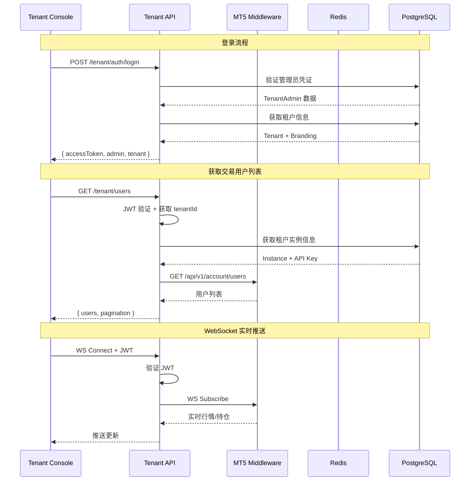

# 设计文档: Tenant API Service

## 概述

本设计文档描述 Tenant API Service 的技术实现方案。这是一个独立的 NestJS 服务，为租户管理控制台 (tenant-console) 提供后端 API。

### 系统定位

```
┌─────────────────────────────────────────────────────────────────────────────┐
│                              用户层                                          │
│  ┌─────────────────┐    ┌─────────────────┐    ┌─────────────────┐          │
│  │  Platform Admin │    │  Tenant Admin   │    │     Trader      │          │
│  └────────┬────────┘    └────────┬────────┘    └────────┬────────┘          │
└───────────│──────────────────────│──────────────────────│───────────────────┘
            │                      │                      │
            ▼                      ▼                      ▼
┌───────────────────┐    ┌───────────────────┐    ┌───────────────────┐
│ Platform Console  │    │  Tenant Console   │    │   Trader App      │
│   (Vue 3:5173)    │    │   (Vue 3:5174)    │    │   (Mobile/Web)    │
└─────────┬─────────┘    └─────────┬─────────┘    └─────────┬─────────┘
          │                        │                        │
          ▼                        ▼                        ▼
┌───────────────────┐    ┌───────────────────┐    ┌───────────────────┐
│ Platform Service  │    │   Tenant API      │    │  MT5 Middleware   │
│ (NestJS:3000)     │    │ (NestJS:3002) ◄───┼────┤  (C++:8082)       │
│                   │    │  本次开发          │    │                   │
└─────────┬─────────┘    └─────────┬─────────┘    └─────────┬─────────┘
          │                        │                        │
          │              ┌─────────┴─────────┐              │
          │              │ 调用中间件 API     │              │
          │              │ 获取交易数据       │              │
          │              └─────────┬─────────┘              │
          │                        │                        │
          ▼                        ▼                        ▼
┌─────────────────────────────────────────────────────────────────────────────┐
│                            数据层                                            │
│  ┌─────────────────┐    ┌─────────────────┐    ┌─────────────────┐          │
│  │  PostgreSQL     │    │     Redis       │    │   MT5 Server    │          │
│  │  (共享数据库)    │    │    (缓存)       │    │                 │          │
│  └─────────────────┘    └─────────────────┘    └─────────────────┘          │
└─────────────────────────────────────────────────────────────────────────────┘
```

### 核心职责

1. **租户管理员认证** - JWT 登录、令牌刷新、密码管理
2. **交易数据代理** - 调用中间件 API 获取用户/持仓/历史/报价
3. **数据聚合** - 统计 Dashboard 数据
4. **WebSocket 网关** - 转发实时行情和持仓更新
5. **租户设置管理** - 白标配置、管理员管理、API 密钥

## 技术标准对齐

### 技术栈

| 层级 | 技术选型 | 说明 |
|------|---------|------|
| 后端框架 | NestJS 10.x | 与 Platform Service 一致 |
| ORM | Prisma 5.x | 共享数据库 Schema |
| 认证 | JWT + Passport | 独立于 Platform Service |
| WebSocket | @nestjs/websockets | Socket.IO 或原生 WS |
| HTTP 客户端 | @nestjs/axios | 调用中间件 API |
| 缓存 | Redis | 行情缓存、会话管理 |
| 验证 | class-validator | DTO 验证 |

### 项目结构

```
apps/tenant-api/
├── src/
│   ├── main.ts                    # 应用入口
│   ├── app.module.ts              # 根模块
│   │
│   ├── common/                    # 公共模块
│   │   ├── decorators/            # 自定义装饰器
│   │   │   ├── current-admin.decorator.ts
│   │   │   ├── roles.decorator.ts
│   │   │   └── tenant.decorator.ts
│   │   ├── filters/               # 异常过滤器
│   │   │   └── http-exception.filter.ts
│   │   ├── guards/                # 守卫
│   │   │   ├── jwt-auth.guard.ts
│   │   │   └── roles.guard.ts
│   │   ├── interceptors/          # 拦截器
│   │   │   └── response.interceptor.ts
│   │   └── dto/                   # 公共 DTO
│   │       └── pagination.dto.ts
│   │
│   ├── config/                    # 配置
│   │   ├── configuration.ts
│   │   └── validation.ts
│   │
│   ├── prisma/                    # Prisma 模块
│   │   ├── prisma.module.ts
│   │   └── prisma.service.ts
│   │
│   ├── middleware-proxy/          # 中间件代理服务
│   │   ├── middleware-proxy.module.ts
│   │   ├── middleware-proxy.service.ts
│   │   └── dto/
│   │       ├── middleware-response.dto.ts
│   │       └── middleware-error.dto.ts
│   │
│   └── modules/
│       ├── auth/                  # 认证模块
│       │   ├── auth.module.ts
│       │   ├── auth.controller.ts
│       │   ├── auth.service.ts
│       │   ├── strategies/
│       │   │   └── jwt.strategy.ts
│       │   └── dto/
│       │       ├── login.dto.ts
│       │       └── change-password.dto.ts
│       │
│       ├── dashboard/             # 仪表板模块
│       │   ├── dashboard.module.ts
│       │   ├── dashboard.controller.ts
│       │   └── dashboard.service.ts
│       │
│       ├── users/                 # 交易用户模块
│       │   ├── users.module.ts
│       │   ├── users.controller.ts
│       │   ├── users.service.ts
│       │   └── dto/
│       │       ├── user-list.dto.ts
│       │       └── update-user.dto.ts
│       │
│       ├── positions/             # 持仓模块
│       │   ├── positions.module.ts
│       │   ├── positions.controller.ts
│       │   └── positions.service.ts
│       │
│       ├── quotes/                # 报价模块
│       │   ├── quotes.module.ts
│       │   ├── quotes.controller.ts
│       │   └── quotes.service.ts
│       │
│       ├── history/               # 交易历史模块
│       │   ├── history.module.ts
│       │   ├── history.controller.ts
│       │   └── history.service.ts
│       │
│       ├── risk/                  # 风控模块
│       │   ├── risk.module.ts
│       │   ├── risk.controller.ts
│       │   └── risk.service.ts
│       │
│       ├── reports/               # 报表模块
│       │   ├── reports.module.ts
│       │   ├── reports.controller.ts
│       │   └── reports.service.ts
│       │
│       ├── settings/              # 设置模块
│       │   ├── settings.module.ts
│       │   ├── branding/          # 白标配置
│       │   │   ├── branding.controller.ts
│       │   │   └── branding.service.ts
│       │   ├── admins/            # 管理员管理
│       │   │   ├── admins.controller.ts
│       │   │   └── admins.service.ts
│       │   ├── api-keys/          # API 密钥
│       │   │   ├── api-keys.controller.ts
│       │   │   └── api-keys.service.ts
│       │   └── notifications/     # 通知设置
│       │       ├── notifications.controller.ts
│       │       └── notifications.service.ts
│       │
│       └── websocket/             # WebSocket 网关
│           ├── websocket.module.ts
│           ├── websocket.gateway.ts
│           └── websocket.service.ts
│
├── prisma/
│   └── schema.prisma              # 共享 Schema (软链接或复制)
│
├── test/
│   └── ...
│
├── .env.example
├── nest-cli.json
├── package.json
├── tsconfig.json
└── Dockerfile
```

## 代码复用分析

### Platform Service 复用

| 组件 | 路径 | 复用方式 |
|------|------|---------|
| Prisma Schema | `prisma/schema.prisma` | 共享数据库 Schema |
| PrismaService | 参考实现 | 复制并适配 |
| HttpExceptionFilter | `common/filters/` | 参考实现 |
| ResponseInterceptor | `common/interceptors/` | 参考实现 |
| BusinessException | `common/exceptions/` | 参考实现 |

### 新增组件

| 组件 | 用途 |
|------|------|
| MiddlewareProxyService | 统一管理中间件 API 调用 |
| WebSocketGateway | 转发实时数据 |
| RiskAlertService | 风控预警管理 |

## 架构设计

### 整体架构图

```mermaid
graph TB
    subgraph "Tenant Console (Vue 3)"
        TC_Auth[登录页]
        TC_Dashboard[仪表板]
        TC_Users[用户管理]
        TC_Positions[持仓监控]
        TC_Quotes[报价监控]
        TC_History[交易历史]
        TC_Reports[报表统计]
        TC_Settings[系统设置]
    end

    subgraph "Tenant API (NestJS:3002)"
        Auth[AuthModule]
        Dashboard[DashboardModule]
        Users[UsersModule]
        Positions[PositionsModule]
        Quotes[QuotesModule]
        History[HistoryModule]
        Risk[RiskModule]
        Reports[ReportsModule]
        Settings[SettingsModule]
        WS[WebSocketGateway]
        Proxy[MiddlewareProxyService]
    end

    subgraph "MT5 Middleware (C++:8082)"
        MW_Trading[/api/v1/trading/*]
        MW_Account[/api/v1/account/*]
        MW_Quotes[/api/v1/quotes/*]
        MW_Monitor[/api/v1/monitor/*]
        MW_WS[WebSocket]
    end

    subgraph "数据层"
        PG[(PostgreSQL)]
        Redis[(Redis)]
    end

    TC_Auth --> Auth
    TC_Dashboard --> Dashboard
    TC_Users --> Users
    TC_Positions --> Positions
    TC_Quotes --> Quotes
    TC_History --> History
    TC_Reports --> Reports
    TC_Settings --> Settings
    TC_Positions -.-> WS
    TC_Quotes -.-> WS

    Auth --> PG
    Settings --> PG

    Dashboard --> Proxy
    Users --> Proxy
    Positions --> Proxy
    Quotes --> Proxy
    History --> Proxy
    Reports --> Proxy
    WS --> Proxy

    Proxy --> MW_Trading
    Proxy --> MW_Account
    Proxy --> MW_Quotes
    Proxy --> MW_Monitor
    WS -.-> MW_WS

    Quotes --> Redis
    Proxy --> Redis
```

### 请求流程



## 组件与接口设计

### 1. 中间件代理服务 (MiddlewareProxyService)

**核心职责**: 统一管理对中间件 API 的调用

```typescript
@Injectable()
export class MiddlewareProxyService {
  constructor(
    private readonly httpService: HttpService,
    private readonly prisma: PrismaService,
    @Inject(CACHE_MANAGER) private cacheManager: Cache,
  ) {}

  // 获取租户实例配置
  async getInstanceConfig(tenantId: string): Promise<InstanceConfig> {
    const instance = await this.prisma.middlewareInstance.findFirst({
      where: { tenantId, status: 'ONLINE' },
    });
    if (!instance) throw new BusinessException('INSTANCE_NOT_FOUND');
    return {
      baseUrl: `http://${instance.host}:${instance.port}`,
      apiKey: instance.apiKey,
    };
  }

  // 代理请求到中间件
  async proxyRequest<T>(
    tenantId: string,
    method: 'GET' | 'POST' | 'PUT' | 'DELETE',
    path: string,
    data?: any,
    params?: any,
  ): Promise<T> {
    const config = await this.getInstanceConfig(tenantId);

    const response = await this.httpService.request({
      method,
      url: `${config.baseUrl}${path}`,
      headers: { 'X-API-Key': config.apiKey },
      data,
      params,
      timeout: 30000,
    }).toPromise();

    return response.data;
  }

  // 带缓存的请求
  async cachedRequest<T>(
    cacheKey: string,
    ttl: number,
    fetcher: () => Promise<T>,
  ): Promise<T> {
    const cached = await this.cacheManager.get<T>(cacheKey);
    if (cached) return cached;

    const result = await fetcher();
    await this.cacheManager.set(cacheKey, result, ttl);
    return result;
  }
}
```

### 2. 认证模块 (AuthModule)

```typescript
// auth.controller.ts
@Controller('tenant/auth')
export class AuthController {
  @Post('login')
  login(@Body() dto: LoginDto): Promise<LoginResponse> {}

  @Post('refresh')
  refresh(@Body() dto: RefreshDto): Promise<RefreshResponse> {}

  @Post('logout')
  @UseGuards(JwtAuthGuard)
  logout(@CurrentAdmin() admin: TenantAdmin): Promise<void> {}

  @Post('change-password')
  @UseGuards(JwtAuthGuard)
  changePassword(
    @CurrentAdmin() admin: TenantAdmin,
    @Body() dto: ChangePasswordDto,
  ): Promise<void> {}

  @Get('profile')
  @UseGuards(JwtAuthGuard)
  getProfile(@CurrentAdmin() admin: TenantAdmin): Promise<ProfileResponse> {}
}

// auth.service.ts
@Injectable()
export class AuthService {
  async login(dto: LoginDto): Promise<LoginResponse> {
    // 1. 验证租户状态
    const tenant = await this.validateTenant(dto.tenantCode);

    // 2. 验证管理员凭证
    const admin = await this.validateAdmin(tenant.id, dto.email, dto.password);

    // 3. 生成令牌
    const tokens = await this.generateTokens(admin, tenant);

    // 4. 更新最后登录时间
    await this.updateLastLogin(admin.id);

    return {
      accessToken: tokens.accessToken,
      refreshToken: tokens.refreshToken,
      admin: this.mapAdminResponse(admin),
      tenant: this.mapTenantResponse(tenant),
    };
  }
}
```

### 3. Dashboard 模块 (DashboardModule)

```typescript
// dashboard.controller.ts
@Controller('tenant/dashboard')
@UseGuards(JwtAuthGuard)
export class DashboardController {
  @Get('stats')
  getStats(@CurrentAdmin() admin: TenantAdmin): Promise<DashboardStats> {}

  @Get('trading-trend')
  getTradingTrend(
    @CurrentAdmin() admin: TenantAdmin,
    @Query('days') days: number,
  ): Promise<TradingTrendData[]> {}

  @Get('symbol-distribution')
  getSymbolDistribution(
    @CurrentAdmin() admin: TenantAdmin,
  ): Promise<SymbolDistribution[]> {}

  @Get('user-activity')
  getUserActivity(
    @CurrentAdmin() admin: TenantAdmin,
    @Query('days') days: number,
  ): Promise<UserActivityData[]> {}

  @Get('recent-trades')
  getRecentTrades(
    @CurrentAdmin() admin: TenantAdmin,
    @Query('limit') limit: number,
  ): Promise<RecentTrade[]> {}

  @Get('system-status')
  getSystemStatus(@CurrentAdmin() admin: TenantAdmin): Promise<SystemStatus> {}
}

// dashboard.service.ts
@Injectable()
export class DashboardService {
  async getStats(tenantId: string): Promise<DashboardStats> {
    // 调用中间件获取统计数据
    const stats = await this.proxy.proxyRequest<MonitorStats>(
      tenantId,
      'GET',
      '/api/v1/monitor/stats',
    );

    return {
      totalUsers: stats.total_users,
      activeUsers: stats.active_users,
      newUsersToday: stats.new_users_today,
      totalTrades: stats.total_trades,
      todayTrades: stats.today_trades,
      totalPositions: stats.open_positions,
      totalProfit: stats.total_profit,
      systemStatus: stats.mt5_connected ? 'online' : 'offline',
    };
  }
}
```

### 4. 交易用户模块 (UsersModule)

```typescript
// users.controller.ts
@Controller('tenant/users')
@UseGuards(JwtAuthGuard)
export class UsersController {
  @Get()
  getList(
    @CurrentAdmin() admin: TenantAdmin,
    @Query() query: UserListQueryDto,
  ): Promise<PaginatedResponse<TradingUser>> {}

  @Get('groups')
  getGroups(@CurrentAdmin() admin: TenantAdmin): Promise<string[]> {}

  @Get(':login')
  getDetail(
    @CurrentAdmin() admin: TenantAdmin,
    @Param('login') login: number,
  ): Promise<TradingUserDetail> {}

  @Put(':login/group')
  @Roles(TenantRole.OWNER, TenantRole.ADMIN)
  updateGroup(
    @CurrentAdmin() admin: TenantAdmin,
    @Param('login') login: number,
    @Body() dto: UpdateGroupDto,
  ): Promise<void> {}

  @Put(':login/leverage')
  @Roles(TenantRole.OWNER, TenantRole.ADMIN)
  updateLeverage(
    @CurrentAdmin() admin: TenantAdmin,
    @Param('login') login: number,
    @Body() dto: UpdateLeverageDto,
  ): Promise<void> {}

  @Put(':login/status')
  @Roles(TenantRole.OWNER, TenantRole.ADMIN)
  updateStatus(
    @CurrentAdmin() admin: TenantAdmin,
    @Param('login') login: number,
    @Body() dto: UpdateStatusDto,
  ): Promise<void> {}

  @Get(':login/transactions')
  getTransactions(
    @CurrentAdmin() admin: TenantAdmin,
    @Param('login') login: number,
    @Query() query: PaginationDto,
  ): Promise<PaginatedResponse<Transaction>> {}

  @Post('export')
  @Roles(TenantRole.OWNER, TenantRole.ADMIN)
  exportCsv(
    @CurrentAdmin() admin: TenantAdmin,
    @Body() query: UserListQueryDto,
    @Res() res: Response,
  ): Promise<void> {}
}
```

### 5. 持仓模块 (PositionsModule)

```typescript
// positions.controller.ts
@Controller('tenant/positions')
@UseGuards(JwtAuthGuard)
export class PositionsController {
  @Get()
  getList(
    @CurrentAdmin() admin: TenantAdmin,
    @Query() query: PositionListQueryDto,
  ): Promise<PaginatedResponse<Position>> {}

  @Get('stats')
  getStats(@CurrentAdmin() admin: TenantAdmin): Promise<PositionStats> {}
}

// positions.service.ts
@Injectable()
export class PositionsService {
  async getList(
    tenantId: string,
    query: PositionListQueryDto,
  ): Promise<PaginatedResponse<Position>> {
    const response = await this.proxy.proxyRequest<MiddlewarePositionsResponse>(
      tenantId,
      'GET',
      '/api/v1/trading/positions',
      null,
      {
        login: query.login,
        symbol: query.symbol,
        page: query.page,
        limit: query.pageSize,
      },
    );

    return {
      data: response.positions.map(this.mapPosition),
      meta: {
        page: query.page,
        pageSize: query.pageSize,
        total: response.total,
        totalPages: Math.ceil(response.total / query.pageSize),
      },
    };
  }

  async getStats(tenantId: string): Promise<PositionStats> {
    const response = await this.proxy.proxyRequest<MiddlewarePositionStats>(
      tenantId,
      'GET',
      '/api/v1/trading/positions/stats',
    );

    return {
      total: response.total_positions,
      volume: response.total_volume,
      profit: response.total_profit,
      longShortRatio: response.long_count / (response.short_count || 1),
    };
  }
}
```

### 6. WebSocket 网关 (WebSocketGateway)

```typescript
// websocket.gateway.ts
@WebSocketGateway({
  namespace: '/ws',
  cors: { origin: '*' },
})
export class TenantWebSocketGateway implements OnGatewayConnection, OnGatewayDisconnect {
  @WebSocketServer()
  server: Server;

  private adminSockets: Map<string, Socket[]> = new Map();

  async handleConnection(client: Socket) {
    try {
      // 验证 JWT
      const token = client.handshake.auth.token;
      const payload = await this.authService.verifyToken(token);

      // 存储连接
      const adminId = payload.sub;
      const sockets = this.adminSockets.get(adminId) || [];
      sockets.push(client);
      this.adminSockets.set(adminId, sockets);

      // 订阅中间件 WebSocket
      await this.subscribeToMiddleware(payload.tenantId, client);
    } catch (error) {
      client.disconnect();
    }
  }

  handleDisconnect(client: Socket) {
    // 清理连接
    this.removeClientFromMap(client);
  }

  // 订阅中间件 WebSocket
  private async subscribeToMiddleware(tenantId: string, client: Socket) {
    const config = await this.proxy.getInstanceConfig(tenantId);
    const middlewareWs = new WebSocket(`ws://${config.baseUrl}/ws/trading`);

    middlewareWs.on('message', (data) => {
      const message = JSON.parse(data.toString());
      client.emit(message.type, message.data);
    });
  }

  // 广播持仓更新
  broadcastPositionUpdate(tenantId: string, position: Position) {
    this.server.to(`tenant:${tenantId}`).emit('position:update', position);
  }

  // 广播报价更新
  broadcastQuoteUpdate(tenantId: string, quote: Quote) {
    this.server.to(`tenant:${tenantId}`).emit('quote:update', quote);
  }
}
```

### 7. 设置模块 (SettingsModule)

#### 白标配置 (BrandingController)

```typescript
@Controller('tenant/settings/branding')
@UseGuards(JwtAuthGuard)
export class BrandingController {
  @Get()
  getBranding(@CurrentAdmin() admin: TenantAdmin): Promise<TenantBranding> {}

  @Put()
  @Roles(TenantRole.OWNER)
  updateBranding(
    @CurrentAdmin() admin: TenantAdmin,
    @Body() dto: UpdateBrandingDto,
  ): Promise<void> {}

  @Post('logo')
  @Roles(TenantRole.OWNER)
  @UseInterceptors(FileInterceptor('file'))
  uploadLogo(
    @CurrentAdmin() admin: TenantAdmin,
    @UploadedFile() file: Express.Multer.File,
  ): Promise<{ url: string }> {}

  @Post('favicon')
  @Roles(TenantRole.OWNER)
  @UseInterceptors(FileInterceptor('file'))
  uploadFavicon(
    @CurrentAdmin() admin: TenantAdmin,
    @UploadedFile() file: Express.Multer.File,
  ): Promise<{ url: string }> {}
}
```

#### 管理员管理 (AdminsController)

```typescript
@Controller('tenant/settings/admins')
@UseGuards(JwtAuthGuard, RolesGuard)
@Roles(TenantRole.OWNER)
export class AdminsController {
  @Get()
  getList(
    @CurrentAdmin() admin: TenantAdmin,
    @Query() query: PaginationDto,
  ): Promise<PaginatedResponse<TenantAdminResponse>> {}

  @Post()
  create(
    @CurrentAdmin() admin: TenantAdmin,
    @Body() dto: CreateAdminDto,
  ): Promise<TenantAdminResponse> {}

  @Put(':id')
  update(
    @CurrentAdmin() admin: TenantAdmin,
    @Param('id') id: string,
    @Body() dto: UpdateAdminDto,
  ): Promise<void> {}

  @Post(':id/reset-password')
  resetPassword(
    @CurrentAdmin() admin: TenantAdmin,
    @Param('id') id: string,
    @Body() dto: ResetPasswordDto,
  ): Promise<void> {}

  @Put(':id/status')
  toggleStatus(
    @CurrentAdmin() admin: TenantAdmin,
    @Param('id') id: string,
    @Body() dto: ToggleStatusDto,
  ): Promise<void> {}

  @Delete(':id')
  delete(
    @CurrentAdmin() admin: TenantAdmin,
    @Param('id') id: string,
  ): Promise<void> {}
}
```

## 数据模型

### JWT Payload

```typescript
interface TenantJwtPayload {
  sub: string;           // admin ID
  email: string;
  tenantId: string;
  tenantCode: string;
  role: TenantRole;      // OWNER | ADMIN | OPERATOR
  type: 'tenant_admin';
  iat: number;
  exp: number;
}
```

### 响应格式

```typescript
// 成功响应
interface SuccessResponse<T> {
  success: true;
  data: T;
  meta?: {
    page?: number;
    pageSize?: number;
    total?: number;
    totalPages?: number;
  };
}

// 错误响应
interface ErrorResponse {
  success: false;
  error: {
    code: string;        // 如 AUTH_401_001
    message: string;
    details?: object;
    timestamp: string;
    traceId: string;
  };
}
```

### 新增数据库表

```prisma
// 风控预警表
model RiskAlert {
  id          String   @id @default(uuid())
  tenantId    String   @map("tenant_id")
  type        RiskAlertType
  level       RiskAlertLevel
  message     String
  data        Json?
  isRead      Boolean  @default(false) @map("is_read")
  createdAt   DateTime @default(now()) @map("created_at")

  @@index([tenantId, createdAt])
  @@map("risk_alerts")
}

enum RiskAlertType {
  LARGE_TRADE       // 大额交易
  LOW_MARGIN        // 低保证金
  HIGH_FREQUENCY    // 高频交易
  ABNORMAL_PROFIT   // 异常盈利
}

enum RiskAlertLevel {
  INFO
  WARNING
  CRITICAL
}

// 风控配置表
model RiskConfig {
  id                   String   @id @default(uuid())
  tenantId             String   @unique @map("tenant_id")
  largeTradeThreshold  Decimal  @default(100000) @map("large_trade_threshold")
  lowMarginThreshold   Decimal  @default(50) @map("low_margin_threshold")  // 百分比
  highFrequencyLimit   Int      @default(100) @map("high_frequency_limit")  // 每分钟
  isEnabled            Boolean  @default(true) @map("is_enabled")
  createdAt            DateTime @default(now()) @map("created_at")
  updatedAt            DateTime @updatedAt @map("updated_at")

  @@map("risk_configs")
}

// 管理员自选品种表
model AdminFavoriteSymbol {
  id        String   @id @default(uuid())
  adminId   String   @map("admin_id")
  symbol    String
  sortOrder Int      @default(0) @map("sort_order")
  createdAt DateTime @default(now()) @map("created_at")

  @@unique([adminId, symbol])
  @@map("admin_favorite_symbols")
}

// 通知设置表
model NotificationSetting {
  id              String   @id @default(uuid())
  tenantId        String   @unique @map("tenant_id")
  riskAlertEmail  Boolean  @default(true) @map("risk_alert_email")
  systemAlertEmail Boolean @default(true) @map("system_alert_email")
  webhookUrl      String?  @map("webhook_url")
  webhookEnabled  Boolean  @default(false) @map("webhook_enabled")
  createdAt       DateTime @default(now()) @map("created_at")
  updatedAt       DateTime @updatedAt @map("updated_at")

  @@map("notification_settings")
}
```

## 错误处理

### 错误码定义

| 模块 | 错误码 | HTTP状态 | 描述 |
|------|--------|----------|------|
| AUTH | AUTH_401_001 | 401 | 用户名或密码错误 |
| AUTH | AUTH_401_002 | 401 | Token 无效或已过期 |
| AUTH | AUTH_403_001 | 403 | 账号已被禁用 |
| TENANT | TENANT_403_001 | 403 | 租户已暂停或过期 |
| TENANT | TENANT_404_001 | 404 | 租户不存在 |
| INSTANCE | INSTANCE_404_001 | 404 | 实例不存在或离线 |
| INSTANCE | INSTANCE_503_001 | 503 | 中间件服务不可用 |
| USER | USER_404_001 | 404 | 用户不存在 |
| USER | USER_422_001 | 422 | 无效的组别 |
| USER | USER_422_002 | 422 | 无效的杠杆值 |
| ADMIN | ADMIN_404_001 | 404 | 管理员不存在 |
| ADMIN | ADMIN_409_001 | 409 | 邮箱已存在 |
| ADMIN | ADMIN_422_001 | 422 | 无法删除唯一的 Owner |
| API_KEY | API_KEY_404_001 | 404 | API 密钥不存在 |

## 与中间件集成

### 中间件 API 映射

| Tenant API | 中间件 API | 说明 |
|------------|-----------|------|
| GET /tenant/users | GET /api/v1/account/users | 用户列表 |
| GET /tenant/users/:login | GET /api/v1/account/users/:login | 用户详情 |
| PUT /tenant/users/:login/group | PUT /api/v1/account/users/:login/group | 修改组别 |
| GET /tenant/positions | GET /api/v1/trading/positions | 持仓列表 |
| GET /tenant/quotes | GET /api/v1/quotes/symbols | 报价列表 |
| GET /tenant/history | GET /api/v1/trading/history/orders | 历史订单 |
| GET /tenant/dashboard/stats | GET /api/v1/monitor/stats | 监控统计 |
| WS /ws | WS /ws/trading | WebSocket |

### 中间件调用示例

```typescript
// 获取用户列表
async getUsers(tenantId: string, query: UserListQueryDto) {
  return this.proxy.proxyRequest<UsersResponse>(
    tenantId,
    'GET',
    '/api/v1/account/users',
    null,
    {
      search: query.search,
      group: query.group,
      status: query.status,
      page: query.page,
      limit: query.pageSize,
      sort_by: query.sortBy,
      sort_order: query.sortOrder,
    },
  );
}

// 修改用户组别
async updateUserGroup(tenantId: string, login: number, group: string) {
  return this.proxy.proxyRequest<void>(
    tenantId,
    'PUT',
    `/api/v1/account/users/${login}/group`,
    { group },
  );
}
```

## 测试策略

### 单元测试

- **测试框架**: Jest
- **覆盖目标**: 所有 Service 方法 > 80%
- **Mock**: 中间件 API 调用、数据库查询

### 集成测试

- **测试框架**: Jest + Supertest
- **测试数据库**: SQLite (内存) 或 PostgreSQL 测试实例
- **中间件 Mock**: 使用 nock 或 msw

### 关键测试场景

1. 登录流程: 正常登录、无效凭证、租户暂停、账号禁用
2. 中间件调用: 成功响应、超时、错误处理
3. WebSocket: 连接、认证、消息推送、断开重连
4. 权限控制: owner/admin/operator 角色权限验证

## API 端点汇总

### 认证 (/tenant/auth)

| 方法 | 端点 | 描述 | 权限 |
|------|------|------|------|
| POST | /login | 登录 | Public |
| POST | /refresh | 刷新令牌 | Public |
| POST | /logout | 登出 | All |
| POST | /change-password | 修改密码 | All |
| GET | /profile | 获取个人信息 | All |
| PUT | /profile | 更新个人信息 | All |

### 仪表板 (/tenant/dashboard)

| 方法 | 端点 | 描述 | 权限 |
|------|------|------|------|
| GET | /stats | 统计数据 | All |
| GET | /trading-trend | 交易趋势 | All |
| GET | /symbol-distribution | 品种分布 | All |
| GET | /user-activity | 用户活跃度 | All |
| GET | /recent-trades | 最近交易 | All |
| GET | /system-status | 系统状态 | All |

### 用户管理 (/tenant/users)

| 方法 | 端点 | 描述 | 权限 |
|------|------|------|------|
| GET | / | 用户列表 | All |
| GET | /groups | 组别列表 | All |
| GET | /:login | 用户详情 | All |
| PUT | /:login/group | 修改组别 | Owner, Admin |
| PUT | /:login/leverage | 修改杠杆 | Owner, Admin |
| PUT | /:login/status | 修改状态 | Owner, Admin |
| GET | /:login/transactions | 出入金记录 | All |
| GET | /:login/logs | 操作日志 | All |
| POST | /export | 导出 CSV | Owner, Admin |

### 持仓监控 (/tenant/positions)

| 方法 | 端点 | 描述 | 权限 |
|------|------|------|------|
| GET | / | 持仓列表 | All |
| GET | /stats | 持仓统计 | All |

### 报价监控 (/tenant/quotes)

| 方法 | 端点 | 描述 | 权限 |
|------|------|------|------|
| GET | / | 报价列表 | All |
| GET | /favorites | 自选列表 | All |
| POST | /favorites | 添加自选 | All |
| POST | /favorites/remove | 移除自选 | All |

### 交易历史 (/tenant/history)

| 方法 | 端点 | 描述 | 权限 |
|------|------|------|------|
| GET | / | 历史订单 | All |
| GET | /stats | 历史统计 | All |
| POST | /export | 导出 | Owner, Admin |

### 风控 (/tenant/risk)

| 方法 | 端点 | 描述 | 权限 |
|------|------|------|------|
| GET | /alerts | 预警列表 | All |
| GET | /config | 预警配置 | Owner, Admin |
| PUT | /config | 更新配置 | Owner, Admin |

### 报表 (/tenant/reports)

| 方法 | 端点 | 描述 | 权限 |
|------|------|------|------|
| GET | /trading | 交易报表 | All |
| GET | /users | 用户报表 | All |
| GET | /finance | 财务报表 | All |
| POST | /:type/export | 导出报表 | Owner, Admin |

### 设置 (/tenant/settings)

| 方法 | 端点 | 描述 | 权限 |
|------|------|------|------|
| GET | /branding | 白标配置 | All |
| PUT | /branding | 更新白标 | Owner |
| POST | /branding/logo | 上传 Logo | Owner |
| POST | /branding/favicon | 上传 Favicon | Owner |
| GET | /admins | 管理员列表 | Owner |
| POST | /admins | 创建管理员 | Owner |
| PUT | /admins/:id | 更新管理员 | Owner |
| POST | /admins/:id/reset-password | 重置密码 | Owner |
| PUT | /admins/:id/status | 启用/禁用 | Owner |
| DELETE | /admins/:id | 删除管理员 | Owner |
| GET | /api-keys | API密钥列表 | Owner, Admin |
| POST | /api-keys | 创建密钥 | Owner, Admin |
| PUT | /api-keys/:id/permissions | 更新权限 | Owner, Admin |
| POST | /api-keys/:id/regenerate | 重新生成 | Owner, Admin |
| PUT | /api-keys/:id/status | 启用/禁用 | Owner, Admin |
| DELETE | /api-keys/:id | 删除密钥 | Owner, Admin |
| GET | /notifications | 通知设置 | Owner, Admin |
| PUT | /notifications | 更新通知设置 | Owner, Admin |
| GET | /mt5-server | MT5服务器信息 | All |
