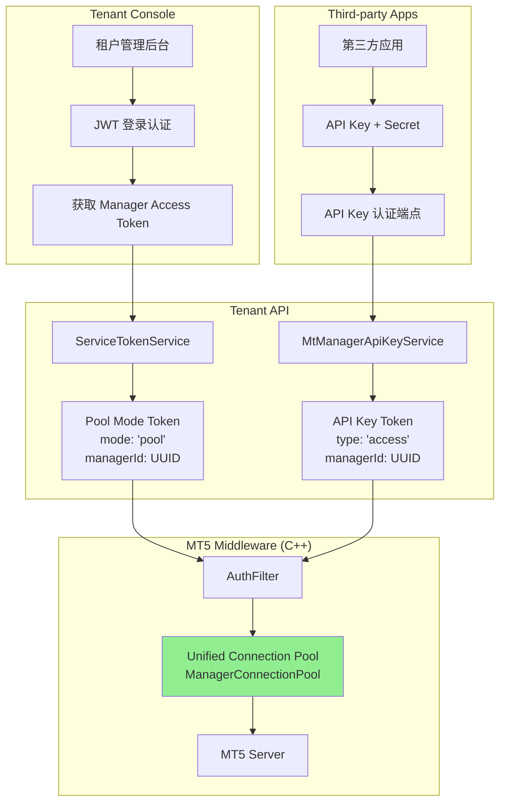
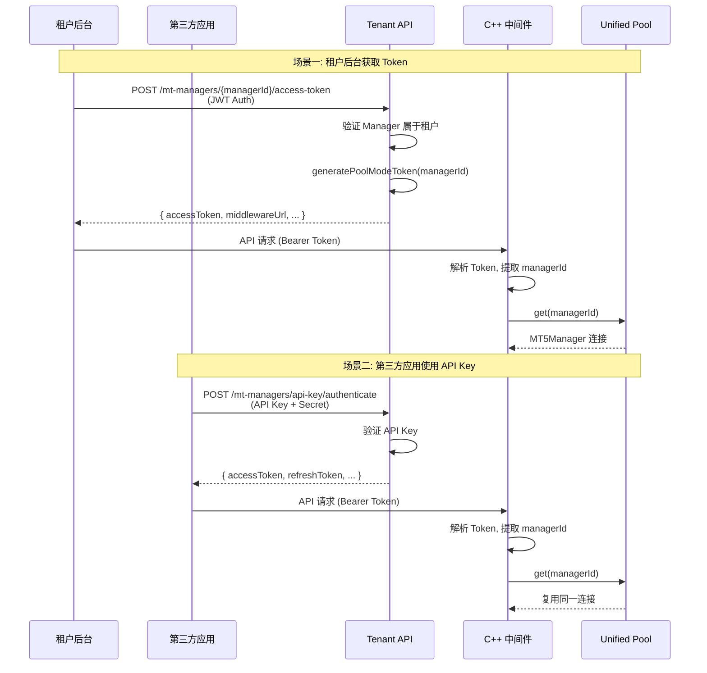

# Design Document: Unified Connection Pool

## Overview

本设计文档描述统一连接池架构的技术实现方案。目标是将现有的两套连接池（`ManagerSessionPool` 和 `ManagerConnectionPool`）合并为一套，使用 `managerId` 作为唯一标识，允许租户管理后台和第三方应用共享同一个 MT5 经理账号的连接。

## Steering Document Alignment

### Technical Standards (tech.md)

- **NestJS 模块化架构**: 新增端点遵循现有模块组织结构
- **JWT Token 标准**: 沿用现有 JWT 签名和验证机制
- **TypeScript 严格模式**: 所有新代码遵循项目 TypeScript 配置
- **C++ 代码规范**: 中间件代码遵循现有命名和结构约定

### Project Structure (structure.md)

- `apps/tenant-api/src/mt-manager/` - Manager 相关新端点
- `apps/tenant-api/src/auth/services/` - Token 服务扩展
- `MT5-middleware/src/services/` - C++ 连接池统一
- `MT5-middleware/include/services/` - C++ 头文件

## Code Reuse Analysis

### Existing Components to Leverage

- **ManagerConnectionPool (C++)**: 作为统一连接池的基础，已有 managerId 索引、健康检查、自动重连
- **ServiceTokenService (TypeScript)**: 已有 `generatePoolModeToken()` 方法，生成 `mode: 'pool'` 的 Token
- **MtManagerApiKeyService (TypeScript)**: API Key 认证逻辑保持不变，复用 Token 验证
- **TenantApiClient (C++)**: 已有从 Tenant API 获取 Manager 列表的能力

### Integration Points

- **Prisma Schema**: 无需修改，`MtManager` 已有 `id (managerId)` 字段
- **中间件通信**: 复用现有 HTTP 通信层
- **JWT 验证**: 复用现有密钥和算法配置

## Architecture

### 统一后的连接池架构



### Token 统一流程



### Modular Design Principles

- **Single File Responsibility**: 每个服务类专注单一职责
- **Component Isolation**: Token 生成与连接池管理分离
- **Service Layer Separation**: 认证层、业务层、数据层清晰分离
- **Utility Modularity**: 加密工具、Token 工具独立封装

## Components and Interfaces

### Component 1: MtManagerAccessTokenController (新增)

- **Purpose**: 提供租户后台获取 Manager Pool Mode Access Token 的端点
- **File**: `apps/tenant-api/src/mt-manager/mt-manager-access-token.controller.ts`
- **Interfaces**:
  ```typescript
  @Post(':managerId/access-token')
  async getAccessToken(
    @Param('managerId') managerId: string,
    @TenantId() tenantId: string,
    @CurrentUser() user: AuthenticatedUser,
  ): Promise<ManagerAccessTokenResponseDto>
  ```
- **Dependencies**: `MtManagerAccessTokenService`, `TenantGuard`, `RoleGuard`
- **Reuses**: 现有的 Guard 和 Decorator

### Component 2: MtManagerAccessTokenService (新增)

- **Purpose**: 处理 Manager Access Token 的生成逻辑
- **File**: `apps/tenant-api/src/mt-manager/mt-manager-access-token.service.ts`
- **Interfaces**:
  ```typescript
  async generateAccessToken(
    tenantId: string,
    managerId: string,
    userId: string,
  ): Promise<ManagerAccessTokenResponse>

  async validateManagerAccess(
    tenantId: string,
    managerId: string,
  ): Promise<MtManager & { server: MtServer }>
  ```
- **Dependencies**: `PrismaService`, `ServiceTokenService`, `ConfigService`
- **Reuses**: `ServiceTokenService.generatePoolModeToken()`

### Component 3: UnifiedTokenValidator (C++ 新增)

- **Purpose**: 统一验证所有类型的 Token 并提取 `managerId`
- **File**: `MT5-middleware/include/filters/UnifiedTokenValidator.h`
- **Interfaces**:
  ```cpp
  struct TokenValidationResult {
      bool valid;
      std::string managerId;
      std::string tenantId;
      std::string error;
      TokenType type; // POOL_MODE, API_KEY, LEGACY
  };

  TokenValidationResult validate(const std::string& token);
  ```
- **Dependencies**: `jwt-cpp`, 配置服务
- **Reuses**: 现有 JWT 验证逻辑

### Component 4: ManagerConnectionPool (C++ 增强)

- **Purpose**: 统一连接池，所有请求都使用 managerId 获取连接
- **File**: `MT5-middleware/src/services/ManagerConnectionPool.cpp` (修改)
- **新增 Interfaces**:
  ```cpp
  // 通过旧格式 Token 获取 managerId (向后兼容)
  std::string resolveManagerId(
      uint64_t managerLogin,
      const std::string& serverId
  );

  // 预热连接 (中间件启动时)
  int preloadConnections();
  ```
- **Dependencies**: `TenantApiClient`, `CredentialEncryption`
- **Reuses**: 现有连接管理、健康检查、自动重连逻辑

## Data Models

### Model 1: ManagerAccessTokenResponseDto (TypeScript)

```typescript
export class ManagerAccessTokenResponseDto {
  /** Pool Mode Access Token */
  accessToken: string;

  /** Token 有效期 (秒) */
  expiresIn: number;

  /** Token 过期时间 (Unix 时间戳) */
  expiresAt: number;

  /** Token 类型 */
  tokenType: 'Bearer';

  /** 中间件实例 URL */
  middlewareUrl: string;

  /** Manager 基本信息 */
  manager: {
    id: string;
    managerLogin: string;
    displayName: string | null;
    serverName: string | null;
    platformType: string;
  };
}
```

### Model 2: TokenValidationResult (C++)

```cpp
enum class TokenType {
    POOL_MODE,      // mode: 'pool' - 新格式
    API_KEY,        // type: 'access' - API Key Token
    LEGACY          // 旧格式 (包含 encryptedPassword)
};

struct TokenValidationResult {
    bool valid = false;
    std::string managerId;      // 提取的 managerId
    std::string tenantId;       // 租户 ID
    std::string apiKeyId;       // API Key ID (仅 API_KEY 类型)
    TokenType type = TokenType::LEGACY;
    std::string error;
};
```

### Model 3: ManagerIdMapping (C++ 新增，用于旧格式兼容)

```cpp
struct ManagerIdMapping {
    uint64_t managerLogin;      // Manager 登录号
    std::string serverId;       // MT 服务器 ID
    std::string managerId;      // Manager UUID
    std::chrono::system_clock::time_point cachedAt;
};
```

## Error Handling

### Error Scenarios

1. **Manager 不存在或未激活**
   - **Handling**: 返回 404 Not Found
   - **User Impact**: 提示 "MT 经理账号不存在或未激活"

2. **Manager 不属于当前租户**
   - **Handling**: 返回 403 Forbidden
   - **User Impact**: 提示 "无权访问该经理账号"

3. **Manager 关联的服务器未配置中间件**
   - **Handling**: 返回 400 Bad Request
   - **User Impact**: 提示 "关联的 MT 服务器未配置中间件实例"

4. **连接池中不存在该 Manager 的连接**
   - **Handling**: C++ 中间件尝试按需建立连接
   - **User Impact**: 首次请求可能略慢（建立连接）

5. **旧格式 Token 无法解析 managerId**
   - **Handling**: 查询 Manager 映射表，如果找不到返回 401
   - **User Impact**: 提示升级 Token 或重新登录

6. **用户角色权限不足**
   - **Handling**: 返回 403 Forbidden
   - **User Impact**: 提示 "权限不足，需要 owner/admin/operator 角色"

## API Design

### 新增端点: POST /api/v1/mt-managers/{managerId}/access-token

**认证**: JWT Token (租户用户登录后获得)

**权限**: owner, admin, operator

**Request**:
```http
POST /api/v1/mt-managers/550e8400-e29b-41d4-a716-446655440000/access-token
Authorization: Bearer <jwt_token>
X-Tenant-Id: e0cd8035-ac4c-4b54-9198-35c6fcbcaddc
```

**Response (200 OK)**:
```json
{
  "accessToken": "eyJhbGciOiJIUzI1NiIsInR5cCI6IkpXVCJ9...",
  "expiresIn": 900,
  "expiresAt": 1766073000,
  "tokenType": "Bearer",
  "middlewareUrl": "http://middleware.example.com:8080",
  "manager": {
    "id": "550e8400-e29b-41d4-a716-446655440000",
    "managerLogin": "1001",
    "displayName": "Demo Manager",
    "serverName": "MT5 Server 1",
    "platformType": "MT5"
  }
}
```

**Error Responses**:
- 400: Manager 关联的服务器未配置中间件
- 403: 无权访问该经理账号 / 角色权限不足
- 404: MT 经理账号不存在或未激活

### 现有端点保持不变

- `POST /api/v1/mt-managers/api-key/authenticate` - 第三方应用认证
- `POST /api/v1/mt-managers/api-key/refresh` - 刷新 Token

## Implementation Strategy

### Phase 1: Tenant API 扩展

1. 创建 `MtManagerAccessTokenController` 和 `MtManagerAccessTokenService`
2. 实现 Manager 访问权限验证（租户隔离 + 中间件分配检查）
3. 复用 `ServiceTokenService.generatePoolModeToken()` 生成 Token
4. 添加单元测试和 E2E 测试

### Phase 2: C++ 中间件统一

1. 创建 `UnifiedTokenValidator` 类，支持解析三种 Token 格式
2. 修改 `AuthFilter` 使用新的验证器
3. 移除对 `ManagerSessionPool` 的依赖（保留代码但不再使用）
4. 添加 Manager ID 映射缓存（兼容旧格式 Token）
5. 增强 `ManagerConnectionPool` 支持按需连接

### Phase 3: 向后兼容和迁移

1. 旧格式 Token 支持期：6 个月
2. 添加日志警告，提示使用旧格式 Token
3. 前端逐步迁移到新端点

## C++ AuthFilter 修改方案

### 当前流程

```
Token → 判断类型 → Service Token: ManagerSessionPool
                 → API Key Token: ManagerConnectionPool
```

### 统一后流程

```
Token → UnifiedTokenValidator.validate()
      → 提取 managerId
      → ManagerConnectionPool.get(managerId)
      → 如果不存在且是旧格式: 按需建立连接
```

### 核心代码变更

```cpp
// AuthFilter.cpp - 修改后的处理逻辑
void AuthFilter::doFilter(const drogon::HttpRequestPtr& req,
                          FilterCallback&& fcb,
                          FilterChainCallback&& fccb) {
    // 1. 提取 Token
    auto token = extractBearerToken(req);
    if (token.empty()) {
        return sendUnauthorized(fcb, "Missing authorization token");
    }

    // 2. 使用统一验证器
    auto result = m_tokenValidator->validate(token);
    if (!result.valid) {
        return sendUnauthorized(fcb, result.error);
    }

    // 3. 从统一连接池获取连接
    auto connection = m_connectionPool->get(result.managerId);
    if (!connection) {
        // 旧格式兼容: 尝试按需建立连接
        if (result.type == TokenType::LEGACY) {
            connection = tryEstablishLegacyConnection(result, req);
        }
        if (!connection) {
            return sendServiceUnavailable(fcb, "Connection not available");
        }
    }

    // 4. 设置请求上下文
    req->attributes()->insert("managerId", result.managerId);
    req->attributes()->insert("tenantId", result.tenantId);
    req->attributes()->insert("mt5Connection", connection);

    fccb();
}
```

## Testing Strategy

### Unit Testing

- **Tenant API**:
  - `MtManagerAccessTokenService` 单元测试
  - Token 生成和验证测试
  - 权限验证测试

- **C++ Middleware**:
  - `UnifiedTokenValidator` 单元测试
  - 三种 Token 格式解析测试
  - Manager ID 映射缓存测试

### Integration Testing

- Tenant API → Middleware 端到端认证流程
- 租户后台和第三方应用共享连接测试
- 连接池健康检查和自动重连测试

### End-to-End Testing

- **场景 1**: 租户管理员登录 → 获取 Manager Token → 调用交易接口
- **场景 2**: 第三方应用使用 API Key → 获取 Token → 调用同一 Manager 的接口
- **场景 3**: 两个客户端同时访问同一 Manager，验证连接复用
- **场景 4**: 旧格式 Token 向后兼容测试

## Performance Considerations

### 连接复用收益

- 预估减少 50% 以上的 MT5 连接数
- Token 验证延迟 < 10ms（无密码解密开销）
- 连接池命中率预期 > 95%

### 潜在瓶颈

- Manager ID 映射查询（旧格式兼容）：添加本地缓存
- 按需建立连接：可能导致首次请求延迟，建议预热

## Security Considerations

### Token 安全

- Pool Mode Token 不包含密码，降低泄露风险
- Token 有效期限制在 15 分钟
- 签名算法使用 HS256，密钥通过环境变量配置

### 租户隔离

- Manager 访问严格验证租户归属
- 中间件实例访问验证租户分配关系
- 日志记录所有 Token 生成和使用

### 审计日志

- 记录 Token 生成事件（谁、何时、为哪个 Manager）
- 记录连接池访问事件
- 记录异常情况（无效 Token、权限拒绝）

## Migration Plan

### Phase 1: 准备 (Week 1)

- 部署新端点（不影响现有流程）
- 更新 C++ 中间件支持新 Token 格式

### Phase 2: 并行运行 (Week 2-4)

- 前端开始使用新端点
- 监控新旧两种流程的使用情况
- 收集性能数据

### Phase 3: 逐步迁移 (Month 2-6)

- 推动第三方应用升级 Token 格式
- 添加旧格式 Token 使用警告日志
- 监控旧格式 Token 使用量下降

### Phase 4: 清理 (Month 7+)

- 在旧格式 Token 使用量降至 5% 以下后
- 移除 ManagerSessionPool 相关代码
- 移除旧格式 Token 解析支持
