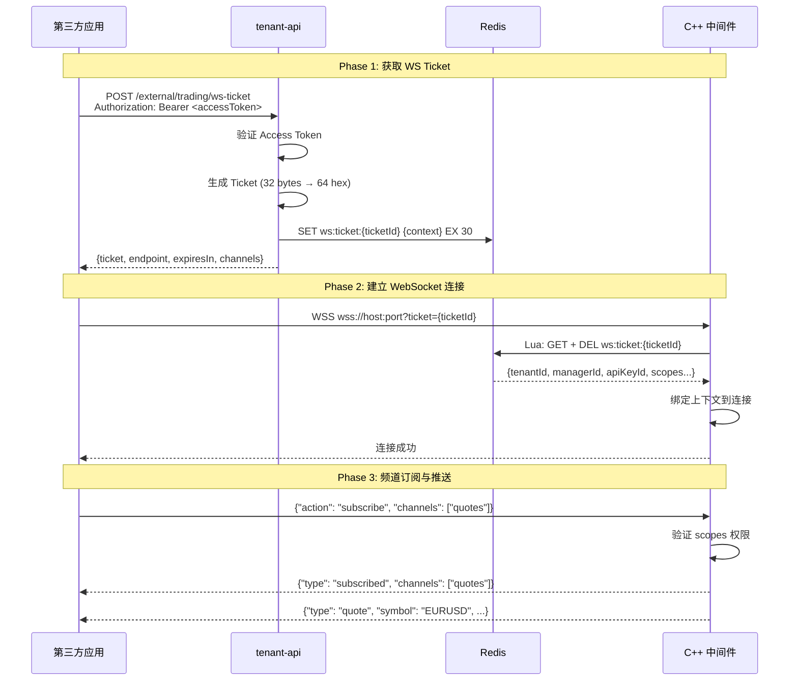

# Design Document: WebSocket Ticket Authentication

## Overview

本设计实现 WebSocket 一次性 Ticket 认证机制，采用混合架构：
- **REST API**（交易/查询）：通过 tenant-api 代理
- **WebSocket**（实时推送）：通过 Ticket 直连 C++ 中间件

核心流程：第三方应用使用 Access Token 从 tenant-api 获取一次性 WS Ticket，然后使用该 Ticket 直接连接 C++ 中间件的 WebSocket 端点。

## Steering Document Alignment

### Technical Standards (tech.md)

- **NestJS 架构模式**: 遵循现有 Module/Controller/Service 分层
- **Redis 缓存模式**: 复用 CacheService 的 ioredis 实现
- **JWT 认证流程**: 与现有 ApiKeyAuthGuard 模式一致
- **DTO 验证**: 使用 class-validator 进行输入验证

### Project Structure (structure.md)

tenant-api 新增文件结构：
```
src/
├── ws-ticket/
│   ├── ws-ticket.module.ts
│   ├── ws-ticket.controller.ts
│   ├── ws-ticket.service.ts
│   └── dto/
│       └── ws-ticket.dto.ts
```

## Code Reuse Analysis

### Existing Components to Leverage

- **CacheService** (`src/common/services/cache.service.ts`): Redis 操作封装，复用 `set<T>()` 和 `get<T>()` 方法
- **ApiKeyAuthGuard** (`src/auth/guards/api-key-auth.guard.ts`): Access Token 验证，WS Ticket 端点使用此守卫
- **RequestContext** (`src/auth/interfaces/request-context.interface.ts`): 统一上下文接口，提取 tenantId, managerId, apiKeyId 等信息
- **ConfigService**: 读取 `MIDDLEWARE_WS_ENDPOINT` 环境变量

### Integration Points

- **Redis 共享**: tenant-api 和 C++ 中间件共享同一 Redis 实例
- **Access Token 认证**: 复用现有 ApiKeyAuthGuard 验证流程
- **Scopes 权限**: 复用 API Key 的 scopes 定义

## Architecture

### 系统架构图



### 模块设计原则

- **Single File Responsibility**: WsTicketService 仅负责 Ticket 生成和存储
- **Component Isolation**: WS Ticket 模块独立，不影响现有认证流程
- **Service Layer Separation**: Controller 处理 HTTP，Service 处理业务逻辑

## Components and Interfaces

### Part A: tenant-api 组件

#### WsTicketController

- **Purpose:** 提供 WS Ticket 签发的 HTTP 端点
- **Interfaces:**
  ```typescript
  @Post('/external/trading/ws-ticket')
  @UseGuards(ApiKeyAuthGuard)
  async generateTicket(@Req() req): Promise<WsTicketResponseDto>
  ```
- **Dependencies:** WsTicketService, ApiKeyAuthGuard
- **Reuses:** ApiKeyAuthGuard 验证 Access Token

#### WsTicketService

- **Purpose:** 生成 WS Ticket 并存储到 Redis
- **Interfaces:**
  ```typescript
  async generateTicket(context: RequestContext): Promise<WsTicketResponseDto>
  private generateSecureTicket(): string  // 32 bytes → 64 hex
  private calculateChannels(scopes: string[]): string[]
  ```
- **Dependencies:** CacheService, ConfigService
- **Reuses:**
  - CacheService 的 Redis 操作
  - ConfigService 读取 WebSocket 端点配置

### Part B: C++ 中间件组件

#### WebSocketServer

- **Purpose:** 管理 WSS 连接和消息路由
- **Interfaces:**
  ```cpp
  void start(uint16_t port);
  void onConnection(WebSocketConnection* conn, const std::string& ticket);
  void broadcast(const std::string& channel, const nlohmann::json& data);
  ```
- **Dependencies:** TicketValidator, ChannelManager

#### TicketValidator

- **Purpose:** 验证 Ticket 的有效性（原子性 GET + DEL）
- **Interfaces:**
  ```cpp
  std::optional<TicketData> validateAndConsume(const std::string& ticketId);
  ```
- **Dependencies:** Redis (hiredis)
- **Redis Lua Script:**
  ```lua
  local data = redis.call('GET', KEYS[1])
  if data then
    redis.call('DEL', KEYS[1])
  end
  return data
  ```

#### ChannelManager

- **Purpose:** 管理频道订阅和消息分发
- **Interfaces:**
  ```cpp
  bool subscribe(WebSocketConnection* conn, const std::vector<std::string>& channels);
  void unsubscribe(WebSocketConnection* conn, const std::vector<std::string>& channels);
  void publish(const std::string& channel, const nlohmann::json& data, const std::string& tenantId);
  ```
- **Dependencies:** ConnectionContext

#### ConnectionContext

- **Purpose:** 存储 WebSocket 连接的上下文信息
- **Interfaces:**
  ```cpp
  struct ConnectionContext {
    std::string tenantId;
    std::string managerId;
    std::string apiKeyId;
    std::string serverId;
    std::vector<std::string> scopes;
    std::set<std::string> subscribedChannels;
    std::chrono::steady_clock::time_point lastActivity;
  };
  ```

## Data Models

### WS Ticket Response DTO

```typescript
// tenant-api: POST /external/trading/ws-ticket 响应
class WsTicketResponseDto {
  @ApiProperty({ description: '一次性 Ticket (64 字符 hex)' })
  ticket: string;

  @ApiProperty({ description: 'WebSocket 端点地址' })
  endpoint: string;

  @ApiProperty({ description: 'Ticket 有效期（秒）' })
  expiresIn: number;

  @ApiProperty({ description: '可订阅的频道列表' })
  channels: string[];
}
```

### Redis Ticket Data

```typescript
// Redis Key: ws:ticket:{ticketId}
// TTL: 30 seconds
interface TicketData {
  tenantId: string;
  managerId: string;
  apiKeyId: string;
  serverId: string;
  scopes: string[];
  createdAt: number;  // Unix timestamp ms
}
```

### WebSocket 消息格式

```typescript
// 客户端 → 服务端
interface ClientMessage {
  action: 'subscribe' | 'unsubscribe' | 'ping';
  channels?: string[];
}

// 服务端 → 客户端
interface ServerMessage {
  type: 'subscribed' | 'unsubscribed' | 'quote' | 'position' | 'order' | 'error' | 'pong';
  data?: any;
  timestamp: number;
}

// 频道数据格式
interface QuoteMessage {
  type: 'quote';
  symbol: string;
  bid: number;
  ask: number;
  timestamp: number;
}

interface PositionMessage {
  type: 'position';
  ticket: number;
  symbol: string;
  profit: number;
  margin: number;
  timestamp: number;
}

interface OrderMessage {
  type: 'order';
  ticket: number;
  status: 'pending' | 'filled' | 'canceled' | 'expired';
  filledVolume?: number;
  timestamp: number;
}
```

## Error Handling

### Error Scenarios

1. **Access Token 无效/过期** (tenant-api)
   - **Handling:** ApiKeyAuthGuard 返回 401 Unauthorized
   - **User Impact:** 需要刷新 Access Token 或重新认证

2. **Redis 不可用** (tenant-api)
   - **Handling:** WsTicketService 捕获异常，返回 503 Service Unavailable
   - **User Impact:** 提示服务暂时不可用，稍后重试

3. **Ticket 缺失** (C++ 中间件)
   - **Handling:** 关闭 WebSocket 连接，返回错误码 4001
   - **User Impact:** 需要重新获取 WS Ticket

4. **Ticket 无效/过期** (C++ 中间件)
   - **Handling:** 关闭 WebSocket 连接，返回错误码 4002
   - **User Impact:** 需要重新获取 WS Ticket（30 秒内使用）

5. **频道权限不足** (C++ 中间件)
   - **Handling:** 返回错误消息 `{"type": "error", "code": 4003, ...}`
   - **User Impact:** 只能订阅有权限的频道

6. **连接超时** (C++ 中间件)
   - **Handling:** 60 秒无 Pong 响应，关闭连接
   - **User Impact:** 需要重新建立连接

### 错误码定义

| 错误码 | 来源 | HTTP/WS | 描述 |
|-------|------|---------|------|
| 401 | tenant-api | HTTP | Access Token 无效 |
| 503 | tenant-api | HTTP | Redis 不可用 |
| 4001 | C++ 中间件 | WS Close | Ticket 参数缺失 |
| 4002 | C++ 中间件 | WS Close | Ticket 无效或已过期 |
| 4003 | C++ 中间件 | WS Message | 无权订阅该频道 |
| 4004 | C++ 中间件 | WS Message | 请求频率过高 |
| 4005 | C++ 中间件 | WS Close | 服务器内部错误 |

## Testing Strategy

### Unit Testing

**tenant-api:**
- `WsTicketService.generateTicket()`: 验证 Ticket 格式（64 hex 字符）
- `WsTicketService.calculateChannels()`: 验证 scopes → channels 映射
- Redis 存储: Mock CacheService，验证存储参数

**C++ 中间件:**
- `TicketValidator.validateAndConsume()`: Mock Redis，验证原子性
- `ChannelManager.subscribe()`: 验证权限检查逻辑
- 消息序列化: 验证 JSON 格式正确

### Integration Testing

**tenant-api:**
```typescript
describe('WS Ticket Integration', () => {
  it('should generate ticket with valid access token', async () => {
    const response = await request(app.getHttpServer())
      .post('/external/trading/ws-ticket')
      .set('Authorization', `Bearer ${validAccessToken}`)
      .expect(201);

    expect(response.body.ticket).toHaveLength(64);
    expect(response.body.endpoint).toMatch(/^wss:\/\//);
    expect(response.body.expiresIn).toBe(30);
  });

  it('should return 401 without access token', async () => {
    await request(app.getHttpServer())
      .post('/external/trading/ws-ticket')
      .expect(401);
  });
});
```

**C++ 中间件:**
- 模拟 Redis 存储 Ticket，验证连接建立
- 验证 Ticket 只能使用一次（重放攻击测试）
- 验证租户隔离（不同 tenantId 数据不互相推送）

### End-to-End Testing

1. **完整流程测试**:
   - 使用 API Key 获取 Access Token
   - 使用 Access Token 获取 WS Ticket
   - 使用 WS Ticket 连接 WebSocket
   - 订阅频道并接收数据

2. **安全测试**:
   - 验证 Ticket 30 秒过期
   - 验证 Ticket 只能使用一次
   - 验证非 TLS 连接被拒绝

3. **性能测试**:
   - Ticket 签发延迟 < 50ms
   - WebSocket 连接建立 < 100ms
   - 消息推送延迟 < 10ms
